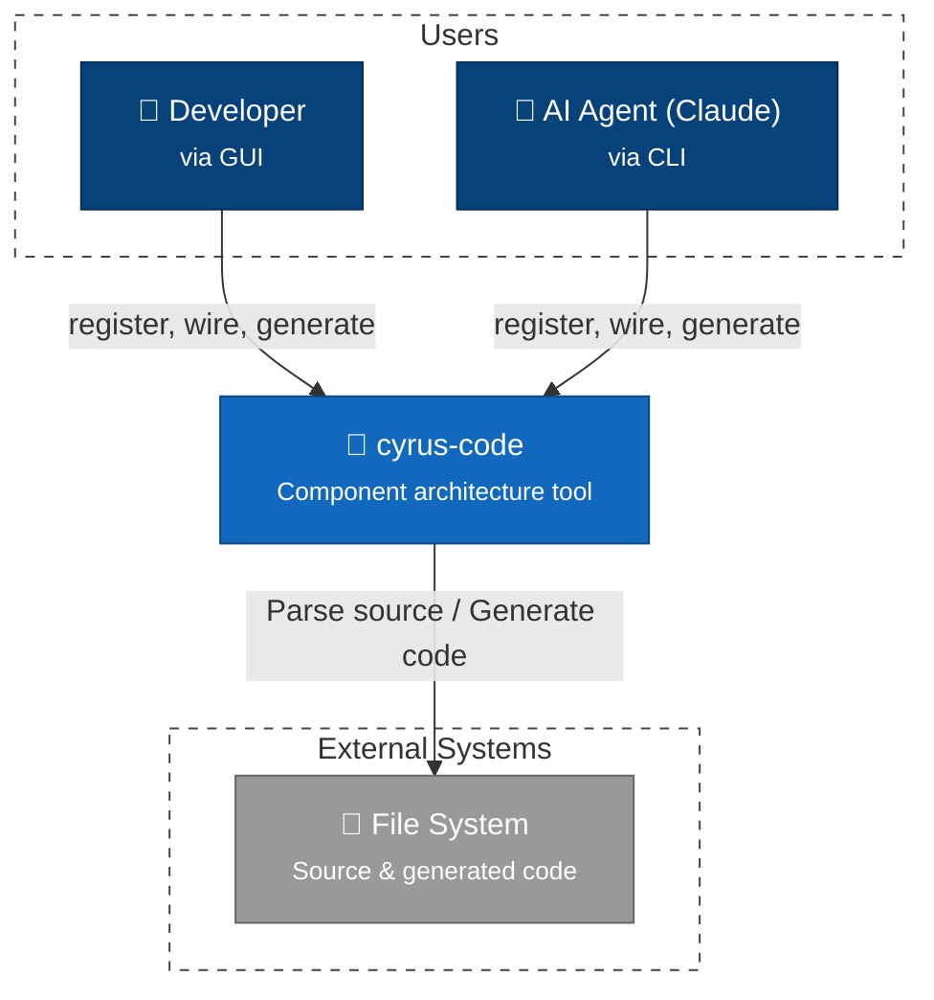

# C4 Context Diagram - cyrus-code

## Overview

System context showing cyrus-code and its external actors/systems.

## Context Diagram

## Legend

| Element | Notation | Description |
|---------|----------|-------------|
| **Person** | Stick figure | Human actor interacting with the system |
| **System** | Blue box | The system being documented (cyrus-code) |
| **System_Ext** | Gray box | External systems that cyrus-code integrates with |
| **Rel** | Arrow with label | Relationship showing data/control flow direction |

> **C4 Model Reference**: This is a Level 1 (Context) diagram showing the system boundary and external dependencies. For internal architecture, see [Level 2: Container](2-container.md).

## Actors

| Actor | Description | Interface |
|-------|-------------|-----------|
| **Developer** | Software architect designing systems | GUI (Electron app) |
| **AI Agent (Claude)** | Claude Code using cyrus-code as a tool | CLI (`cyrus-code` commands) |

Both actors perform the same operations: `register`, `list`, `wire`, `validate`, `generate`, `graph`.

## External Systems

| System | Purpose | Integration |
|--------|---------|-------------|
| **File System** | Source and output storage | Parse existing code, write generated TypeScript files |

> **Note**: Package Registry integration (npm, PyPI, crates.io) is planned for future releases.

## Key Interactions

1. **Developer → cyrus-code** (via GUI): Register components, wire interfaces, generate code
2. **AI Agent → cyrus-code** (via CLI): Same operations via `cyrus-code` commands
3. **cyrus-code → File System**: Parse existing source code, generate TypeScript output
