# C4 Context Diagram - cyrus-code

## Overview

System context showing cyrus-code's external actors and dependencies. This is the highest-level view—internal architecture is in [Level 2](2-container.md).

## Context Diagram

```mermaid
flowchart TB
    subgraph users ["Users"]
        dev["👤 Developer<br/><small>GUI & CLI</small>"]
        ai["🤖 AI Agent<br/><small>CLI</small>"]
    end

    cyrus["🔷 cyrus-code<br/><small>Component architecture tool</small>"]

    subgraph external ["External Systems"]
        fs["📁 File System<br/><small>Source & generated code</small>"]
    end

    dev -->|"commands & visual editing"| cyrus
    ai -->|"commands"| cyrus
    cyrus -->|"read/write code"| fs

    classDef person fill:#08427b,stroke:#052e56,color:#fff
    classDef system fill:#1168bd,stroke:#0b4884,color:#fff
    classDef external fill:#999999,stroke:#666666,color:#fff
    classDef boundary fill:transparent,stroke:#444,stroke-dasharray:5

    class dev,ai person
    class cyrus system
    class fs external
    class users,external boundary
```

## Actors

| Actor | Description | Interface |
|-------|-------------|-----------|
| **Developer** | Software architect designing systems | GUI & CLI |
| **AI Agent** | Claude Code using cyrus-code as a tool | CLI (`cyrus-code` commands) |

Both actors perform the same operations: `register`, `list`, `wire`, `validate`, `generate`, `graph`.

## External Systems

| System | Purpose | Integration |
|--------|---------|-------------|
| **File System** | Source and output storage | Parse existing code, write generated TypeScript files |

> **Note**: Package Registry integration (npm, PyPI, crates.io) is planned for future releases.

## Design Decisions

| Decision | Rationale |
|----------|-----------|
| Separate Developer and AI actors | Different interaction patterns (visual vs CLI-only) |
| File System as only external system | Keeps L1 focused; package registries are future scope |
