# C4 Context Diagram - cyrus-code

## Overview

System context showing cyrus-code and its external actors/systems.

## Context Diagram

```mermaid
flowchart TB
    subgraph users ["Users"]
        dev["👤 Developer<br/><small>Designs architecture</small>"]
        ai["🤖 AI Agent<br/><small>Configures components</small>"]
    end

    cyrus["🔷 cyrus-code<br/><small>Component architecture tool</small>"]

    subgraph external ["External Systems"]
        local["📁 Local Environment<br/><small>File system, IDE, Git</small>"]
        registry["📦 Package Registry<br/><small>npm, PyPI, crates.io</small>"]
        claude["🧠 Claude API<br/><small>AI reasoning</small>"]
    end

    dev -->|"Defines & wires"| cyrus
    ai -->|"Queries & configures"| cyrus
    cyrus -->|"Read/write"| local
    cyrus -->|"Resolve deps"| registry
    ai -.->|"AI assistance"| claude

    classDef person fill:#08427b,stroke:#052e56,color:#fff
    classDef system fill:#1168bd,stroke:#0b4884,color:#fff
    classDef external fill:#999999,stroke:#666666,color:#fff
    classDef boundary fill:transparent,stroke:#444,stroke-dasharray:5

    class dev,ai person
    class cyrus system
    class local,registry,claude external
    class users,external boundary
```

## Legend

| Element | Notation | Description |
|---------|----------|-------------|
| **Person** | Stick figure | Human actor interacting with the system |
| **System** | Blue box | The system being documented (cyrus-code) |
| **System_Ext** | Gray box | External systems that cyrus-code integrates with |
| **Rel** | Arrow with label | Relationship showing data/control flow direction |

> **C4 Model Reference**: This is a Level 1 (Context) diagram showing the system boundary and external dependencies. For internal architecture, see [Level 2: Container](2-container.md).

## Actors

| Actor | Description | Interactions |
|-------|-------------|--------------|
| **Developer** | Software architect designing systems | Defines components, wires interfaces, triggers generation |
| **AI Agent** | Automated component configurator | Queries symbol table, suggests connections, configures parameters |

## External Systems

| System | Purpose | Integration |
|--------|---------|-------------|
| **Local Environment** | Development workspace | File system (source/output), IDE (LSP), Git (versioning) |
| **Package Registry** | Dependency metadata | Resolve npm, PyPI, crates.io versions |
| **Claude API** | AI reasoning | Component configuration assistance |

## Key Interactions

1. **Developer → cyrus-code**: Define components via CLI or visual editor
2. **AI Agent → cyrus-code**: Query registry for compatible components
3. **cyrus-code → File System**: Parse existing code, generate new code
4. **cyrus-code → Package Registry**: Check external dependency versions
5. **cyrus-code → IDE**: Provide completions, diagnostics, refactoring
