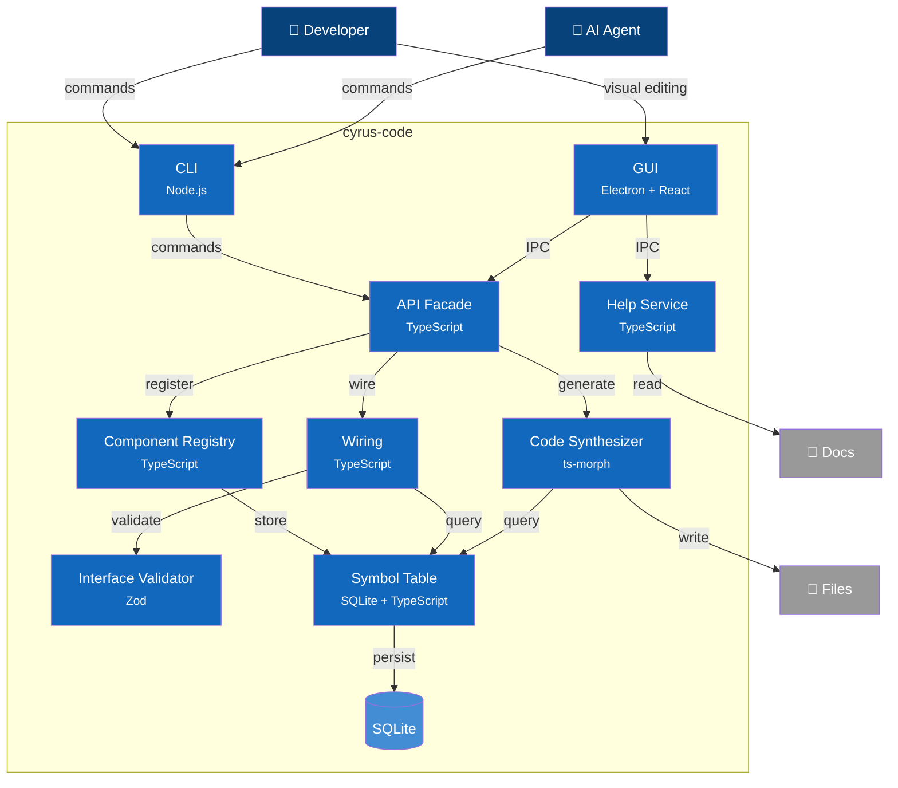

# C4 Container Diagram - cyrus-code

## Overview

Internal architecture of cyrus-code showing major containers and their responsibilities.

> **Implementation Status Legend:**
> - ✅ **Implemented** - Working in current codebase
> - 🔮 **Planned** - Defined in ADRs, not yet implemented

> **C4 Navigation**: [L1: Context](1-context.md) | L2: Container | L3: [Symbol Table](3-component-symbol-table.md) / [Synthesizer](3-component-synthesizer.md) / [Help](3-component-help.md) / [Wiring](3-component-wiring.md) / [Validator](3-component-validator.md) / [Registry](3-component-registry.md) / [Facade](3-component-facade.md) | [Dynamic Flows](dynamic.md)

## Container Diagram

> **Note**: Containers marked 🔮 are defined in ADRs but not yet implemented. See status tables below.

> **Note**: Help Service has direct IPC access (not through API Facade) because it operates on documentation files, not the symbol table ecosystem.

## Containers

### User-Facing

| Container | Technology | Purpose | Status |
|-----------|------------|---------|--------|
| **CLI** | Node.js | Primary interface for all operations | ✅ |
| **GUI** | Electron + React | Graphical component wiring (see [ADR-009](../adr/009-electron-gui-framework.md)) | ✅ |
| **Language Server** | TypeScript | IDE integration (LSP protocol) | 🔮 |

### Core Services

| Container | Technology | Purpose | Status |
|-----------|------------|---------|--------|
| **API Facade** | TypeScript | Single entry point for CLI and GUI; routes to all services | ✅ |
| **Help Service** | TypeScript | Documentation and help topic management | ✅ |
| **Symbol Table** | SQLite + TypeScript | Central registry of all tracked components | ✅ |
| **Component Registry** | TypeScript | Discovery, loading, version resolution | ✅ |
| **Interface Validator** | TypeScript + Zod | Port type checking and compatibility | ✅ |
| **Wiring** | TypeScript | Connection management and graph operations | ✅ |
| **Code Synthesizer** | ts-morph | AST-based code generation | ✅ |

### Analysis Services (ADR-005, ADR-006)

| Container | Technology | Purpose | Status |
|-----------|------------|---------|--------|
| **Static Analyzer** | ts-morph | Build call graphs, detect unreachable code | 🔮 |
| **Runtime Tracer** | TypeScript | Optional dev-time execution tracking | 🔮 |
| **Import Detector** | ts-morph | Scan and import untracked manual code | 🔮 |

### Lifecycle Services (ADR-007)

| Container | Technology | Purpose | Status |
|-----------|------------|---------|--------|
| **Spec Manager** | TypeScript | Requirements, acceptance criteria, traceability | 🔮 |
| **Test Generator** | ts-morph | Generate tests from port contracts | 🔮 |
| **Impact Analyzer** | TypeScript | Change propagation, regression selection | 🔮 |
| **Release Manager** | TypeScript | Composition snapshots, deployment | 🔮 |

### Storage

| Container | Technology | Purpose | Status |
|-----------|------------|---------|--------|
| **Symbol Database** | SQLite | Persistent symbol storage | ✅ |
| **Component Store** | File System | Component source and interface files | ✅ |

> **Technology Decisions**: See [ADR index](../adr/) for detailed rationale on SQLite, ts-morph, Zod, Electron, and other technology choices.
