# C4 Container Diagram - cyrus-code

## Overview

Internal architecture of cyrus-code showing major containers and their responsibilities.

## Container Diagram

```mermaid
C4Container
    title Container Diagram - cyrus-code

    Person(developer, "Developer", "Designs and composes components")
    Person(aiAgent, "AI Agent", "Queries and configures via API")

    System_Boundary(cyrusCode, "cyrus-code") {
        Container(cli, "CLI", "Node.js", "Command-line interface for all operations")
        Container(visualEditor, "Visual Editor", "Electron + React", "Graphical component wiring interface")
        Container(languageServer, "Language Server", "LSP", "IDE integration for completions and diagnostics")

        Container(symbolTable, "Symbol Table", "SQLite + TypeScript", "Persistent registry of all components with versions")
        Container(componentRegistry, "Component Registry", "TypeScript", "Component discovery, loading, version resolution")
        Container(interfaceValidator, "Interface Validator", "TypeScript + Zod", "Type checking and port compatibility validation")
        Container(wiring, "Wiring", "TypeScript", "Connection validation and dependency graph resolution")
        Container(codeSynthesizer, "Code Synthesizer", "ts-morph", "AST-based code generation from component graph")

        Container(staticAnalyzer, "Static Analyzer", "ts-morph", "Build-time call graph analysis for dead code detection")
        Container(runtimeTracer, "Runtime Tracer", "TypeScript", "Optional dev-time execution tracing")
        Container(importDetector, "Import Detector", "ts-morph", "Detect and import untracked manual code")

        Container(specManager, "Spec Manager", "TypeScript", "Requirement specifications and traceability")
        Container(testGenerator, "Test Generator", "ts-morph", "Contract-based test generation")
        Container(impactAnalyzer, "Impact Analyzer", "TypeScript", "Change propagation and impact analysis")
        Container(releaseManager, "Release Manager", "TypeScript", "Composition versioning and deployment")

        ContainerDb(symbolDb, "Symbol Database", "SQLite", "Persistent symbol storage")
        Container(componentStore, "Component Store", "File System", "Component source files and interfaces")
    }

    System_Ext(fileSystem, "File System", "Project source and output")
    System_Ext(packageRegistry, "Package Registry", "npm, crates, PyPI")

    Rel(developer, cli, "Commands")
    Rel(developer, visualEditor, "Visual wiring")
    Rel(aiAgent, cli, "API calls")

    Rel(cli, symbolTable, "Creates, reads, updates, deletes symbols")
    Rel(cli, wiring, "Validates connections")
    Rel(cli, codeSynthesizer, "Generates code")
    Rel(visualEditor, symbolTable, "Queries components")
    Rel(visualEditor, wiring, "Validates wiring")
    Rel(languageServer, symbolTable, "Provides completions and diagnostics")

    Rel(symbolTable, symbolDb, "Persists symbols")
    Rel(componentRegistry, componentStore, "Loads components")
    Rel(componentRegistry, packageRegistry, "Resolves versions")
    Rel(interfaceValidator, symbolTable, "Looks up types")
    Rel(wiring, interfaceValidator, "Validates port connections")
    Rel(codeSynthesizer, symbolTable, "Reads component graph")
    Rel(codeSynthesizer, fileSystem, "Writes generated code")

    Rel(cli, staticAnalyzer, "Analyzes dead code")
    Rel(staticAnalyzer, symbolTable, "Updates status and builds call graph")
    Rel(staticAnalyzer, fileSystem, "Parses source files")
    Rel(runtimeTracer, symbolTable, "Updates execution status")
    Rel(cli, importDetector, "Imports untracked files")
    Rel(importDetector, symbolTable, "Registers manual symbols")
    Rel(importDetector, fileSystem, "Scans for untracked files")

    Rel(cli, specManager, "Manages requirements")
    Rel(specManager, symbolTable, "Traces requirements to components")
    Rel(cli, testGenerator, "Generates tests")
    Rel(testGenerator, symbolTable, "Reads port contracts")
    Rel(testGenerator, fileSystem, "Writes test files")
    Rel(cli, impactAnalyzer, "Analyzes changes")
    Rel(impactAnalyzer, symbolTable, "Queries dependency graph")
    Rel(cli, releaseManager, "Manages releases")
    Rel(releaseManager, symbolTable, "Snapshots compositions")
```



## Legend

| Element | Notation | Description |
|---------|----------|-------------|
| **Person** | Stick figure | Human actor interacting with containers |
| **Container** | Blue box | Application or service within the system |
| **ContainerDb** | Cylinder | Database or persistent storage |
| **System_Ext** | Gray box | External systems outside cyrus-code |
| **System_Boundary** | Dashed box | The cyrus-code system boundary |
| **Rel** | Arrow with label | Data/control flow between elements |

> **C4 Model Reference**: This is a Level 2 (Container) diagram showing internal architecture. For system context, see [Level 1: Context](1-context.md). For Symbol Table internals, see [Level 3: Component](3-component.md). For runtime flows, see [Dynamic Diagrams](dynamic.md).

## Containers

### User-Facing

| Container | Technology | Purpose |
|-----------|------------|---------|
| **CLI** | Node.js | Primary interface for all operations |
| **Visual Editor** | Electron + React | Graphical component wiring (see [ADR-009](../adr/009-electron-gui-framework.md)) |
| **Language Server** | LSP | IDE integration |

### Core Services

| Container | Technology | Purpose |
|-----------|------------|---------|
| **Symbol Table** | SQLite + TypeScript | Central registry of all tracked components |
| **Component Registry** | TypeScript | Discovery, loading, version resolution |
| **Interface Validator** | TypeScript + Zod | Port type checking and compatibility |
| **Wiring** | TypeScript | Connection graph validation |
| **Code Synthesizer** | ts-morph | AST-based code generation |

### Analysis Services (ADR-005, ADR-006)

| Container | Technology | Purpose |
|-----------|------------|---------|
| **Static Analyzer** | ts-morph | Build call graphs, detect unreachable code |
| **Runtime Tracer** | TypeScript | Optional dev-time execution tracking |
| **Import Detector** | ts-morph | Scan and import untracked manual code |

### Lifecycle Services (ADR-007)

| Container | Technology | Purpose |
|-----------|------------|---------|
| **Spec Manager** | TypeScript | Requirements, acceptance criteria, traceability |
| **Test Generator** | ts-morph | Generate tests from port contracts |
| **Impact Analyzer** | TypeScript | Change propagation, regression selection |
| **Release Manager** | TypeScript | Composition snapshots, deployment |

### Storage

| Container | Technology | Purpose |
|-----------|------------|---------|
| **Symbol Database** | SQLite | Persistent symbol storage |
| **Component Store** | File System | Component source and interface files |

## Data Flow

### Registration Flow

```
Source File → Parser → Symbol Table → Symbol Database
```

1. Developer creates/modifies source file
2. Parser extracts component, ports, types
3. Symbol Table registers with unique ID
4. Symbol Database persists

### Validation Flow

```
Connection Config → Wiring → Interface Validator → Symbol Table → Result
                      ↓              ↓
                  [Error]        [Error]
              Missing symbol   Type mismatch
```

1. Configuration defines connections
2. Wiring collects all connections
   - **Error**: Missing symbol → Reports unresolved reference
3. Interface Validator checks each connection
   - **Error**: Type mismatch → Reports incompatible port types
   - **Error**: Direction conflict → Reports invalid flow direction
4. Symbol Table provides type information
5. Result includes errors/warnings with source locations

### Generation Flow

```
Symbol Table → Code Synthesizer → AST → Source Files
     ↓               ↓
 [Error]         [Error]
No components   AST error
```

1. Read component graph from Symbol Table
   - **Error**: No components → Reports empty graph
   - **Error**: Circular dependency → Reports cycle path
2. Code Synthesizer builds AST
   - **Error**: Invalid template → Reports synthesis failure
3. AST transformed to source code
4. Written to output directory
   - **Error**: Write failure → Reports file system error

### Analysis Flow (ADR-005)

```
Entry Points → Static Analyzer → Call Graph → Symbol Table (status update)
```

1. Define entry points (main, routes, handlers)
2. Static Analyzer builds call graph via AST
3. Mark reachable symbols as `referenced`
4. Unreachable symbols flagged as dead code candidates

### Import Flow (ADR-006)

```
File System → Import Detector → Parse → Symbol Table (register)
```

1. Scan project for files not in symbol table
2. Parse untracked files, extract structure
3. Suggest classification (level, kind, namespace)
4. Register with `source='manual'`

### Lifecycle Flows (ADR-007)

**Design → Test Flow:**
```
Requirements → Spec Manager → Symbol Table → Test Generator → Test Files
```

**Impact Analysis Flow:**
```
Changed Symbol → Impact Analyzer → Dependency Graph → Affected Symbols + Tests
```

**Release Flow:**
```
Symbol Table → Release Manager → Composition Snapshot → Deployment
```

## CLI Commands

```bash
# Symbol management
cyrus-code register <file>        # Register component from source
cyrus-code list [--level L1]      # List symbols, optionally filter
cyrus-code get <symbol-id>        # Get symbol details
cyrus-code remove <symbol-id>     # Remove from registry

# Validation
cyrus-code validate               # Validate all connections
cyrus-code lint                   # Check for issues

# Generation
cyrus-code generate <output>      # Generate code from graph
cyrus-code preview                # Show what would be generated

# Version management
cyrus-code version <symbol-id>    # Show version history
cyrus-code bump <symbol-id> <type># Bump version (major/minor/patch)

# Dead code analysis (ADR-005)
cyrus-code analyze                # Run static analysis
cyrus-code analyze --entry <file> # Specify entry points
cyrus-code dead                   # List dead code candidates
cyrus-code status <symbol-id>     # Show symbol status
cyrus-code trace start            # Start runtime tracing (dev mode)
cyrus-code trace stop             # Stop and report

# Import detection (ADR-006)
cyrus-code scan                   # Find untracked files
cyrus-code import <file>          # Import file to registry
cyrus-code import --interactive   # Interactive import wizard
cyrus-code check                  # Check for modified generated files

# Lifecycle management (ADR-007)
cyrus-code spec create <name>     # Create requirement specification
cyrus-code spec link <req> <sym>  # Link requirement to component
cyrus-code test generate <symbol> # Generate tests from contracts
cyrus-code test affected <symbol> # Run affected tests only
cyrus-code impact <symbol>        # Analyze change impact
cyrus-code release create <ver>   # Create immutable release
cyrus-code release diff <v1> <v2> # Compare releases
```

## Technology Decisions

| Decision | Choice | Rationale |
|----------|--------|-----------|
| Symbol storage | SQLite | Single file, queryable, no server |
| AST manipulation | ts-morph | High-level TypeScript API |
| Schema validation | Zod | Runtime + compile-time types |
| Desktop UI | Electron + React | Cross-platform, web tech |
| LSP | TypeScript LSP | IDE agnostic |
