# C4 Container Diagram - cyrus-code

## Overview

Internal architecture of cyrus-code showing major containers and their responsibilities.

> **Implementation Status Legend:**
> - ✅ **Implemented** - Working in current codebase
> - 🔮 **Planned** - Defined in ADRs, not yet implemented

## Container Diagram

> **Note**: Containers marked 🔮 are defined in ADRs but not yet implemented. See status tables below.

```mermaid
flowchart TD
    dev["👤 Developer"] --> cli & gui
    ai["🤖 AI Agent"] --> cli

    subgraph cyrus ["cyrus-code"]
        cli["CLI"]
        gui["GUI"]
        st["Symbol Table"]
        reg["Registry"]
        val["Validator"]
        wire["Wiring"]
        synth["Synthesizer"]
        db[("SQLite")]
    end

    cli & gui --> st
    cli --> wire --> val
    cli --> synth
    st --> db
    reg --> st
    synth --> fs["📁 Files"]

    classDef person fill:#08427b,color:#fff
    classDef container fill:#1168bd,color:#fff
    classDef storage fill:#438dd5,color:#fff
    classDef external fill:#999,color:#fff

    class dev,ai person
    class cli,gui,st,reg,val,wire,synth container
    class db storage
    class fs external
```

## Legend

| Element | Notation | Description |
|---------|----------|-------------|
| **Person** | Stick figure | Human actor interacting with containers |
| **Container** | Blue box | Application or service within the system |
| **ContainerDb** | Cylinder | Database or persistent storage |
| **System_Ext** | Gray box | External systems outside cyrus-code |
| **System_Boundary** | Dashed box | The cyrus-code system boundary |
| **Rel** | Arrow with label | Data/control flow between elements |

> **C4 Model Reference**: This is a C4-2 (Container) diagram showing internal architecture. For system context, see [C4-1: Context](1-context.md). For Symbol Table internals, see [C4-3: Component](3-component.md). For runtime flows, see [Dynamic Diagrams](dynamic.md).

## Scaling Guidance

> **C4 Best Practice**: Per [Simon Brown's guidance](https://dev.to/simonbrown/diagramming-distributed-architectures-with-the-c4-model-51cm), diagrams with 20+ elements become difficult to understand. cyrus-code currently has ~16 containers, organized into logical subgraphs for clarity.
>
> If the system grows significantly (30+ containers), consider:
> - **Focused diagrams**: One diagram per domain/subsystem showing only direct dependencies
> - **Model-based tooling**: Tools like Structurizr that generate multiple views from a single model

## Containers

### User-Facing

| Container | Technology | Purpose | Status |
|-----------|------------|---------|--------|
| **CLI** | Node.js | Primary interface for all operations | ✅ |
| **Visual Editor** | Electron + React | Graphical component wiring (see [ADR-009](../adr/009-electron-gui-framework.md)) | ✅ |
| **Language Server** | LSP | IDE integration | 🔮 |

### Core Services

| Container | Technology | Purpose | Status |
|-----------|------------|---------|--------|
| **Symbol Table** | SQLite + TypeScript | Central registry of all tracked components | ✅ |
| **Component Registry** | TypeScript | Discovery, loading, version resolution | ✅ |
| **Interface Validator** | TypeScript + Zod | Port type checking and compatibility | ✅ |
| **Wiring** | TypeScript | Connection graph validation | ✅ |
| **Code Synthesizer** | ts-morph | AST-based code generation | ✅ |

### Analysis Services (ADR-005, ADR-006)

| Container | Technology | Purpose | Status |
|-----------|------------|---------|--------|
| **Static Analyzer** | ts-morph | Build call graphs, detect unreachable code | 🔮 |
| **Runtime Tracer** | TypeScript | Optional dev-time execution tracking | 🔮 |
| **Import Detector** | ts-morph | Scan and import untracked manual code | 🔮 |

### Lifecycle Services (ADR-007)

| Container | Technology | Purpose | Status |
|-----------|------------|---------|--------|
| **Spec Manager** | TypeScript | Requirements, acceptance criteria, traceability | 🔮 |
| **Test Generator** | ts-morph | Generate tests from port contracts | 🔮 |
| **Impact Analyzer** | TypeScript | Change propagation, regression selection | 🔮 |
| **Release Manager** | TypeScript | Composition snapshots, deployment | 🔮 |

### Storage

| Container | Technology | Purpose | Status |
|-----------|------------|---------|--------|
| **Symbol Database** | SQLite | Persistent symbol storage | ✅ |
| **Component Store** | File System | Component source and interface files | ✅ |

## Technology Decisions

| Decision | Choice | Rationale | Status |
|----------|--------|-----------|--------|
| Symbol storage | SQLite | Single file, queryable, no server | ✅ |
| AST manipulation | ts-morph | High-level TypeScript API | ✅ |
| Schema validation | Zod | Runtime + compile-time types | ✅ |
| Desktop UI | Electron + React | Cross-platform, web tech | ✅ |
| LSP | TypeScript LSP | IDE agnostic | 🔮 |
