# C4 Container Diagram - cyrus-code

## Overview

Internal architecture of cyrus-code showing major containers and their responsibilities.

> **Implementation Status Legend:**
> - ✅ **Implemented** - Working in current codebase
> - 🔮 **Planned** - Defined in ADRs, not yet implemented

## Container Diagram

> **Note**: Containers marked 🔮 are defined in ADRs but not yet implemented. See status tables below.

```mermaid
flowchart TD
    dev["👤 Developer"] --> cli & gui
    ai["🤖 AI Agent"] --> cli

    subgraph cyrus ["cyrus-code"]
        cli["CLI"]
        gui["GUI"]
        st["Symbol Table"]
        wire["Wiring"]
        synth["Synthesizer"]
        db[("SQLite")]
    end

    cli & gui --> st
    cli --> wire
    cli --> synth
    st --> db
    synth --> fs["📁 Files"]

    classDef person fill:#08427b,color:#fff
    classDef container fill:#1168bd,color:#fff
    classDef storage fill:#438dd5,color:#fff
    classDef external fill:#999,color:#fff

    class dev,ai person
    class cli,gui,st,wire,synth container
    class db storage
    class fs external
```



## Legend

| Element | Notation | Description |
|---------|----------|-------------|
| **Person** | Stick figure | Human actor interacting with containers |
| **Container** | Blue box | Application or service within the system |
| **ContainerDb** | Cylinder | Database or persistent storage |
| **System_Ext** | Gray box | External systems outside cyrus-code |
| **System_Boundary** | Dashed box | The cyrus-code system boundary |
| **Rel** | Arrow with label | Data/control flow between elements |

> **C4 Model Reference**: This is a C4-2 (Container) diagram showing internal architecture. For system context, see [C4-1: Context](1-context.md). For Symbol Table internals, see [C4-3: Component](3-component.md). For runtime flows, see [Dynamic Diagrams](dynamic.md).

## Scaling Guidance

> **C4 Best Practice**: Per [Simon Brown's guidance](https://dev.to/simonbrown/diagramming-distributed-architectures-with-the-c4-model-51cm), diagrams with 20+ elements become difficult to understand. cyrus-code currently has ~16 containers, organized into logical subgraphs for clarity.
>
> If the system grows significantly (30+ containers), consider:
> - **Focused diagrams**: One diagram per domain/subsystem showing only direct dependencies
> - **Model-based tooling**: Tools like Structurizr that generate multiple views from a single model

## Containers

### User-Facing

| Container | Technology | Purpose | Status |
|-----------|------------|---------|--------|
| **CLI** | Node.js | Primary interface for all operations | ✅ |
| **Visual Editor** | Electron + React | Graphical component wiring (see [ADR-009](../adr/009-electron-gui-framework.md)) | ✅ |
| **Language Server** | LSP | IDE integration | 🔮 |

### Core Services

| Container | Technology | Purpose | Status |
|-----------|------------|---------|--------|
| **Symbol Table** | SQLite + TypeScript | Central registry of all tracked components | ✅ |
| **Component Registry** | TypeScript | Discovery, loading, version resolution | ✅ |
| **Interface Validator** | TypeScript + Zod | Port type checking and compatibility | ✅ |
| **Wiring** | TypeScript | Connection graph validation | ✅ |
| **Code Synthesizer** | ts-morph | AST-based code generation | ✅ |

### Analysis Services (ADR-005, ADR-006)

| Container | Technology | Purpose | Status |
|-----------|------------|---------|--------|
| **Static Analyzer** | ts-morph | Build call graphs, detect unreachable code | 🔮 |
| **Runtime Tracer** | TypeScript | Optional dev-time execution tracking | 🔮 |
| **Import Detector** | ts-morph | Scan and import untracked manual code | 🔮 |

### Lifecycle Services (ADR-007)

| Container | Technology | Purpose | Status |
|-----------|------------|---------|--------|
| **Spec Manager** | TypeScript | Requirements, acceptance criteria, traceability | 🔮 |
| **Test Generator** | ts-morph | Generate tests from port contracts | 🔮 |
| **Impact Analyzer** | TypeScript | Change propagation, regression selection | 🔮 |
| **Release Manager** | TypeScript | Composition snapshots, deployment | 🔮 |

### Storage

| Container | Technology | Purpose | Status |
|-----------|------------|---------|--------|
| **Symbol Database** | SQLite | Persistent symbol storage | ✅ |
| **Component Store** | File System | Component source and interface files | ✅ |

## Data Flow

### Registration Flow

```
Source File → Parser → Symbol Table → Symbol Database
```

1. Developer creates/modifies source file
2. Parser extracts component, ports, types
3. Symbol Table registers with unique ID
4. Symbol Database persists

### Validation Flow

```
Connection Config → Wiring → Interface Validator → Symbol Table → Result
                      ↓              ↓
                  [Error]        [Error]
              Missing symbol   Type mismatch
```

1. Configuration defines connections
2. Wiring collects all connections
   - **Error**: Missing symbol → Reports unresolved reference
3. Interface Validator checks each connection
   - **Error**: Type mismatch → Reports incompatible port types
   - **Error**: Direction conflict → Reports invalid flow direction
4. Symbol Table provides type information
5. Result includes errors/warnings with source locations

### Generation Flow

```
Symbol Table → Code Synthesizer → AST → Source Files
     ↓               ↓
 [Error]         [Error]
No components   AST error
```

1. Read component graph from Symbol Table
   - **Error**: No components → Reports empty graph
   - **Error**: Circular dependency → Reports cycle path
2. Code Synthesizer builds AST
   - **Error**: Invalid template → Reports synthesis failure
3. AST transformed to source code
4. Written to output directory
   - **Error**: Write failure → Reports file system error

### Analysis Flow (ADR-005) 🔮

> **Status**: Planned - Static Analyzer has schema only, logic not implemented

```
Entry Points → Static Analyzer → Call Graph → Symbol Table (status update)
```

1. Define entry points (main, routes, handlers)
2. Static Analyzer builds call graph via AST
3. Mark reachable symbols as `referenced`
4. Unreachable symbols flagged as dead code candidates

### Import Flow (ADR-006) 🔮

> **Status**: Planned - Import Detector not implemented

```
File System → Import Detector → Parse → Symbol Table (register)
```

1. Scan project for files not in symbol table
2. Parse untracked files, extract structure
3. Suggest classification (level, kind, namespace)
4. Register with `source='manual'`

### Lifecycle Flows (ADR-007) 🔮

> **Status**: Planned - Spec Manager, Test Generator, Impact Analyzer, Release Manager not implemented

**Design → Test Flow:**
```
Requirements → Spec Manager → Symbol Table → Test Generator → Test Files
```

**Impact Analysis Flow:**
```
Changed Symbol → Impact Analyzer → Dependency Graph → Affected Symbols + Tests
```

**Release Flow:**
```
Symbol Table → Release Manager → Composition Snapshot → Deployment
```

## CLI Commands

### Implemented ✅

```bash
# Symbol management
cyrus-code register <file>        # Register component from source
cyrus-code list [--level L1]      # List symbols, optionally filter
cyrus-code get <symbol-id>        # Get symbol details

# Wiring
cyrus-code wire <from> <to>       # Connect component ports
cyrus-code graph                  # Display dependency graph

# Validation & Generation
cyrus-code validate               # Validate all connections
cyrus-code generate <output>      # Generate code from graph

# Help
cyrus-code help                   # Show help information
```

### Planned 🔮

```bash
# Symbol management (ADR-003)
cyrus-code remove <symbol-id>     # Remove from registry

# Validation
cyrus-code lint                   # Check for issues
cyrus-code preview                # Show what would be generated

# Version management (ADR-003)
cyrus-code version <symbol-id>    # Show version history
cyrus-code bump <symbol-id> <type># Bump version (major/minor/patch)

# Dead code analysis (ADR-005)
cyrus-code analyze                # Run static analysis
cyrus-code analyze --entry <file> # Specify entry points
cyrus-code dead                   # List dead code candidates
cyrus-code status <symbol-id>     # Show symbol status
cyrus-code trace start            # Start runtime tracing (dev mode)
cyrus-code trace stop             # Stop and report

# Import detection (ADR-006)
cyrus-code scan                   # Find untracked files
cyrus-code import <file>          # Import file to registry
cyrus-code import --interactive   # Interactive import wizard
cyrus-code check                  # Check for modified generated files

# Lifecycle management (ADR-007)
cyrus-code spec create <name>     # Create requirement specification
cyrus-code spec link <req> <sym>  # Link requirement to component
cyrus-code test generate <symbol> # Generate tests from contracts
cyrus-code test affected <symbol> # Run affected tests only
cyrus-code impact <symbol>        # Analyze change impact
cyrus-code release create <ver>   # Create immutable release
cyrus-code release diff <v1> <v2> # Compare releases
```

## Technology Decisions

| Decision | Choice | Rationale | Status |
|----------|--------|-----------|--------|
| Symbol storage | SQLite | Single file, queryable, no server | ✅ |
| AST manipulation | ts-morph | High-level TypeScript API | ✅ |
| Schema validation | Zod | Runtime + compile-time types | ✅ |
| Desktop UI | Electron + React | Cross-platform, web tech | ✅ |
| LSP | TypeScript LSP | IDE agnostic | 🔮 |
