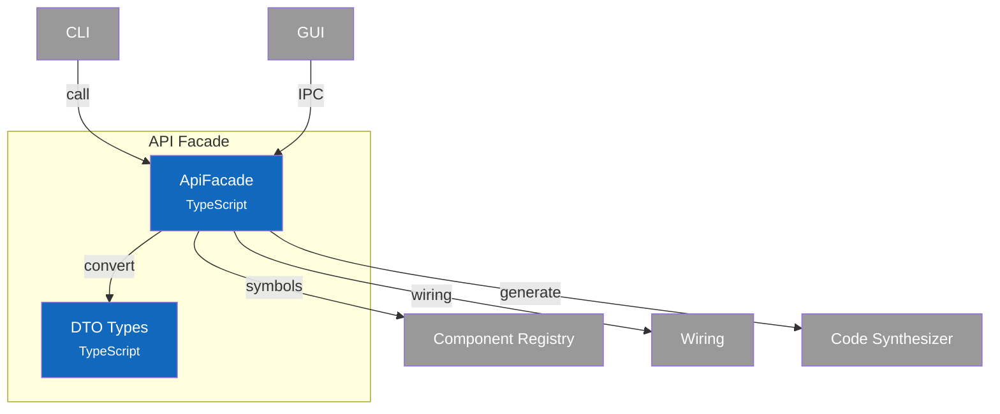

# C4 Component Diagram - API Facade

## Overview

Internal structure of the API Facade container, showing its single-component design and service routing.

## Component Diagram

## Components

| Component | Responsibility | Key Operations | Status | Notes |
|-----------|----------------|----------------|--------|-------|
| **ApiFacade** | Single entry point, service routing, DTO conversion | All public API methods | ✅ | `src/api/facade.ts` |
| **DTO Types** | Transport-safe type definitions | DTOs for all domain types | ✅ | `src/api/types.ts` |

> **Code Details**: See [L4 Code - API Facade](4-code-facade.md) for interface definitions, service routing table, and IPC channel mapping.
>
> **Design Patterns**: See [ADR-008: Design Patterns](../adr/008-design-patterns.md) - Facade pattern.

## Design Decisions

| Decision | Rationale |
|----------|-----------|
| Single facade class | Simplified API surface, one import for all operations |
| DTO conversion | Transport-agnostic: works with Electron IPC, HTTP, CLI |
| ApiResponse wrapper | Consistent error handling across all operations |
| Service composition | Facade holds Registry, Wiring, Synthesizer - routes appropriately |
| Factory methods | `create()` and `createInMemory()` for different contexts |
| Transport-agnostic | Same facade used by CLI (direct) and GUI (via IPC) |
