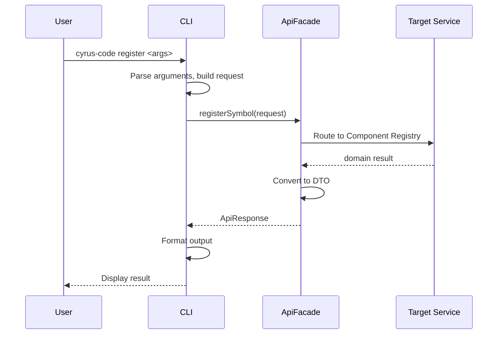
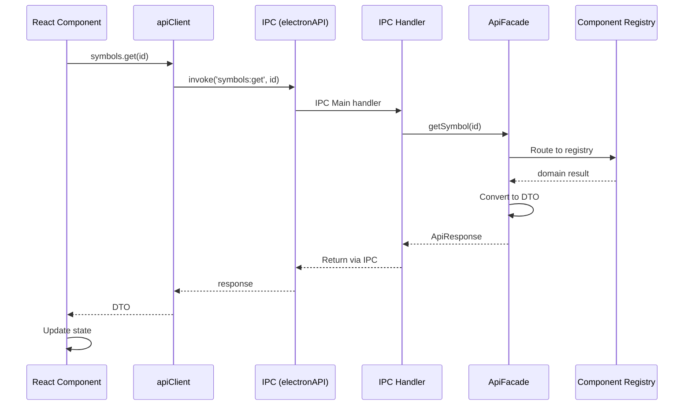

# C4 Component Diagram - API Facade

> **Navigation**: [← Container](2-container.md) | [Index](index.md) | [Dynamic →](dynamic.md)

## Overview

Internal structure of the API Facade container, showing its single-component design and service routing.

## Component Diagram


## Components

| Component | Responsibility | Key Operations | Status | Notes |
|-----------|----------------|----------------|--------|-------|
| **ApiFacade** | Single entry point, service routing, DTO conversion | All public API methods | ✅ | `src/api/facade.ts` |
| **DTO Types** | Transport-safe type definitions | DTOs for all domain types | ✅ | `src/api/types.ts` |

> **Design Patterns**: See [ADR-008: Design Patterns](../adr/008-design-patterns.md) - Facade pattern.

## Service Routing Table

The facade routes operations to internal services:

| API Method Group | Routes To | Operations |
|------------------|-----------|------------|
| **Symbol CRUD** | Component Registry | `registerSymbol`, `getSymbol`, `updateSymbol`, `removeSymbol` |
| **Symbol Queries** | Component Registry | `listSymbols`, `searchSymbols`, `resolveSymbol`, `getVersions`, `getLatest` |
| **Relationships** | Component Registry | `getContains`, `getContainedBy`, `getDependents`, `getDependencies` |
| **Connections** | Component Registry | `createConnection`, `removeConnection`, `getConnections`, `getAllConnections` |
| **Validation** | Component Registry | `validate`, `validateSymbol`, `checkCircular` |
| **Wiring** | Wiring Service | `wireConnection`, `unwireConnection`, `validateConnectionRequest`, `getDependencyGraph`, `detectCycles`, `getTopologicalOrder`, `getGraphStats`, `findCompatiblePorts`, `findUnconnectedRequired` |
| **Status** | Component Registry | `updateStatus`, `findUnreachable`, `findUntested` |
| **Bulk** | Component Registry | `importSymbols`, `exportSymbols` |
| **Generation** | Synthesizer Service | `generateSymbol`, `generateMultiple`, `generateAll`, `previewGeneration`, `listGeneratableSymbols`, `canGenerateSymbol`, `hasUserImplementation` |

## Key Interfaces

### ApiFacade API

```typescript
class ApiFacade {
  // Factory methods
  static create(dbPath: string): ApiFacade;
  static createInMemory(): ApiFacade;
  close(): void;

  // Symbol CRUD
  registerSymbol(request: RegisterSymbolRequest): ApiResponse<ComponentSymbolDTO>;
  getSymbol(id: string): ApiResponse<ComponentSymbolDTO>;
  updateSymbol(request: UpdateSymbolRequest): ApiResponse<ComponentSymbolDTO>;
  removeSymbol(id: string): ApiResponse<void>;

  // Symbol Queries
  listSymbols(query?: SymbolQuery): ApiResponse<PaginatedResponse<ComponentSymbolDTO>>;
  searchSymbols(query: string): ApiResponse<ComponentSymbolDTO[]>;
  resolveSymbol(namespace: string, name: string, options?: ResolveOptions): ApiResponse<ComponentSymbolDTO>;
  getVersions(namespace: string, name: string): ApiResponse<ComponentSymbolDTO[]>;
  getLatest(namespace: string, name: string): ApiResponse<ComponentSymbolDTO>;

  // Relationships
  getContains(id: string): ApiResponse<ComponentSymbolDTO[]>;
  getContainedBy(id: string): ApiResponse<ComponentSymbolDTO | null>;
  getDependents(id: string): ApiResponse<ComponentSymbolDTO[]>;
  getDependencies(id: string): ApiResponse<ComponentSymbolDTO[]>;

  // Connections
  createConnection(request: CreateConnectionRequest): ApiResponse<ConnectionDTO>;
  removeConnection(connectionId: string): ApiResponse<void>;
  getConnections(symbolId: string): ApiResponse<ConnectionDTO[]>;
  getAllConnections(): ApiResponse<ConnectionDTO[]>;

  // Validation
  validate(): ApiResponse<ValidationResultDTO>;
  validateSymbol(id: string): ApiResponse<ValidationResultDTO>;
  checkCircular(): ApiResponse<string[][]>;

  // Wiring (delegated to WiringService)
  wireConnection(request: CreateConnectionRequest): ApiResponse<WiringResultDTO>;
  unwireConnection(connectionId: string): ApiResponse<WiringResultDTO>;
  validateConnectionRequest(request: CreateConnectionRequest): ApiResponse<ValidationResultDTO>;
  getDependencyGraph(symbolId?: string): ApiResponse<DependencyGraphDTO>;
  detectCycles(): ApiResponse<string[][]>;
  getTopologicalOrder(): ApiResponse<string[] | null>;
  getGraphStats(): ApiResponse<GraphStatsDTO>;
  findCompatiblePorts(fromSymbolId: string, fromPort: string): ApiResponse<CompatiblePortDTO[]>;
  findUnconnectedRequired(): ApiResponse<UnconnectedPortDTO[]>;

  // Status (ADR-005)
  updateStatus(request: UpdateStatusRequest): ApiResponse<void>;
  findUnreachable(): ApiResponse<ComponentSymbolDTO[]>;
  findUntested(): ApiResponse<ComponentSymbolDTO[]>;

  // Bulk Operations
  importSymbols(symbols: ComponentSymbolDTO[]): ApiResponse<number>;
  exportSymbols(): ApiResponse<ComponentSymbolDTO[]>;

  // Code Generation (delegated to SynthesizerService)
  generateSymbol(request: GenerateRequest): ApiResponse<GenerationResultDTO>;
  generateMultiple(request: GenerateBatchRequest): ApiResponse<GenerationBatchResultDTO>;
  generateAll(options: GenerationOptionsDTO): ApiResponse<GenerationBatchResultDTO>;
  previewGeneration(request: PreviewRequest): ApiResponse<PreviewResultDTO>;
  listGeneratableSymbols(): ApiResponse<ComponentSymbolDTO[]>;
  canGenerateSymbol(symbolId: string): ApiResponse<boolean>;
  hasUserImplementation(symbolId: string, outputDir: string): ApiResponse<boolean>;
}
```

### API Response Type

```typescript
interface ApiResponse<T> {
  success: boolean;
  data?: T;
  error?: {
    code: string;
    message: string;
    details?: unknown;
  };
}

interface PaginatedResponse<T> {
  items: T[];
  total: number;
  page: number;
  pageSize: number;
}
```

### DTO Conversion

The facade converts between domain types and DTOs:

| Domain Type | DTO Type | Conversion |
|-------------|----------|------------|
| `ComponentSymbol` | `ComponentSymbolDTO` | `Date` → ISO string, nested objects flattened |
| `Connection` | `ConnectionDTO` | `Date` → ISO string |
| `ValidationResult` | `ValidationResultDTO` | Direct mapping |
| `GenerationResult` | `GenerationResultDTO` | Direct mapping |
| `DependencyGraph` | `DependencyGraphDTO` | `Map` → array of entries |

## IPC Channel Mapping

For Electron GUI, the facade methods are exposed via IPC handlers:

| IPC Channel | Facade Method |
|-------------|---------------|
| `symbols:register` | `registerSymbol()` |
| `symbols:get` | `getSymbol()` |
| `symbols:update` | `updateSymbol()` |
| `symbols:remove` | `removeSymbol()` |
| `symbols:list` | `listSymbols()` |
| `symbols:search` | `searchSymbols()` |
| `wiring:connect` | `wireConnection()` |
| `wiring:disconnect` | `unwireConnection()` |
| `wiring:graph` | `getDependencyGraph()` |
| `wiring:compatible-ports` | `findCompatiblePorts()` |
| `synthesizer:generate` | `generateSymbol()` |
| `synthesizer:preview` | `previewGeneration()` |
| `synthesizer:list-generable` | `listGeneratableSymbols()` |

> **Note**: IPC handlers are defined in `electron/ipc-handlers.ts`

## Data Flow

> **Scope**: These sequence diagrams show **internal component interactions** within the API Facade container (L3). For container-to-container flows, see [Dynamic Diagram](dynamic.md).

### CLI Request



### GUI (Electron) Request



## Design Decisions

| Decision | Rationale |
|----------|-----------|
| Single facade class | Simplified API surface, one import for all operations |
| DTO conversion | Transport-agnostic: works with Electron IPC, HTTP, CLI |
| ApiResponse wrapper | Consistent error handling across all operations |
| Service composition | Facade holds Registry, Wiring, Synthesizer - routes appropriately |
| Factory methods | `create()` and `createInMemory()` for different contexts |
| Transport-agnostic | Same facade used by CLI (direct) and GUI (via IPC) |
