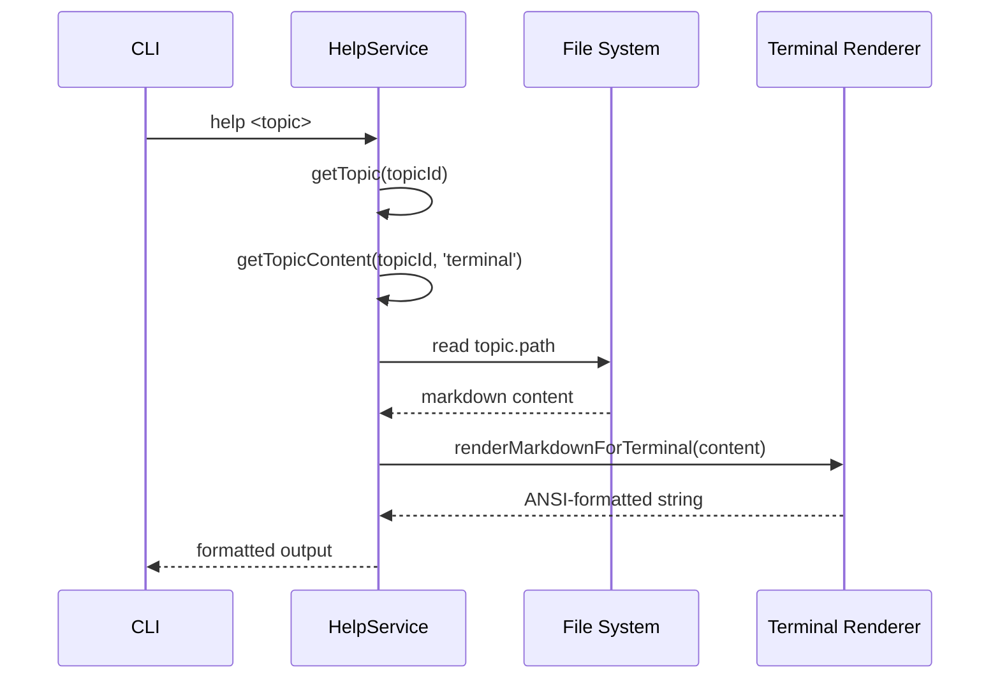
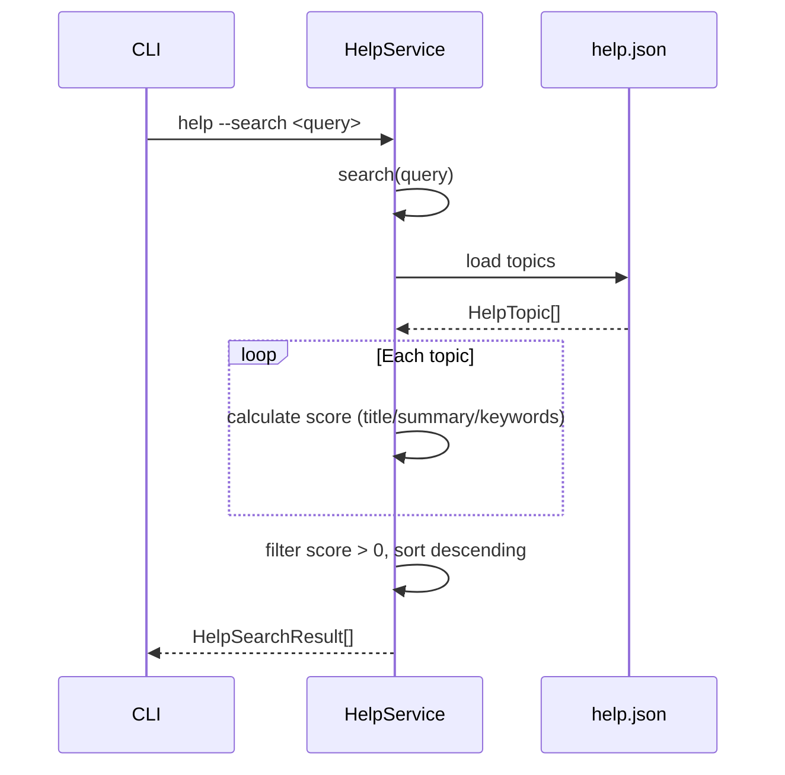

# C4 Component Diagram - Help Service

> **Navigation**: [← Container](2-container.md) | [Index](index.md) | [Dynamic →](dynamic.md)

## Overview

Internal structure of the Help Service container, showing its components and their relationships.

## Component Diagram

```mermaid
flowchart TD
    subgraph help ["Help Service"]
        service["HelpService<br/><small>TypeScript</small>"]
        renderer["Terminal Renderer<br/><small>TypeScript</small>"]
        schema["Schema<br/><small>TypeScript</small>"]
    end

    service -->|"load"| manifest["docs/help.json"]
    service -->|"read"| topics["📄 Markdown Files"]
    service -->|"format"| renderer
    renderer -->|"output"| terminal["Terminal (ANSI)"]
    service -->|"use types"| schema

    gui["GUI"] -->|"IPC"| service
    cli["CLI"] -->|"call"| service

    classDef component fill:#1168bd,color:#fff
    classDef external fill:#999,color:#fff

    class service,renderer,schema component
    class manifest,topics,terminal,gui,cli external
```



## Components

| Component | Responsibility | Key Operations | Status | Notes |
|-----------|----------------|----------------|--------|-------|
| **HelpService** | Topic loading, search, formatting | `getTopic()`, `search()`, `getCategories()`, `getTopicContent()` | ✅ | `src/services/help/index.ts` |
| **Terminal Renderer** | Markdown to ANSI conversion | `renderMarkdownForTerminal()` | ✅ | `src/services/help/renderer.ts` |
| **Schema** | Type definitions | `HelpManifest`, `HelpTopic`, `HelpCategory`, `HelpSearchResult` | ✅ | `src/services/help/schema.ts` |

## Key Interfaces

### HelpService API

```typescript
interface HelpService {
  // Category operations
  getCategories(): HelpCategory[];
  getByCategory(categoryId: string): HelpTopic[];

  // Topic operations
  listTopics(): HelpTopic[];
  getTopic(topicId: string): HelpTopic | undefined;
  getTopicContent(topicId: string, format: HelpOutputFormat): string;
  getRelatedTopics(topicId: string): HelpTopic[];

  // Search
  search(query: string): HelpSearchResult[];

  // Formatting
  formatTopicList(topics: HelpTopic[]): string;
  formatCategoryOverview(): string;
}
```

### Help Schema Types

```typescript
interface HelpManifest {
  version: string;
  categories: HelpCategory[];
  topics: HelpTopic[];
}

interface HelpTopic {
  id: string;           // Unique identifier (e.g., "levels", "terminology")
  title: string;        // Human-readable title
  summary: string;      // Brief description
  path: string;         // Path to markdown file
  category: string;     // Category ID
  keywords: string[];   // Search keywords
  related?: string[];   // Related topic IDs
}

interface HelpSearchResult {
  topic: HelpTopic;
  score: number;
  matchedFields: ('title' | 'summary' | 'keywords')[];
}

type HelpOutputFormat = 'terminal' | 'html' | 'raw';
```

## Algorithms

### Search Scoring

```
For each topic:
  score = 0
  if title contains query:      score += 10
  if summary contains query:    score += 5
  if any keyword contains query: score += 3
  if id exactly matches query:   score += 15

Return topics with score > 0, sorted descending
```

### Manifest Loading

```
1. Find project root (look for docs/help.json or package.json)
2. Load docs/help.json
3. Parse JSON as HelpManifest
4. Cache manifest (singleton pattern)
5. Return cached manifest on subsequent calls
```

### Terminal Markdown Rendering

The renderer converts markdown to ANSI-escaped terminal output:

| Markdown | ANSI Output |
|----------|-------------|
| `# H1` | Bold + Cyan + underline with `═` |
| `## H2` | Bold + Yellow + underline with `─` |
| `### H3` | Bold only |
| `` `code` `` | Cyan text |
| `**bold**` | Bold text |
| `*italic*` | Italic text |
| `- item` | Green bullet `•` |
| `> quote` | Dim `│` prefix + italic |
| `[text](url)` | Underlined text + dim URL |
| ``` ```code``` ``` | Dim box with gray content |

## Data Flow

> **Scope**: These sequence diagrams show **internal component interactions** within the Help Service container (L3). For container-to-container flows, see [Dynamic Diagram](dynamic.md).

### Get Topic Content



### Search Topics



## Design Decisions

| Decision | Rationale |
|----------|-----------|
| Manifest-driven topics | Topics defined in JSON, content in markdown - easy to add new topics |
| Lazy loading | Manifest cached on first access, markdown files read on demand |
| Category grouping | Topics organized by category for better discoverability |
| Keyword search | Full-text search across title, summary, and explicit keywords |
| Format abstraction | Support terminal (CLI), HTML (GUI), raw (debugging) output |
| ANSI rendering | No external dependencies - built-in terminal formatting |
