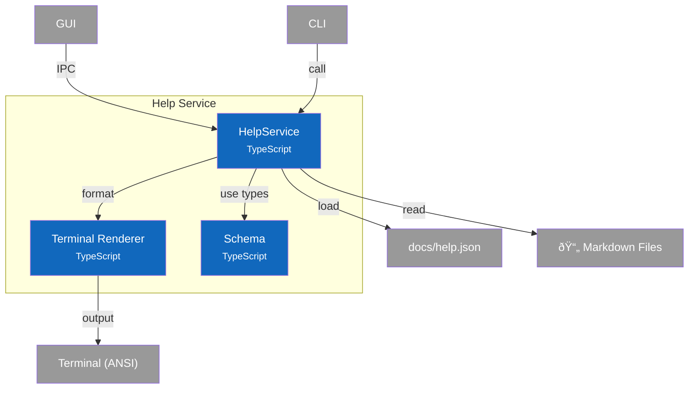

# C4 Component Diagram - Help Service

## Overview

Internal structure of the Help Service container, showing its components and their relationships.

## Component Diagram

## Components

| Component | Responsibility | Key Operations | Status | Notes |
|-----------|----------------|----------------|--------|-------|
| **HelpService** | Topic loading, search, formatting | `getTopic()`, `search()`, `getCategories()`, `getTopicContent()` | ✅ | `src/services/help/index.ts` |
| **Terminal Renderer** | Markdown to ANSI conversion | `renderMarkdownForTerminal()` | ✅ | `src/services/help/renderer.ts` |
| **Schema** | Type definitions | `HelpManifest`, `HelpTopic`, `HelpCategory`, `HelpSearchResult` | ✅ | `src/services/help/schema.ts` |

> **Code Details**: See [L4 Code - Help Service](4-code-help.md) for interface definitions, search algorithms, and terminal rendering table.

## Design Decisions

| Decision | Rationale |
|----------|-----------|
| Manifest-driven topics | Topics defined in JSON, content in markdown - easy to add new topics |
| Lazy loading | Manifest cached on first access, markdown files read on demand |
| Category grouping | Topics organized by category for better discoverability |
| Keyword search | Full-text search across title, summary, and explicit keywords |
| Format abstraction | Support terminal (CLI), HTML (GUI), raw (debugging) output |
| ANSI rendering | No external dependencies - built-in terminal formatting |
