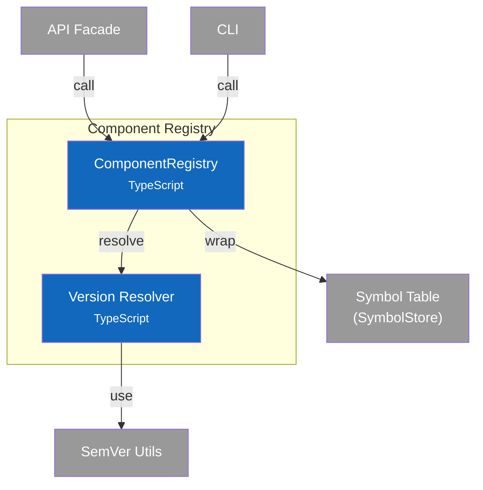

# C4 Component Diagram - Component Registry

## Overview

Internal structure of the Component Registry container, showing its components and their relationships.

## Component Diagram

## Components

| Component | Responsibility | Key Operations | Status | Notes |
|-----------|----------------|----------------|--------|-------|
| **ComponentRegistry** | High-level CRUD, query, version resolution | `register()`, `resolve()`, `query()`, `getVersions()` | ✅ | `src/services/registry/index.ts` |
| **Version Resolver** | SemVer constraint parsing and matching | `parseConstraint()`, `satisfies()`, `findBestMatch()`, `bumpVersion()` | ✅ | `src/services/registry/version.ts` |

> **Code Details**: See [L4 Code - Component Registry](4-code-registry.md) for interface definitions and version resolution algorithms.
>
> **Design Patterns**: See [ADR-001: Symbol Table Architecture](../adr/001-symbol-table-architecture.md) for registry concepts.

## Design Decisions

| Decision | Rationale |
|----------|-----------|
| Wrap SymbolStore | Registry adds version resolution, query logic on top of raw store |
| npm-style constraints | Familiar to JavaScript developers, well-defined semantics |
| Highest match wins | `findBestMatch` returns newest compatible version (like npm) |
| Caret default | `^1.2.3` allows minor updates, balances stability and updates |
| Filter chaining | Query applies filters in order, intersecting results |
| Reset status on bump | New version starts as `declared`, must be re-verified |
