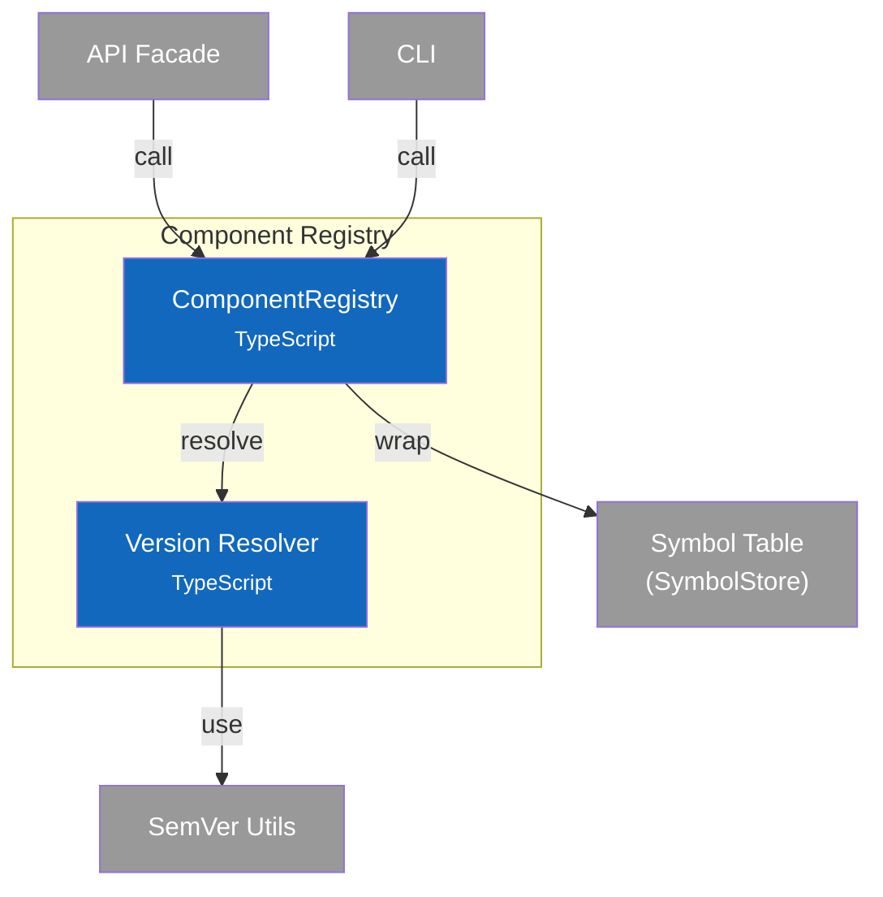
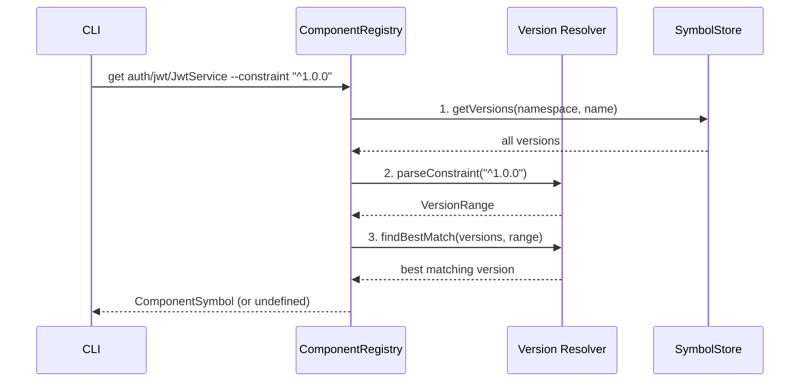
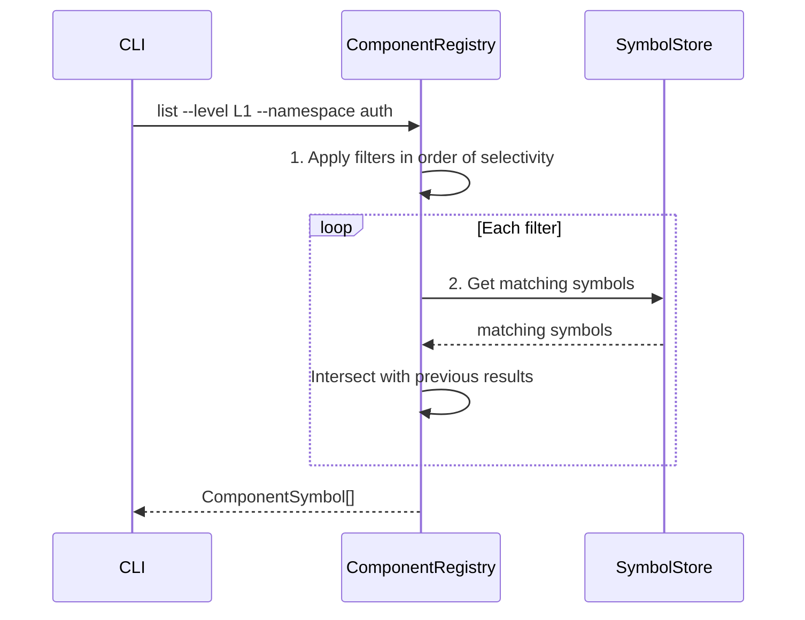
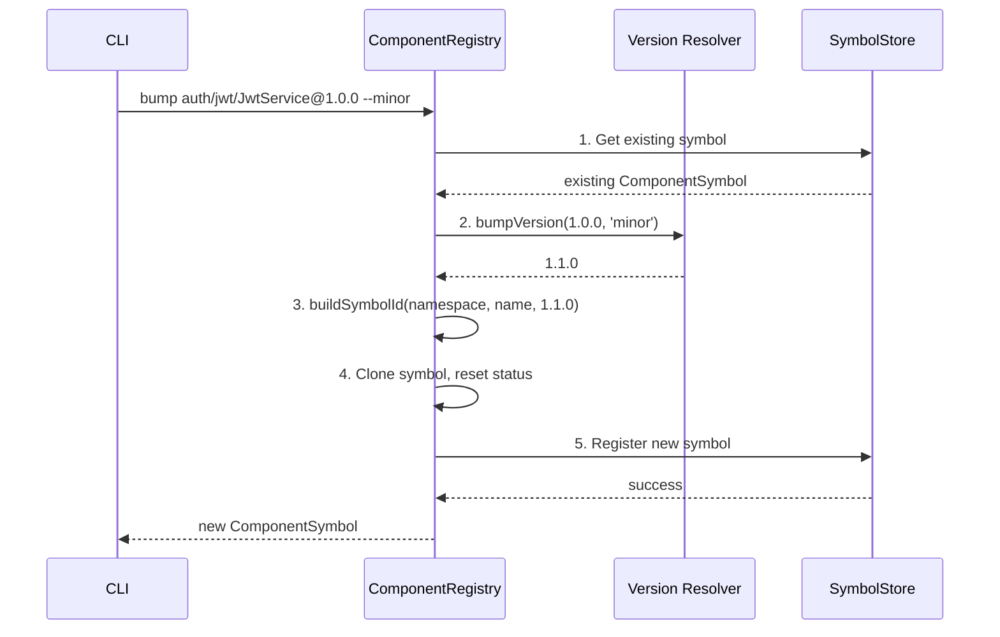

# C4 Component Diagram - Component Registry

> **Navigation**: [← Container](2-container.md) | [Index](index.md) | [Dynamic →](dynamic.md)

## Overview

Internal structure of the Component Registry container, showing its components and their relationships.

## Component Diagram



## Components

| Component | Responsibility | Key Operations | Status | Notes |
|-----------|----------------|----------------|--------|-------|
| **ComponentRegistry** | High-level CRUD, query, version resolution | `register()`, `resolve()`, `query()`, `getVersions()` | ✅ | `src/services/registry/index.ts` |
| **Version Resolver** | SemVer constraint parsing and matching | `parseConstraint()`, `satisfies()`, `findBestMatch()`, `bumpVersion()` | ✅ | `src/services/registry/version.ts` |

> **Design Patterns**: See [ADR-001: Symbol Table Architecture](../adr/001-symbol-table-architecture.md) for registry concepts.

## Key Interfaces

### ComponentRegistry API

```typescript
interface ComponentRegistry {
  // Registration
  register(component: ComponentInput): ComponentSymbol;
  registerNewVersion(existingId: string, bumpType: BumpType, changes?: Partial<ComponentSymbol>): ComponentSymbol;

  // Retrieval
  get(id: string): ComponentSymbol | undefined;
  resolve(namespace: string, name: string, options?: ResolveOptions): ComponentSymbol | undefined;
  getLatest(namespace: string, name: string): ComponentSymbol | undefined;
  getVersions(namespace: string, name: string): ComponentSymbol[];

  // Query
  query(filters: ComponentQuery): ComponentSymbol[];
  list(): ComponentSymbol[];
  search(query: string): ComponentSymbol[];

  // Updates
  update(id: string, updates: Partial<ComponentSymbol>): void;
  remove(id: string): void;

  // Relationships
  getContains(id: string): ComponentSymbol[];
  getContainedBy(id: string): ComponentSymbol | undefined;
  getDependents(id: string): ComponentSymbol[];
  getDependencies(id: string): ComponentSymbol[];

  // Connections
  connect(connection: Connection): void;
  disconnect(connectionId: string): void;
  getConnections(symbolId: string): Connection[];
  getAllConnections(): Connection[];

  // Status (ADR-005)
  findUnreachable(): ComponentSymbol[];
  findUntested(): ComponentSymbol[];

  // Origin (ADR-006)
  findGenerated(): ComponentSymbol[];
  findManual(): ComponentSymbol[];

  // Validation
  validate(): ValidationResult;
  validateComponent(id: string): ValidationResult;
  checkCircular(): string[][];

  // Bulk
  import(components: ComponentSymbol[]): void;
  export(): ComponentSymbol[];
}

type BumpType = 'major' | 'minor' | 'patch';
```

### Query Interface

```typescript
interface ComponentQuery {
  namespace?: string;
  level?: AbstractionLevel;
  kind?: ComponentKind;
  language?: Language;
  status?: SymbolStatus;
  origin?: SymbolOrigin;
  tag?: string;
  search?: string;
}

interface ResolveOptions {
  constraint?: string;      // e.g., "^1.0.0", ">=2.0.0"
  preferLatest?: boolean;   // Default: true
}
```

### Version Types

```typescript
interface SemVer {
  major: number;
  minor: number;
  patch: number;
  prerelease?: string;
  build?: string;
}

interface VersionRange {
  min?: SemVer;         // Inclusive minimum
  max?: SemVer;         // Exclusive maximum
  constraint?: string;  // Original constraint string
}
```

## Algorithms

### Version Constraint Parsing

Parses npm-style version constraints into `VersionRange`:

| Constraint | Meaning | VersionRange |
|------------|---------|--------------|
| `1.2.3` | Exact version | `{ min: 1.2.3, max: 1.2.4 }` |
| `^1.2.3` | Minor/patch updates | `{ min: 1.2.3, max: 2.0.0 }` |
| `~1.2.3` | Patch updates only | `{ min: 1.2.3, max: 1.3.0 }` |
| `>=1.2.3` | At least | `{ min: 1.2.3 }` |
| `<=1.2.3` | At most | `{ max: 1.2.4 }` |
| `>1.2.3` | Greater than | `{ min: 1.2.4 }` |
| `<1.2.3` | Less than | `{ max: 1.2.3 }` |
| `=1.2.3` | Exact (explicit) | `{ min: 1.2.3, max: 1.2.4 }` |
| `*` or `x` | Any version | `{}` |

```
function parseConstraint(constraint):
    trimmed = constraint.trim()

    if matches /^\d+\.\d+\.\d+$/:  // Exact: "1.2.3"
        v = parseSemVer(trimmed)
        return { min: v, max: nextPatch(v) }

    if startsWith '^':  // Caret: "^1.2.3"
        v = parseSemVer(trimmed.slice(1))
        return { min: v, max: { major: v.major + 1, minor: 0, patch: 0 } }

    if startsWith '~':  // Tilde: "~1.2.3"
        v = parseSemVer(trimmed.slice(1))
        return { min: v, max: { major: v.major, minor: v.minor + 1, patch: 0 } }

    if startsWith '>=':
        v = parseSemVer(trimmed.slice(2))
        return { min: v }

    if startsWith '<=':
        v = parseSemVer(trimmed.slice(2))
        return { max: nextPatch(v) }

    if startsWith '>':
        v = parseSemVer(trimmed.slice(1))
        return { min: nextPatch(v) }

    if startsWith '<':
        v = parseSemVer(trimmed.slice(1))
        return { max: v }

    if trimmed == '*' or trimmed == 'x':
        return {}  // Any version

    throw "Unknown constraint format"
```

### Satisfies Check

```
function satisfies(version, range):
    // Wildcard matches everything
    if range.constraint == '*' or range.constraint == 'x':
        return true

    // Check minimum bound (inclusive)
    if range.min:
        if compareSemVer(version, range.min) < 0:
            return false

    // Check maximum bound (exclusive)
    if range.max:
        if compareSemVer(version, range.max) >= 0:
            return false

    return true
```

### Find Best Match

```
function findBestMatch(versions, constraint):
    matching = versions.filter(v => satisfies(v, constraint))
    if matching.length == 0:
        return undefined

    // Sort descending (highest first)
    matching.sort((a, b) => -compareSemVer(a, b))

    return matching[0]  // Return highest matching version
```

### Version Comparison

```
function compareSemVer(a, b):
    if a.major != b.major: return a.major - b.major
    if a.minor != b.minor: return a.minor - b.minor
    return a.patch - b.patch
    // Note: prerelease comparison not shown for brevity
```

### Version Bump

```
function bumpVersion(version, type):
    switch type:
        case 'major': return { major: version.major + 1, minor: 0, patch: 0 }
        case 'minor': return { major: version.major, minor: version.minor + 1, patch: 0 }
        case 'patch': return { major: version.major, minor: version.minor, patch: version.patch + 1 }
```

## Data Flow

> **Scope**: These sequence diagrams show **internal component interactions** within the Component Registry container (L3). For container-to-container flows, see [Dynamic Diagram](dynamic.md).

### Resolve Component



### Query Components



### Register New Version



## Design Decisions

| Decision | Rationale |
|----------|-----------|
| Wrap SymbolStore | Registry adds version resolution, query logic on top of raw store |
| npm-style constraints | Familiar to JavaScript developers, well-defined semantics |
| Highest match wins | `findBestMatch` returns newest compatible version (like npm) |
| Caret default | `^1.2.3` allows minor updates, balances stability and updates |
| Filter chaining | Query applies filters in order, intersecting results |
| Reset status on bump | New version starts as `declared`, must be re-verified |
