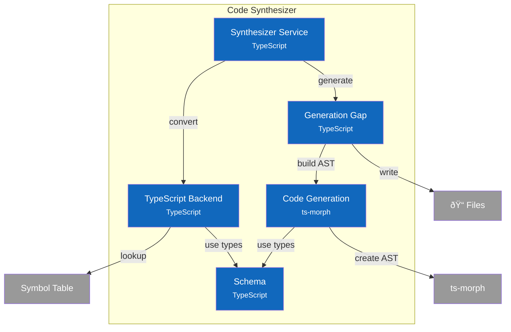

<!-- Part of C4 Architecture: see docs/c4/ for full navigation -->
# C4 Component Diagram - Code Synthesizer

## Overview

Internal structure of the Code Synthesizer container, showing its components and their relationships.

## Component Diagram



## Components

| Component | Responsibility | Key Operations | Status | Notes |
|-----------|----------------|----------------|--------|-------|
| **Synthesizer Service** | Orchestrator, public API | `generateSymbol()`, `generateAll()`, `previewSymbol()` | ✅ | `src/services/synthesizer/index.ts` |
| **TypeScript Backend** | Type mapping, symbol conversion | `symbolToComponent()`, `typeRefToTypeScript()`, `isGeneratable()` | ✅ | `src/services/synthesizer/backends/typescript.ts` |
| **Code Generation** | AST building using ts-morph | `createBaseClass()`, `addInputPortMethods()`, `addOutputPortMethods()` | ✅ | `src/services/synthesizer/codegen.ts` |
| **Generation Gap** | Two-file pattern (ADR-006) | `generateWithGap()`, `generateBaseClassContent()`, `generateUserStubContent()` | ✅ | `src/services/synthesizer/generation-gap.ts` |
| **Schema** | Type definitions, helpers | `GenerationResult`, `GeneratedComponent`, `GeneratedPort` | ✅ | `src/services/synthesizer/schema.ts` |

> **Design Patterns**: See [ADR-006: Generation Gap Pattern](../adr/006-generation-gap-pattern.md) for the two-file generation approach.

## Key Interfaces

### Synthesizer Service API

```typescript
interface SynthesizerService {
  generateSymbol(symbolId: string, options: GenerationOptions): GenerationResult;
  generateMultiple(symbolIds: string[], options: GenerationOptions): GenerationBatchResult;
  generateAll(options: GenerationOptions): GenerationBatchResult;
  previewSymbol(symbolId: string, outputDir: string): PreviewResult | null;
  listGeneratableSymbols(): ComponentSymbol[];
  canGenerate(symbolId: string): boolean;
}
```

### Generation Result Types

```typescript
interface GenerationResult {
  success: boolean;
  symbolId: string;
  generatedPath: string;        // .generated.ts file
  implementationPath: string;   // .ts file (user owns)
  contentHash: string;
  userFileCreated: boolean;
  warnings: string[];
}

interface GeneratedComponent {
  className: string;
  baseClassName: string;
  namespace: string;
  inputPorts: GeneratedPort[];
  outputPorts: GeneratedPort[];
}
```

### TypeScript Backend API

```typescript
interface TypeScriptBackend {
  symbolToComponent(symbol: ComponentSymbol): GeneratedComponent;
  typeRefToTypeScript(typeRef: TypeReference): string;
  isGeneratable(symbol: ComponentSymbol): boolean;  // Only L1 components
}
```

## Data Flow

> **Note**: All CLI/GUI requests route through [API Facade](2-container.md) before reaching Code Synthesizer.

### Generate Symbol

```
CLI/GUI → API Facade → Synthesizer Service
                              ↓
                       TypeScript Backend → Symbol Table (lookup)
                              ↓
                       Generation Gap
                              ↓
                       Code Generation → ts-morph (build AST)
                              ↓
                       File System (write .generated.ts + .ts)
```

### Preview Symbol

```
CLI/GUI → API Facade → Synthesizer Service
                              ↓
                       TypeScript Backend → Symbol Table (lookup)
                              ↓
                       Generation Gap → previewGeneration()
                              ↓
                       Return preview (no file I/O)
```

## Design Decisions

| Decision | Rationale |
|----------|-----------|
| Generation Gap pattern | Safe regeneration: .generated.ts always overwritten, .ts preserved |
| ts-morph for AST | Programmatic TypeScript generation with proper formatting |
| L1-only generation | Clear scope: L0 = types, L1 = implementations, L2+ = compositions |
| Port-based methods | HDL-inspired: `onInput()` handlers, `emitOutput()` emitters |
| Content hashing | SHA256 hash for change detection, avoid unnecessary rewrites |
