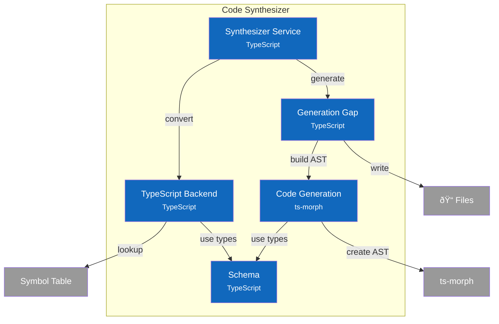

# C4 Component Diagram - Code Synthesizer

## Overview

Internal structure of the Code Synthesizer container, showing its components and their relationships.

## Component Diagram

## Components

| Component | Responsibility | Key Operations | Status | Notes |
|-----------|----------------|----------------|--------|-------|
| **Synthesizer Service** | Orchestrator, public API | `generateSymbol()`, `generateAll()`, `previewSymbol()` | ✅ | `src/services/synthesizer/index.ts` |
| **TypeScript Backend** | Type mapping, symbol conversion | `symbolToComponent()`, `typeRefToTypeScript()`, `isGeneratable()` | ✅ | `src/services/synthesizer/backends/typescript.ts` |
| **Code Generation** | AST building using ts-morph | `createBaseClass()`, `addInputPortMethods()`, `addOutputPortMethods()` | ✅ | `src/services/synthesizer/codegen.ts` |
| **Generation Gap** | Two-file pattern (ADR-006) | `generateWithGap()`, `generateBaseClassContent()`, `generateUserStubContent()` | ✅ | `src/services/synthesizer/generation-gap.ts` |
| **Schema** | Type definitions, helpers | `GenerationResult`, `GeneratedComponent`, `GeneratedPort` | ✅ | `src/services/synthesizer/schema.ts` |

> **Code Details**: See [L4 Code - Code Synthesizer](4-code-synthesizer.md) for interface definitions.
>
> **Design Patterns**: See [ADR-006: Generation Gap Pattern](../adr/006-generation-gap-pattern.md) for the two-file generation approach.

## Design Decisions

| Decision | Rationale |
|----------|-----------|
| Generation Gap pattern | Safe regeneration: .generated.ts always overwritten, .ts preserved |
| ts-morph for AST | Programmatic TypeScript generation with proper formatting |
| L1-only generation | Clear scope: L0 = types, L1 = implementations, L2+ = compositions |
| Port-based methods | HDL-inspired: `onInput()` handlers, `emitOutput()` emitters |
| Content hashing | SHA256 hash for change detection, avoid unnecessary rewrites |
