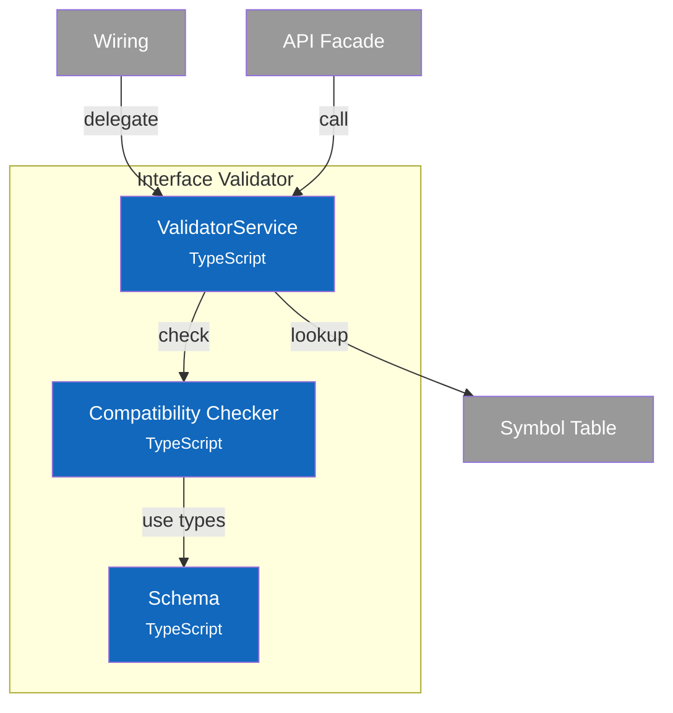

# C4 Component Diagram - Interface Validator

## Overview

Internal structure of the Interface Validator container, showing its components and their relationships.

## Component Diagram



## Components

| Component | Responsibility | Key Operations | Status | Notes |
|-----------|----------------|----------------|--------|-------|
| **ValidatorService** | Connection validation, required port checking | `checkPortCompatibility()`, `validateConnection()`, `validateAllConnections()` | ✅ | `src/services/validator/index.ts` |
| **Compatibility Checker** | Direction and type compatibility rules | `checkDirectionCompatibility()`, `checkTypeCompatibility()`, `checkPortCompatibility()` | ✅ | `src/services/validator/compatibility.ts` |
| **Schema** | Type definitions, error codes | `CompatibilityResult`, `ValidationOptions`, `ValidationErrorCode` | ✅ | `src/services/validator/schema.ts` |

> **Design Patterns**: See [ADR-003: Interface Definition System](../adr/003-interface-definition-system.md) for interface concepts.

## Key Interfaces

### ValidatorService API

```typescript
interface ValidatorService {
  // Port compatibility
  checkPortCompatibility(from: PortRef, to: PortRef): CompatibilityResult;
  checkDirectionCompatibility(from: PortDefinition, to: PortDefinition): CompatibilityResult;
  checkTypeCompatibility(from: PortDefinition, to: PortDefinition): CompatibilityResult;

  // Connection validation
  validateConnection(connection: Connection): ValidationResult;
  validateSymbolConnections(symbolId: string): ValidationResult;
  validateAllConnections(): ValidationResult;

  // Required port validation
  checkRequiredPorts(symbolId: string, ports: PortDefinition[]): ValidationError[];
  checkCardinality(symbolId: string): ValidationError[];

  // Port discovery
  findCompatiblePorts(from: PortRef, targetSymbolId: string): PortMatch[];
}

interface PortRef {
  symbolId: string;
  portName: string;
}
```

### Compatibility Result

```typescript
interface CompatibilityResult {
  compatible: boolean;
  reason?: string;           // Why incompatible (if !compatible)
  suggestions?: string[];    // How to fix
  score?: number;            // 0-100, for ranking matches
}
```

### Validation Options

```typescript
interface ValidationOptions {
  typeMode: TypeCompatibilityMode;  // 'strict' | 'compatible' | 'structural'
  checkRequired: boolean;           // Validate required ports have connections
  checkCardinality: boolean;        // Validate port cardinality limits
}

const DEFAULT_VALIDATION_OPTIONS: ValidationOptions = {
  typeMode: 'compatible',
  checkRequired: true,
  checkCardinality: true,
};
```

### Error Codes

```typescript
enum ValidationErrorCode {
  SYMBOL_NOT_FOUND = 'SYMBOL_NOT_FOUND',
  PORT_NOT_FOUND = 'PORT_NOT_FOUND',
  TYPE_MISMATCH = 'TYPE_MISMATCH',
  DIRECTION_MISMATCH = 'DIRECTION_MISMATCH',
  REQUIRED_PORT_UNCONNECTED = 'REQUIRED_PORT_UNCONNECTED',
  CARDINALITY_EXCEEDED = 'CARDINALITY_EXCEEDED',
  SELF_CONNECTION = 'SELF_CONNECTION',
}
```

## Compatibility Rules

### Direction Compatibility Matrix

| From \ To | `in` | `out` | `inout` |
|-----------|------|-------|---------|
| **`in`** | ❌ Both consume | ❌ Wrong flow | ❌ Wrong flow |
| **`out`** | ✅ Standard | ❌ Both produce | ✅ Output to bidirectional |
| **`inout`** | ✅ Bidirectional to input | ❌ Wrong flow | ✅ Two-way |

**Valid pairs**: `out→in`, `out→inout`, `inout→in`, `inout→inout`

### Type Compatibility Modes

| Mode | Behavior | Use Case |
|------|----------|----------|
| **strict** | Exact match required (symbolId + generics + nullable) | High-security contexts |
| **compatible** | Allow safe widening (non-null → nullable, subtypes) | Default mode |
| **structural** | Duck typing (same shape = compatible) | Maximum flexibility |

### Type Widening Rules (compatible mode)

Non-nullable can flow to nullable (widening is safe):
```
T → T | null  ✅ OK
T | null → T  ❌ Requires null check
```

Builtin numeric widening:
```
int8 → int16 → int32 → int64 → float64
       int8 → float32 → float64
```

### Compatibility Scoring

When finding compatible ports, scores indicate match quality:

| Scenario | Score |
|----------|-------|
| Exact type match, same nullability | 100 |
| Type widening (e.g., int32 → int64) | 90 |
| Nullability widening (T → T|null) | 95 |
| Both widening | 85 |

## Algorithms

### Check Port Compatibility

```
function checkPortCompatibility(fromPort, toPort, typeMode):
    // 1. Check direction first (fast fail)
    dirResult = checkDirectionCompatibility(fromPort.direction, toPort.direction)
    if not dirResult.compatible:
        return dirResult

    // 2. Check type compatibility
    typeResult = checkTypeCompatibility(fromPort.type, toPort.type, typeMode)
    if not typeResult.compatible:
        return typeResult

    // 3. Calculate combined score
    score = (dirResult.score + typeResult.score) / 2
    return compatible(score)
```

### Check Type Compatibility

```
function checkTypeCompatibility(fromType, toType, mode):
    if mode == 'strict':
        return checkStrictTypeMatch(fromType, toType)

    // Compatible mode
    if fromType.symbolId != toType.symbolId:
        // Check builtin widening rules
        if not isBuiltinCompatible(fromType.symbolId, toType.symbolId):
            return incompatible("Type mismatch")

    // Nullable check: non-null → nullable OK, nullable → non-null NOT OK
    if fromType.nullable and not toType.nullable:
        return incompatible("Nullable cannot flow to non-nullable")

    // Check generics recursively
    if not checkGenericsCompatibility(fromType.generics, toType.generics, mode):
        return incompatible("Generic parameter mismatch")

    return compatible(calculateScore(fromType, toType))
```

### Validate All Connections

```
function validateAllConnections():
    result = createValidationResult()

    // Validate each connection
    for each connection in store.getAllConnections():
        connResult = validateConnection(connection)
        result.errors.push(...connResult.errors)
        result.warnings.push(...connResult.warnings)

    // Check required ports for all symbols
    if options.checkRequired:
        for each symbol in store.list():
            requiredErrors = checkRequiredPorts(symbol.id, symbol.ports)
            result.errors.push(...requiredErrors)

    result.valid = result.errors.length == 0
    return result
```

## Data Flow

### Check Port Compatibility

```
Wiring.connect() or API.validate()
    ↓
ValidatorService.checkPortCompatibility(from, to)
    ↓
1. Lookup symbols from Symbol Table
    ↓
2. Find ports on symbols
    ↓
3. checkDirectionCompatibility(fromPort.direction, toPort.direction)
    ↓
4. checkTypeCompatibility(fromPort.type, toPort.type, typeMode)
    ↓
Return CompatibilityResult
```

### Find Compatible Ports

```
GUI: User drags from port, find valid targets
    ↓
ValidatorService.findCompatiblePorts(from, targetSymbolId)
    ↓
1. Get source port from Symbol Table
    ↓
2. Get target symbol, iterate its ports
    ↓
3. For each port, checkPortCompatibility()
    ↓
4. Collect compatible ports with scores
    ↓
5. Sort by score descending
    ↓
Return PortMatch[] (port, compatibility, score)
```

## Design Decisions

| Decision | Rationale |
|----------|-----------|
| Direction-first checking | Fast fail on obvious mismatches before expensive type checking |
| Three type modes | Strict for safety, compatible for convenience, structural for flexibility |
| Numeric widening | Match common programming language semantics (int32 → int64 safe) |
| Nullable widening | T → T|null is safe (widening), reverse requires runtime check |
| Compatibility scoring | Enable ranking of port matches in GUI for best suggestions |
| Separate from Wiring | Single responsibility: Wiring coordinates, Validator owns rules |
