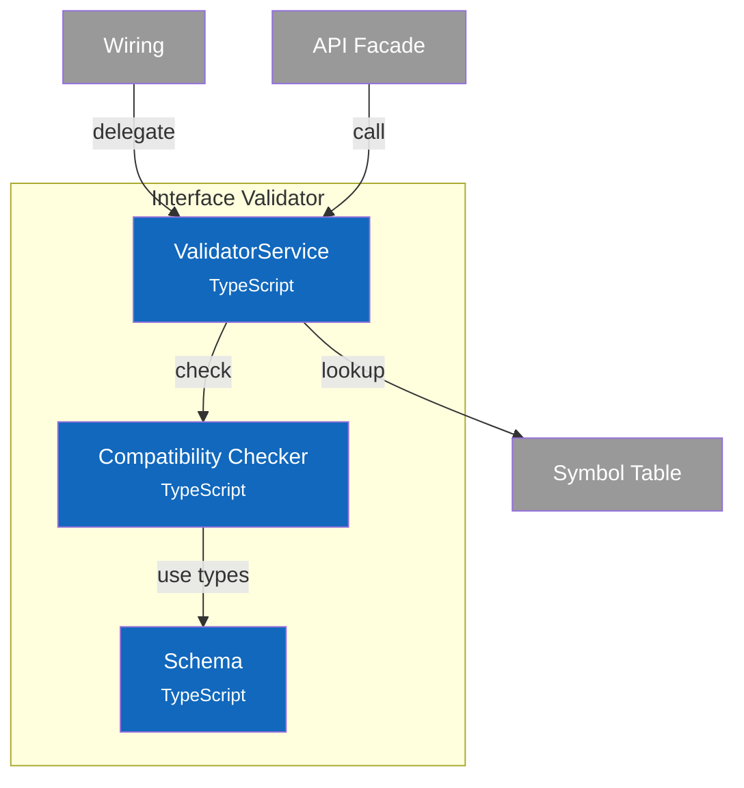

# C4 Component Diagram - Interface Validator

## Overview

Internal structure of the Interface Validator container, showing its components and their relationships.

## Component Diagram

## Components

| Component | Responsibility | Key Operations | Status | Notes |
|-----------|----------------|----------------|--------|-------|
| **ValidatorService** | Connection validation, required port checking | `checkPortCompatibility()`, `validateConnection()`, `validateAllConnections()` | ✅ | `src/services/validator/index.ts` |
| **Compatibility Checker** | Direction and type compatibility rules | `checkDirectionCompatibility()`, `checkTypeCompatibility()`, `checkPortCompatibility()` | ✅ | `src/services/validator/compatibility.ts` |
| **Schema** | Type definitions, error codes | `CompatibilityResult`, `ValidationOptions`, `ValidationErrorCode` | ✅ | `src/services/validator/schema.ts` |

> **Code Details**: See [L4 Code - Interface Validator](4-code-validator.md) for interface definitions, compatibility rules, and validation algorithms.
>
> **Design Patterns**: See [ADR-003: Interface Definition System](../adr/003-interface-definition-system.md) for interface concepts.

## Design Decisions

| Decision | Rationale |
|----------|-----------|
| Direction-first checking | Fast fail on obvious mismatches before expensive type checking |
| Three type modes | Strict for safety, compatible for convenience, structural for flexibility |
| Numeric widening | Match common programming language semantics (int32 → int64 safe) |
| Nullable widening | T → T|null is safe (widening), reverse requires runtime check |
| Compatibility scoring | Enable ranking of port matches in GUI for best suggestions |
| Separate from Wiring | Single responsibility: Wiring coordinates, Validator owns rules |
