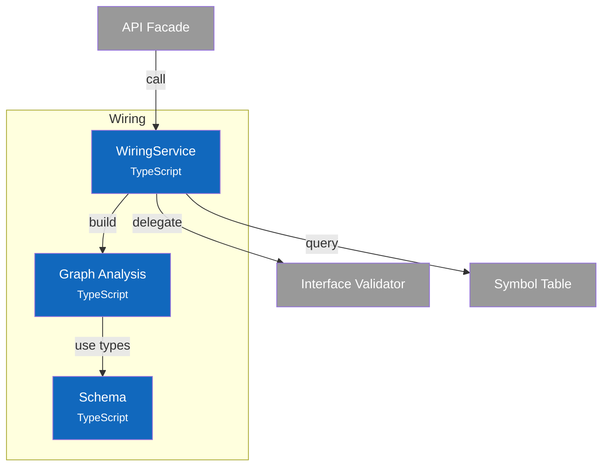

# C4 Component Diagram - Wiring Service

## Overview

Internal structure of the Wiring container, showing its components and their relationships.

## Component Diagram

## Components

| Component | Responsibility | Key Operations | Status | Notes |
|-----------|----------------|----------------|--------|-------|
| **WiringService** | Connection operations, validation orchestration | `connect()`, `disconnect()`, `validateConnection()`, `findCompatiblePorts()` | ✅ | `src/services/wiring/index.ts` |
| **Graph Analysis** | Dependency graph algorithms | `buildDependencyGraph()`, `detectCycles()`, `topologicalSort()`, `getUpstreamDependencies()` | ✅ | `src/services/wiring/graph.ts` |
| **Schema** | Type definitions, error codes | `DependencyGraph`, `GraphNode`, `GraphEdge`, `WiringErrorCode` | ✅ | `src/services/wiring/schema.ts` |

> **Code Details**: See [L4 Code - Wiring Service](4-code-wiring.md) for interface definitions and graph algorithms.
>
> **Design Patterns**: See [ADR-003: Interface Definition System](../adr/003-interface-definition-system.md) for wiring concepts.

## Design Decisions

| Decision | Rationale |
|----------|-----------|
| Pre-connection cycle check | Prevent cycles before creating connection (wouldCreateCycle) |
| Kahn's algorithm for topo sort | O(V+E) complexity, handles disconnected components |
| DFS for cycle detection | Natural fit for finding back edges in directed graph |
| Cardinality enforcement | Ports without `multiple: true` accept only one connection |
| Delegate validation | WiringService coordinates, Validator owns compatibility rules |
| Connected components | Identify disconnected subgraphs for isolated analysis |
