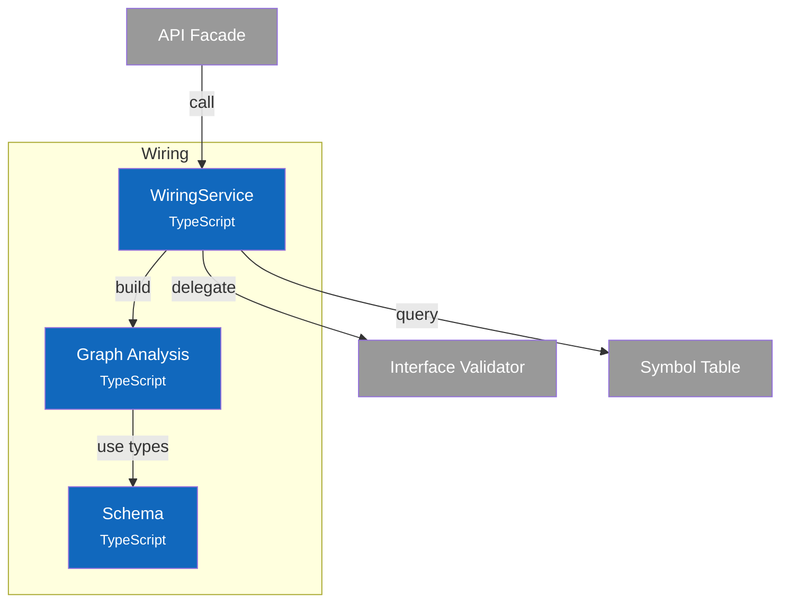
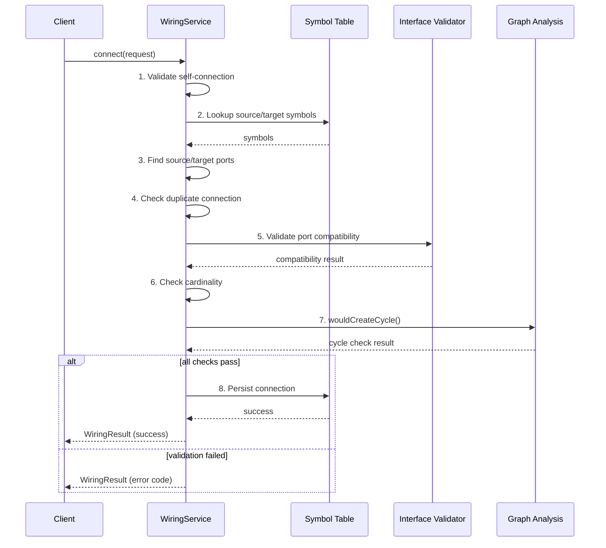
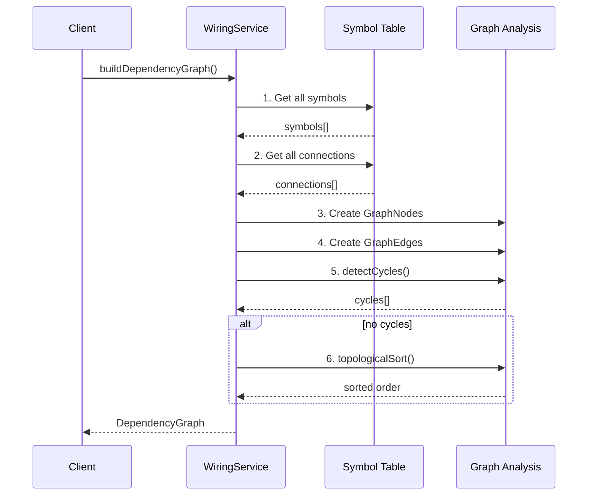

# C4 Component Diagram - Wiring Service

> **Navigation**: [← Container](2-container.md) | [Index](index.md) | [Dynamic →](dynamic.md)

## Overview

Internal structure of the Wiring container, showing its components and their relationships.

## Component Diagram



## Components

| Component | Responsibility | Key Operations | Status | Notes |
|-----------|----------------|----------------|--------|-------|
| **WiringService** | Connection operations, validation orchestration | `connect()`, `disconnect()`, `validateConnection()`, `findCompatiblePorts()` | ✅ | `src/services/wiring/index.ts` |
| **Graph Analysis** | Dependency graph algorithms | `buildDependencyGraph()`, `detectCycles()`, `topologicalSort()`, `getUpstreamDependencies()` | ✅ | `src/services/wiring/graph.ts` |
| **Schema** | Type definitions, error codes | `DependencyGraph`, `GraphNode`, `GraphEdge`, `WiringErrorCode` | ✅ | `src/services/wiring/schema.ts` |

> **Design Patterns**: See [ADR-003: Interface Definition System](../adr/003-interface-definition-system.md) for wiring concepts.

## Key Interfaces

### WiringService API

```typescript
interface WiringService {
  // Connection operations
  connect(request: ConnectionRequest): WiringResult;
  disconnect(connectionId: string): WiringResult;
  getConnections(symbolId: string): Connection[];
  getAllConnections(): Connection[];

  // Graph operations
  buildDependencyGraph(): DependencyGraph;
  buildSubgraph(symbolId: string): DependencyGraph;
  getDependencyGraphDTO(): DependencyGraphDTO;

  // Graph analysis
  detectCycles(): string[][];
  getTopologicalOrder(): string[] | null;
  getUpstreamDependencies(symbolId: string): string[];
  getDownstreamDependencies(symbolId: string): string[];
  getDirectDependencies(symbolId: string): { upstream: string[]; downstream: string[] };
  getRootNodes(): string[];
  getLeafNodes(): string[];
  getConnectedComponents(): string[][];
  getGraphStats(): GraphStats;

  // Validation
  validateAllConnections(): ValidationResult;
  validateSymbolConnections(symbolId: string): ValidationResult;
  validateConnection(request: ConnectionRequest): ValidationResult;
  findCompatiblePorts(fromSymbolId: string, fromPort: string): PortMatch[];

  // Required port analysis
  findUnconnectedRequiredPorts(): UnconnectedPort[];
  hasAllRequiredPortsConnected(symbolId: string): boolean;
}
```

### Graph Types

```typescript
interface DependencyGraph {
  nodes: Map<string, GraphNode>;
  edges: Map<string, GraphEdge[]>;  // keyed by fromSymbolId
  cycles: string[][];
  topologicalOrder: string[] | null;
}

interface GraphNode {
  symbolId: string;
  name: string;
  namespace: string;
  level: AbstractionLevel;
  inputs: PortDefinition[];
  outputs: PortDefinition[];
}

interface GraphEdge {
  connectionId: string;
  fromSymbol: string;
  fromPort: string;
  toSymbol: string;
  toPort: string;
}

interface GraphStats {
  nodeCount: number;
  edgeCount: number;
  rootCount: number;
  leafCount: number;
  maxDepth: number;
  hasCycles: boolean;
  componentCount: number;  // disconnected subgraphs
}
```

### Error Codes

```typescript
enum WiringErrorCode {
  SELF_CONNECTION = 'SELF_CONNECTION',
  SOURCE_SYMBOL_NOT_FOUND = 'SOURCE_SYMBOL_NOT_FOUND',
  TARGET_SYMBOL_NOT_FOUND = 'TARGET_SYMBOL_NOT_FOUND',
  SOURCE_PORT_NOT_FOUND = 'SOURCE_PORT_NOT_FOUND',
  TARGET_PORT_NOT_FOUND = 'TARGET_PORT_NOT_FOUND',
  DUPLICATE_CONNECTION = 'DUPLICATE_CONNECTION',
  INCOMPATIBLE_PORTS = 'INCOMPATIBLE_PORTS',
  TARGET_PORT_FULL = 'TARGET_PORT_FULL',
  WOULD_CREATE_CYCLE = 'WOULD_CREATE_CYCLE',
  CONNECTION_NOT_FOUND = 'CONNECTION_NOT_FOUND',
}
```

## Algorithms

### Cycle Detection (DFS with Recursion Stack)

```
function detectCycles(graph):
    cycles = []
    visited = Set()
    recursionStack = Set()

    function dfs(nodeId, path):
        visited.add(nodeId)
        recursionStack.add(nodeId)

        for each edge from nodeId:
            neighbor = edge.toSymbol
            if neighbor not in visited:
                dfs(neighbor, path + [neighbor])
            else if neighbor in recursionStack:
                // Found cycle - extract from path
                cycleStart = path.indexOf(neighbor)
                cycles.push(path.slice(cycleStart))

        recursionStack.remove(nodeId)

    for each node in graph.nodes:
        if node not in visited:
            dfs(node, [node])

    return deduplicateCycles(cycles)
```

### Topological Sort (Kahn's Algorithm)

```
function topologicalSort(graph):
    // Calculate in-degrees
    inDegree = Map()
    for each node: inDegree[node] = 0
    for each edge: inDegree[edge.toSymbol]++

    // Find nodes with no incoming edges
    queue = [nodes where inDegree == 0]
    result = []

    while queue not empty:
        node = queue.shift()
        result.push(node)

        for each edge from node:
            inDegree[edge.toSymbol]--
            if inDegree[edge.toSymbol] == 0:
                queue.push(edge.toSymbol)

    // If we couldn't process all nodes, there's a cycle
    if result.length != graph.nodes.size:
        return null

    return result
```

### Connected Components (BFS)

```
function getConnectedComponents(graph):
    visited = Set()
    components = []

    // Build undirected adjacency (treat edges as bidirectional)
    adjacency = buildUndirectedAdjacency(graph)

    function bfs(startId):
        component = []
        queue = [startId]

        while queue not empty:
            nodeId = queue.shift()
            if nodeId in visited: continue
            visited.add(nodeId)
            component.push(nodeId)

            for each neighbor in adjacency[nodeId]:
                if neighbor not in visited:
                    queue.push(neighbor)

        return component

    for each node in graph.nodes:
        if node not in visited:
            component = bfs(node)
            components.push(component)

    return components
```

### Would-Create-Cycle Check

```
function wouldCreateCycle(graph, fromSymbolId, toSymbolId):
    // A cycle would be created if toSymbol can already reach fromSymbol
    // (i.e., fromSymbol is downstream of toSymbol)
    downstream = getDownstreamDependencies(graph, toSymbolId)
    return fromSymbolId in downstream || fromSymbolId == toSymbolId
```

## Data Flow

> **Scope**: These sequence diagrams show **internal component interactions** within the Wiring container (L3). For container-to-container flows, see [Dynamic Diagram](dynamic.md).

### Connect Ports



### Build Dependency Graph



## Design Decisions

| Decision | Rationale |
|----------|-----------|
| Pre-connection cycle check | Prevent cycles before creating connection (wouldCreateCycle) |
| Kahn's algorithm for topo sort | O(V+E) complexity, handles disconnected components |
| DFS for cycle detection | Natural fit for finding back edges in directed graph |
| Cardinality enforcement | Ports without `multiple: true` accept only one connection |
| Delegate validation | WiringService coordinates, Validator owns compatibility rules |
| Connected components | Identify disconnected subgraphs for isolated analysis |
