# C4 Component Diagram - Symbol Table

## Overview

Internal structure of the Symbol Table container, showing its components and their relationships.

> **Implementation Status Legend:**
> - ✅ **Implemented** - Working in current codebase
> - 🔮 **Planned** - Defined in ADRs, not yet implemented

## Component Diagram

```mermaid
flowchart TD
    subgraph st ["Symbol Table"]
        store["Symbol Store<br/><small>TypeScript</small>"]
        query["Query Engine<br/><small>TypeScript</small>"]
        version["Version Resolver<br/><small>TypeScript</small>"]
        conn["Connection Manager<br/><small>TypeScript</small>"]
        status["Status Tracker<br/><small>TypeScript</small>"]
        persist["Persistence Layer<br/><small>TypeScript</small>"]
    end

    query -->|"lookup"| store
    version -->|"resolve"| store
    conn -->|"update"| store
    status -->|"track"| store
    store -->|"persist"| persist
    persist -->|"write"| db[("SQLite")]

    conn -->|"validate"| val["Interface Validator<br/><small>Zod</small>"]
    analyzer["Static Analyzer 🔮<br/><small>ts-morph</small>"] -.->|"mark status"| status

    classDef component fill:#1168bd,color:#fff
    classDef storage fill:#438dd5,color:#fff
    classDef external fill:#999,color:#fff
    classDef planned fill:#666,color:#fff,stroke-dasharray:5

    class store,query,version,conn,status,persist component
    class db storage
    class val external
    class analyzer planned
```



> **C4 Navigation**: [L1: Context](1-context.md) | [L2: Containers](2-container.md) | [Dynamic Flows](dynamic.md)

## Components

| Component | Responsibility | Key Operations | Status | Notes |
|-----------|----------------|----------------|--------|-------|
| **Symbol Store** | In-memory symbol cache | `register()`, `get()`, `update()`, `remove()` | ✅ | `src/services/symbol-table/store.ts` |
| **Query Engine** | Symbol discovery | `findByNamespace()`, `findByLevel()`, `search()` | ✅ | Integrated in Symbol Store |
| **Version Resolver** | SemVer compatibility | `findCompatible()`, `getLatest()`, `checkConstraint()` | ✅ | In `src/services/registry/` |
| **Connection Manager** | Port wiring | `connect()`, `disconnect()`, `getConnections()` | ✅ | `src/services/symbol-table/store.ts` |
| **Status Tracker** | Usage tracking | `updateStatus()`, `findUnreachable()`, `findUntested()` | ✅ | Integrated in Symbol Store |
| **Persistence Layer** | Database I/O | `load()`, `save()`, `transaction()` | ✅ | `src/repositories/persistence.ts` |

> **Design Patterns**: See [ADR-008: Design Patterns](../adr/008-design-patterns.md) for complete pattern documentation.
>
> **Note**: Some components shown as separate in the diagram are integrated into a single implementation for simplicity. The conceptual separation remains valid for understanding responsibilities.

## Key Interfaces

### Symbol Store API

```typescript
interface SymbolStore {
  register(symbol: ComponentSymbol): void;
  get(id: string): ComponentSymbol | undefined;
  update(id: string, updates: Partial<ComponentSymbol>): void;
  remove(id: string): void;
  all(): ComponentSymbol[];
}
```

### Query Engine API

```typescript
interface QueryEngine {
  findByNamespace(namespace: string): ComponentSymbol[];
  findByLevel(level: AbstractionLevel): ComponentSymbol[];
  findByKind(kind: ComponentKind): ComponentSymbol[];
  findByTag(tag: string): ComponentSymbol[];
  search(query: string): ComponentSymbol[];
}
```

### Connection Manager API

```typescript
interface ConnectionManager {
  connect(connection: Connection): ValidationResult;
  disconnect(connectionId: string): void;
  getConnections(symbolId: string): Connection[];
  getAllConnections(): Connection[];
  validate(): ValidationResult;
}
```

> **Type Definitions**: See [Symbol Table Schema](../spec/symbol-table-schema.md) for complete type definitions.

## Data Flow

> **Note**: All CLI/GUI requests route through [API Facade](2-container.md) before reaching Symbol Table.

### Register Symbol

```
CLI/GUI → API Facade → Symbol Store → Persistence Layer → SQLite
                              ↓
                        Query Engine (index update)
```

### Query Symbol

```
CLI/GUI → API Facade → Query Engine → Symbol Store (cache hit)
                                   ↓
                             Persistence Layer → SQLite (cache miss)
```

### Connect Ports

```
CLI/GUI → API Facade → Connection Manager → Interface Validator (type check)
                                        ↓
                                   Symbol Store (persist connection)
```

## Design Decisions

| Decision | Rationale |
|----------|-----------|
| In-memory cache | Fast queries, SQLite for durability |
| Separate Query Engine | Complex queries isolated from CRUD |
| Status Tracker as component | ADR-005 dead code detection integrated |
| Connection validation delegated | Interface Validator owns type checking |
