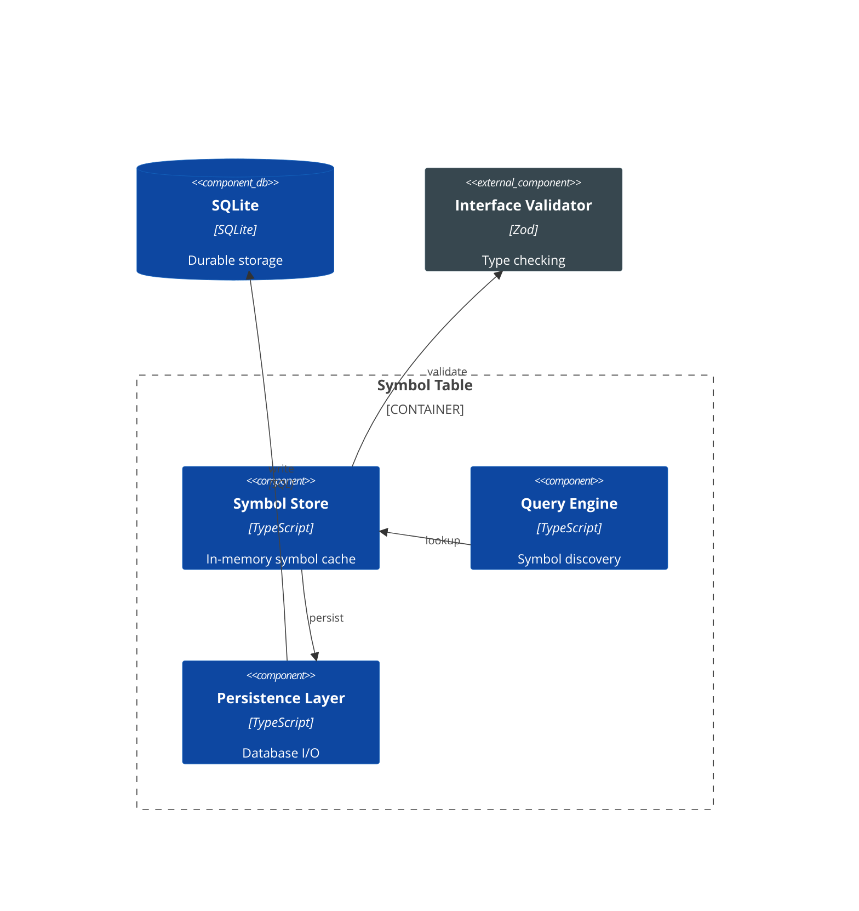
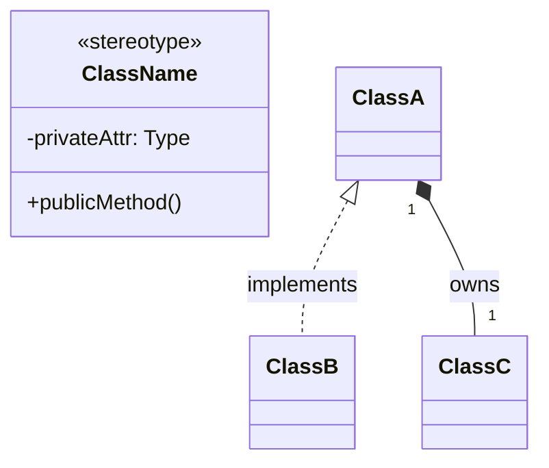
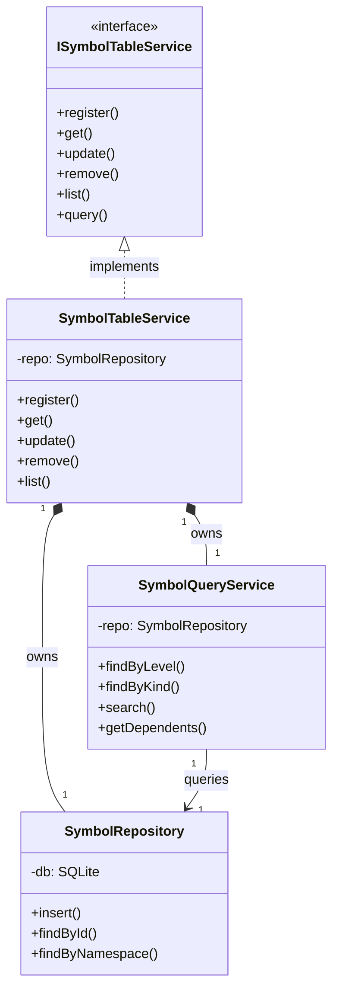

# C4 Diagram Authoring Guide

This guide documents the standards and patterns for creating C4 architecture diagrams in cyrus-code. It covers Mermaid syntax, styling conventions, and content structure for Level 3 (Component) and Level 4 (Code) diagrams.

## Overview

| Level | Diagram Type | Mermaid Syntax | Purpose |
|-------|-------------|----------------|---------|
| C4-1 | Context | `C4Context` | System + external actors |
| C4-2 | Container | `C4Container` | Deployable units |
| **C4-3** | **Component** | **`C4Component`** | Internal structure of a container |
| **C4-4** | **Code** | **`classDiagram`** | Implementation architecture (UML) |

> **Note**: This guide focuses on Level 3 and Level 4 diagrams. For Context and Container diagrams, see the existing `1-context.md` and `2-container.md`.

---

## Level 3: Component Diagrams

### Syntax Overview

Use Mermaid's native `C4Component` diagram type for proper C4 shapes and semantics.

```mermaid
C4Component
    Container_Boundary(id, "Container Name") {
        Component(id, "Name", "Technology", "Description")
        Component(id2, "Name2", "Technology", "Description")
    }

    ComponentDb(db, "Database", "Technology", "Description")
    Component_Ext(ext, "External", "Technology", "Description")

    Rel(from, to, "label")
    Rel(from, to, "label", "technology")
```

### Element Types

| Element | Syntax | Visual | Use For |
|---------|--------|--------|---------|
| Internal Component | `Component(id, "Name", "Tech", "Desc")` | Blue rectangle | Services, modules within the container |
| Database Component | `ComponentDb(id, "Name", "Tech", "Desc")` | Cylinder | Databases, persistent storage |
| External Component | `Component_Ext(id, "Name", "Tech", "Desc")` | Gray rectangle | External dependencies |
| Container Boundary | `Container_Boundary(id, "Name") { ... }` | Dashed border | Groups internal components |

### Relationships

```mermaid
Rel(source, target, "label")           %% Basic relationship
Rel(source, target, "label", "tech")   %% With technology annotation
```

- Use verb phrases: "lookup", "persist", "validate", "write"
- Add technology when relevant: `"write", "SQL"`

### Styling for Dark Theme

Mermaid C4 diagrams use a fixed color palette. Override with `UpdateElementStyle()` for better contrast on dark backgrounds:

```mermaid
C4Component
    %% ... components and relationships ...

    %% Dark blue for internal components (better contrast with white text)
    UpdateElementStyle(store, $bgColor="#0d47a1", $fontColor="#ffffff", $borderColor="#1565c0")

    %% Dark gray for external components
    UpdateElementStyle(ext, $bgColor="#37474f", $fontColor="#ffffff", $borderColor="#546e7a")
```

**Color Reference:**
| Element Type | Background | Border | Font |
|-------------|-----------|--------|------|
| Internal Component | `#0d47a1` | `#1565c0` | `#ffffff` |
| External Component | `#37474f` | `#546e7a` | `#ffffff` |
| Database | `#0d47a1` | `#1565c0` | `#ffffff` |

### Complete Example



---

## Level 4: Code Diagrams

### Syntax Overview

Use Mermaid's `classDiagram` for UML class diagrams showing implementation architecture.



### Direction

Use `direction TB` (top-to-bottom) for vertical layouts that fit well in the help dialog:

```mermaid
classDiagram
    direction TB
    %% ... classes ...
```

> **Note**: `direction LR` creates horizontal layouts that can be too wide for the content area. Prefer `direction TB` for better readability.

### Class Structure

```mermaid
class ISymbolTableService {
    <<interface>>
    +register()
    +get()
    +update()
}

class SymbolTableService {
    -repo: SymbolRepository
    -queryService: SymbolQueryService
    +register()
    +get()
}
```

**Conventions:**
- Use `<<interface>>` stereotype for interfaces
- Prefix private members with `-`
- Prefix public members with `+`
- Include key attributes and methods (not exhaustive)
- Limit to 4-7 items per class for readability

### Relationships

| Relationship | Syntax | Meaning |
|-------------|--------|---------|
| Implements | `A <\|.. B : implements` | B implements interface A |
| Composition | `A "1" *-- "1" B : owns` | A owns B (lifecycle dependency) |
| Association | `A "1" --> "1" B : uses` | A uses B |
| Inheritance | `A <\|-- B : extends` | B extends A |

**Always include:**
1. **Labels**: `: implements`, `: owns`, `: queries`
2. **Cardinality**: `"1"`, `"*"`, `"0..1"` where relevant

### Readability Guidelines

1. **Limit classes**: 4-5 classes maximum per diagram
2. **Limit members**: 4-7 methods/attributes per class
3. **Focus on architecture**: Show structure, not every method
4. **Use vertical layout**: `direction TB` for help dialog

### Complete Example



---

## Document Structure

### File Naming

- C4 documentation: `{container-name}.md` (e.g., `symbol-table.md`)
- Place in `docs/c4/`

### Markdown Structure

```markdown
# C4 - {Container Name}

## Component Diagram

```mermaid
C4Component
    %% Level 3 diagram
```

*Figure: Brief description of what the diagram shows.*

### Components

| Component | Responsibility | Key Operations | Status | Notes |
|-----------|----------------|----------------|--------|-------|
| **Name** | What it does | `method1()`, `method2()` | ✅ | `src/path/file.ts` |

### Design Decisions

| Decision | Rationale |
|----------|-----------|
| Decision 1 | Why we made it |

---

## Code Diagram

*C4-4 UML class diagram showing the {container} implementation architecture.*

```mermaid
classDiagram
    %% Level 4 diagram
```

*Figure: Description of the code architecture.*

### Architecture Story

Narrative explanation of the layers and patterns.

### Core Types

| Type | Purpose | Key Fields |
|------|---------|------------|
| `TypeName` | What it represents | `field1`, `field2` |

### Design Patterns Applied

| Pattern | Class | Purpose |
|---------|-------|---------|
| **Pattern Name** | `ClassName` | Why we used it |

### Source Files

| File | Responsibility |
|------|----------------|
| `src/path/file.ts` | What it contains |
```

### Figure Captions

Use italic markdown for figure captions. They will be styled automatically:

```markdown
*Figure: Description of the diagram.*
```

- Place immediately after the diagram code block
- Start with "Figure:"
- Keep concise but descriptive

---

## Rendering Considerations

### Help Dialog

Diagrams render in the help dialog with these constraints:
- Dark background (`#0d1117`)
- Limited width (~800px content area)
- White text forced via CSS

### Testing

Run Playwright E2E tests to verify rendering:

```bash
npm run test:e2e -- --grep "C4 Component Diagram"
npm run test:e2e -- --grep "Symbol Table UML"
```

Screenshots saved to `/tmp/cyrus-code/screenshots/`.

---

## Anti-Patterns

### Avoid

1. **Inline titles in C4 diagrams** - Use markdown headers instead
   ```mermaid
   %% DON'T: Duplicate title
   C4Component
       title Symbol Table - Component Diagram  %% Remove this
   ```

2. **Hub-and-spoke relationships** - Avoid one component connecting to many others
   - Mermaid C4 layouts components horizontally in a row
   - Multiple relationships from one component cause wire crossings
   - Use linear chains: A → B → C → D (each connects only to neighbors)

3. **Too many classes** - Keep Level 4 diagrams to 4-5 classes

4. **Exhaustive method lists** - Show key methods, not everything

5. **Default C4 colors on dark theme** - Always use `UpdateElementStyle()`

6. **Horizontal layout for UML** - Use `direction TB` for better fit

### Prefer

1. **Markdown headers for titles** - `## Component Diagram`
2. **Linear chains in Level 3** - Store → Query → Conn → Persist → DB (each connects only to neighbors)
3. **Focused class diagrams** - Architectural overview, not exhaustive
4. **Labeled relationships** - `: implements`, `: owns`, `: queries`
5. **Cardinality** - `"1" *-- "1"` for clarity
6. **Dark blue backgrounds** - `#0d47a1` for contrast

---

## References

- [Mermaid C4 Diagrams](https://mermaid.js.org/syntax/c4.html)
- [C4 Model](https://c4model.com/)
- [ADR-008: Design Patterns](../adr/008-design-patterns.md)
