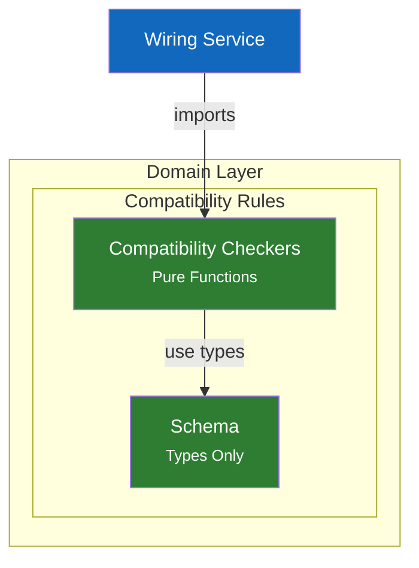

# C4 Component Diagram - Compatibility (Domain Layer)

## Overview

Port compatibility checking is a **domain concern** containing pure business rules. Located in `src/domain/compatibility/` - no service class, just pure functions.

> **Architecture Note**: Compatibility was moved from services/ to domain/ (2024-12) because it contains pure business rules with no state, no I/O, and no service dependencies.

## Component Diagram



## Components

| Component | Responsibility | Key Operations | Location |
|-----------|----------------|----------------|----------|
| **Compatibility Checkers** | Pure functions for port compatibility | `checkPortCompatibility()`, `checkDirectionCompatibility()`, `checkTypeCompatibility()` | `src/domain/compatibility/checkers.ts` |
| **Schema** | Type definitions | `CompatibilityResult`, `TypeCompatibilityMode` | `src/domain/compatibility/schema.ts` |

> **Design Patterns**: See [ADR-003: Interface Definition System](../adr/003-interface-definition-system.md) for interface concepts.

## Design Decisions

| Decision | Rationale |
|----------|-----------|
| Direction-first checking | Fast fail on obvious mismatches before expensive type checking |
| Three type modes | Strict for safety, compatible for convenience, structural for flexibility |
| Numeric widening | Match common programming language semantics (int32 → int64 safe) |
| Nullable widening | T → T|null is safe (widening), reverse requires runtime check |
| Compatibility scoring | Enable ranking of port matches in GUI for best suggestions |
| Separate from Wiring | Single responsibility: Wiring coordinates, Compatibility owns rules |

---

## Code Details

### Quick Reference

| Function | Purpose |
|----------|---------|
| `checkPortCompatibility()` | Check if two ports can be connected |
| `checkDirectionCompatibility()` | Validate port direction flow |
| `checkTypeCompatibility()` | Validate type compatibility |

### Types (from `src/domain/compatibility/schema.ts`)

```typescript
// Compatibility check result
interface CompatibilityResult {
  compatible: boolean;
  score: number;        // 0-100, higher = better match
  reason?: string;      // Explanation if incompatible
}

// Type matching strictness
type TypeCompatibilityMode = 'strict' | 'compatible' | 'structural';
```

### Compatibility Rules

#### Direction Compatibility Matrix

| From \ To | `in` | `out` | `inout` |
|-----------|------|-------|---------|
| **`in`** | Both consume | Wrong flow | Wrong flow |
| **`out`** | Standard | Both produce | Output to bidirectional |
| **`inout`** | Bidirectional to input | Wrong flow | Two-way |

**Valid pairs**: `out->in`, `out->inout`, `inout->in`, `inout->inout`

#### Type Compatibility Modes

| Mode | Behavior | Use Case |
|------|----------|----------|
| **strict** | Exact match required (symbolId + generics + nullable) | High-security contexts |
| **compatible** | Allow safe widening (non-null -> nullable, subtypes) | Default mode |
| **structural** | Duck typing (same shape = compatible) | Maximum flexibility |

#### Type Widening Rules (compatible mode)

Non-nullable can flow to nullable (widening is safe):
```
T -> T | null  OK
T | null -> T  Requires null check
```

Builtin numeric widening:
```
int8 -> int16 -> int32 -> int64 -> float64
       int8 -> float32 -> float64
```

#### Compatibility Scoring

When finding compatible ports, scores indicate match quality:

| Scenario | Score |
|----------|-------|
| Exact type match, same nullability | 100 |
| Type widening (e.g., int32 -> int64) | 90 |
| Nullability widening (T -> T|null) | 95 |
| Both widening | 85 |

### Algorithm: Check Port Compatibility

```
function checkPortCompatibility(fromPort, toPort, typeMode):
    // 1. Check direction first (fast fail)
    dirResult = checkDirectionCompatibility(fromPort.direction, toPort.direction)
    if not dirResult.compatible:
        return dirResult

    // 2. Check type compatibility
    typeResult = checkTypeCompatibility(fromPort.type, toPort.type, typeMode)
    if not typeResult.compatible:
        return typeResult

    // 3. Calculate combined score
    score = (dirResult.score + typeResult.score) / 2
    return compatible(score)
```

### Notes

- **Source Files**: `src/domain/compatibility/checkers.ts`, `src/domain/compatibility/schema.ts`
- **Layer**: Domain (pure functions, no dependencies)
- **Consumers**: WiringService imports `checkPortCompatibility()` for connection validation
- **Design Patterns**: See [ADR-003: Interface Definition System](../adr/003-interface-definition-system.md) for interface concepts.
