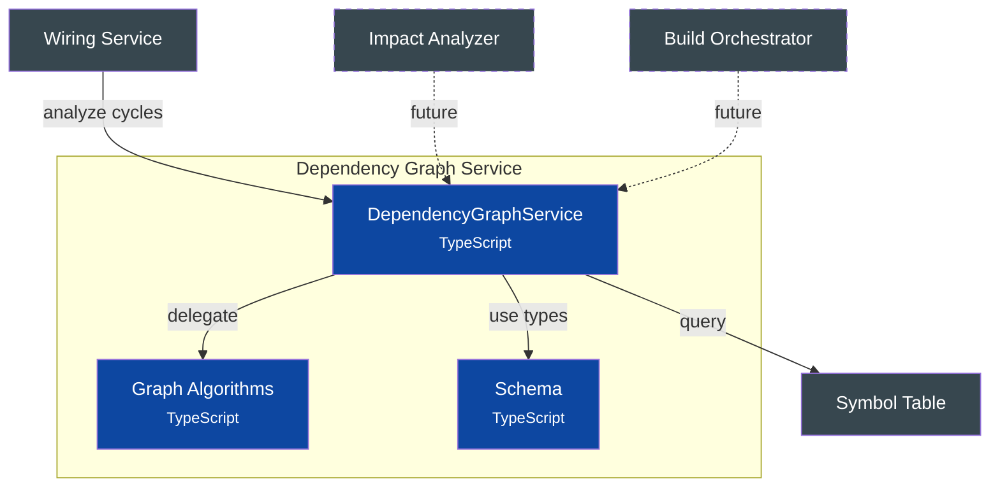

# C4 Component Diagram - Dependency Graph Service

## Overview

Graph algorithms and analysis for component dependencies. Provides cycle detection, topological sorting, and dependency traversal operations. Extracted from Wiring Service for reusability across impact analysis, build ordering, and dead code detection.

## Component Diagram



## Components

| Component | Responsibility | Key Operations | Status | Notes |
|-----------|----------------|----------------|--------|-------|
| **DependencyGraphService** | Graph orchestration | `buildGraph()`, `detectCycles()`, `getTopologicalOrder()`, `wouldCreateCycle()` | ✅ | `src/services/dependency-graph/service.ts` |
| **Graph Algorithms** | Pure graph algorithms | `topologicalSort()`, `getUpstreamDependencies()`, `getDownstreamDependencies()`, `getConnectedComponents()` | ✅ | `src/services/dependency-graph/algorithms.ts` |
| **Schema** | Type definitions and interface | `DependencyGraph`, `GraphNode`, `GraphEdge`, `GraphStats`, `IDependencyGraphService` | ✅ | `src/services/dependency-graph/schema.ts` |

> **Architecture**: Extracted from Wiring Service to enable reuse by future impact analysis, build ordering, and dead code detection features.

## Design Decisions

| Decision | Rationale |
|----------|-----------|
| Extract from wiring | Graph analysis is more fundamental than wiring business logic; enables reuse |
| Kahn's algorithm for topo sort | O(V+E) complexity, handles disconnected components gracefully |
| DFS for cycle detection | Natural fit for finding back edges in directed graph |
| Pure utilities module | Graph algorithms have zero service dependencies - just data structures |
| Connected components analysis | Identify disconnected subgraphs for isolated analysis |
| Immutable graph structure | All graph operations return new data, no mutation |

---

## Code Details

### Quick Reference

| Category | Methods |
|----------|---------|
| **Graph Building** | `buildGraph()`, `buildSubgraph()` |
| **Cycle Analysis** | `detectCycles()`, `wouldCreateCycle()` |
| **Ordering** | `getTopologicalOrder()` |
| **Traversal** | `getUpstream()`, `getDownstream()`, `getDirect()` |
| **Analysis** | `getRootNodes()`, `getLeafNodes()`, `getStats()` |

### DependencyGraphService API

```typescript:include
source: src/services/dependency-graph/schema.ts
exports: [IDependencyGraphService]
```

### Graph Types

| Type | Key Fields | Purpose |
|------|------------|---------|
| `DependencyGraph` | `nodes: Map<string, GraphNode>`, `edges: Map<string, GraphEdge[]>`, `topologicalOrder`, `cycles` | Main graph data structure |
| `GraphNode` | `symbolId`, `name`, `namespace`, `level`, `inputs[]`, `outputs[]` | Component node in graph |
| `GraphEdge` | `connectionId`, `fromSymbol`, `fromPort`, `toSymbol`, `toPort` | Connection between components |
| `GraphStats` | `nodeCount`, `edgeCount`, `rootCount`, `leafCount`, `maxDepth`, `hasCycles`, `componentCount` | Graph statistics |

### Algorithms

#### Cycle Detection (DFS with Recursion Stack)

```
function detectCycles(graph):
    cycles = []
    visited = Set()
    recursionStack = Set()

    function dfs(nodeId, path):
        visited.add(nodeId)
        recursionStack.add(nodeId)

        for each edge from nodeId:
            neighbor = edge.toSymbol
            if neighbor not in visited:
                dfs(neighbor, path + [neighbor])
            else if neighbor in recursionStack:
                // Found cycle - extract from path
                cycleStart = path.indexOf(neighbor)
                cycles.push(path.slice(cycleStart))

        recursionStack.remove(nodeId)

    for each node in graph.nodes:
        if node not in visited:
            dfs(node, [node])

    return deduplicateCycles(cycles)
```

**Complexity**: O(V + E) where V = nodes, E = edges
**Key insight**: Recursion stack tracks current DFS path; back edges indicate cycles

#### Topological Sort (Kahn's Algorithm)

```
function topologicalSort(graph):
    // Calculate in-degrees
    inDegree = Map()
    for each node: inDegree[node] = 0
    for each edge: inDegree[edge.toSymbol]++

    // Find nodes with no incoming edges
    queue = [nodes where inDegree == 0]
    result = []

    while queue not empty:
        node = queue.shift()
        result.push(node)

        for each edge from node:
            inDegree[edge.toSymbol]--
            if inDegree[edge.toSymbol] == 0:
                queue.push(edge.toSymbol)

    // If we couldn't process all nodes, there's a cycle
    if result.length != graph.nodes.size:
        return null

    return result
```

**Complexity**: O(V + E)
**Key insight**: Process nodes with no dependencies first, removing edges as we go

#### Connected Components (BFS)

```
function getConnectedComponents(graph):
    visited = Set()
    components = []

    // Build undirected adjacency (treat graph as undirected for connectivity)
    adjacency = Map<nodeId, Set<neighborIds>>

    for each node in graph.nodes:
        if node in visited: continue

        // BFS to find all connected nodes
        component = []
        queue = [node]

        while queue not empty:
            current = queue.shift()
            if current in visited: continue

            visited.add(current)
            component.push(current)

            // Add neighbors (both directions)
            for each neighbor in adjacency[current]:
                if neighbor not in visited:
                    queue.push(neighbor)

        components.push(component)

    return components
```

**Complexity**: O(V + E)
**Key insight**: Treat directed graph as undirected to find weakly connected components

#### Would-Create-Cycle Check

```
function wouldCreateCycle(graph, fromSymbol, toSymbol):
    // A cycle would be created if toSymbol can already reach fromSymbol
    // (i.e., fromSymbol is downstream of toSymbol)
    downstream = getDownstreamDependencies(graph, toSymbol)
    return downstream.includes(fromSymbol) || fromSymbol == toSymbol
```

**Complexity**: O(V + E) in worst case
**Key insight**: If adding edge A→B, check if B can already reach A (would close a cycle)
