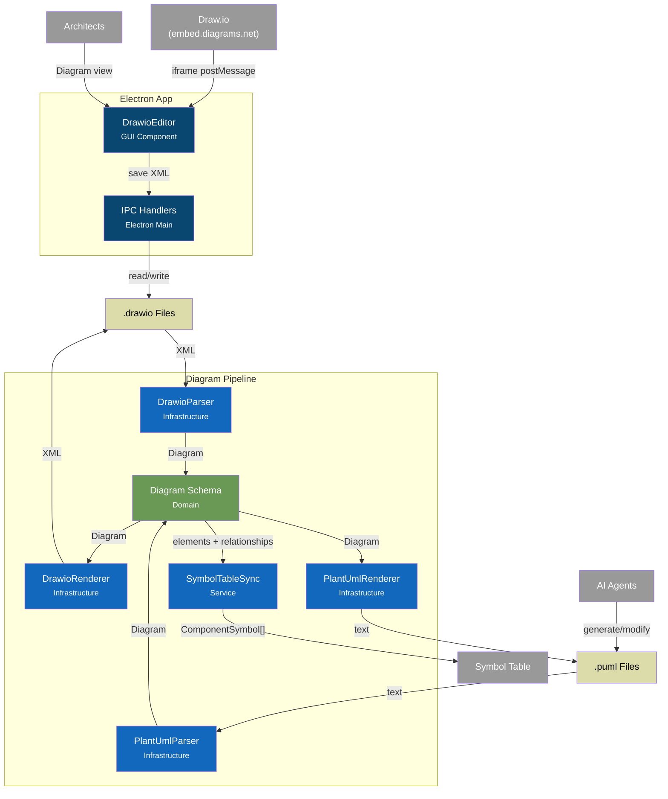

# C4 Component Diagram - Diagram-Driven Architecture Pipeline

## Overview

Internal structure of the Diagram Pipeline, showing Draw.io parsing, PlantUML conversion, and Symbol Table synchronization.

> **Reference**: See [ADR-012: Diagram-Driven Architecture](../adr/012-diagram-driven-architecture.md) for detailed specifications.

## Component Diagram



## Components

| Component | Layer | Responsibility | Status | Location |
|-----------|-------|----------------|--------|----------|
| **DrawioEditor** | GUI | Embed Draw.io editor via iframe, handle postMessage | ✅ Complete | `src/gui/components/DrawioEditor.tsx` |
| **IPC Handlers** | Electron Main | Handle diagram file operations (open/save) | ✅ Complete | `electron/ipc-handlers.ts` |
| **DrawioParser** | Infrastructure | Parse mxGraphModel XML into Diagram | ✅ Complete | `src/infrastructure/drawio/parser.ts` |
| **DrawioRenderer** | Infrastructure | Render Diagram back to mxGraphModel XML | ⏳ Planned | ADR-012 Phase 3 |
| **PlantUmlParser** | Infrastructure | Parse PlantUML text into Diagram | ⏳ Planned | ADR-012 Phase 3 |
| **PlantUmlRenderer** | Infrastructure | Render Diagram to PlantUML text | ⏳ Planned | ADR-012 Phase 3 |
| **SymbolTableSync** | Service | Sync Diagram elements with Symbol Table | ⏳ Planned | ADR-012 Phase 4 |
| **Diagram Schema** | Domain | Type definitions for DiagramElement, DiagramRelationship | ✅ Complete | `src/infrastructure/drawio/schema.ts` |

## Data Flow

### Human → Code Generation

```
1. Architect opens Diagram view in cyrus-code Electron app
2. DrawioEditor loads Draw.io via iframe (embed.diagrams.net)
3. Architect creates/edits diagram using full Draw.io UI
4. On save, XML is sent via postMessage → IPC → file system
5. DrawioParser extracts DiagramElement[] and DiagramRelationship[]
6. SymbolTableSync creates/updates ComponentSymbol[] in database
7. CodeGenerationService generates code from symbols
```

### AI → Code Generation

```
1. AI agent generates/modifies architecture.puml
2. PlantUmlParser extracts DiagramElement[] and DiagramRelationship[]
3. SymbolTableSync creates/updates ComponentSymbol[] in database
4. CodeGenerationService generates code from symbols
5. (Optional) PlantUmlRenderer → DrawioRenderer to sync visual diagram
```

### Bidirectional Sync

```
              ┌─────────────┐
              │  Draw.io    │ ◄─── Architect (visual)
              │  .drawio    │
              └──────┬──────┘
                     │
           DrawioParser/Renderer
                     │
              ┌──────▼──────┐
              │   Diagram   │ ◄─── Internal Model
              │  (Schema)   │
              └──────┬──────┘
                     │
          PlantUmlParser/Renderer
                     │
              ┌──────▼──────┐
              │  PlantUML   │ ◄─── AI Agent (text)
              │   .puml     │
              └─────────────┘
```

## Design Decisions

| Decision | Rationale |
|----------|-----------|
| Separate parsers/renderers | Single Responsibility: parsing ≠ rendering |
| Internal Diagram model | Decouples Draw.io format from PlantUML format |
| cyrus-* custom properties | Preserve metadata on Draw.io round-trip |
| SymbolTableSync service | Centralizes diagram ↔ symbol table mapping |
| Zod schemas | Runtime validation + TypeScript types from one source |

## Custom Properties (cyrus-* prefix)

These properties are stored in Draw.io `<object>` elements:

| Property | Purpose | Example |
|----------|---------|---------|
| `cyrus-level` | Abstraction level | `L1`, `L2`, `infra` |
| `cyrus-stereotype` | UML stereotype | `service`, `controller` |
| `cyrus-symbolId` | Link to Symbol Table | `auth/jwt/JwtService@1.2.0` |
| `cyrus-templateRef` | Template reference | `patterns/jwt-auth/JwtService` |
| `cyrus-type` | Relationship type (edges) | `dependency`, `implements` |
| `cyrus-kind` | Injection kind (edges) | `constructor`, `property` |

## Implementation Status

| Phase | Components | Status |
|-------|------------|--------|
| **Phase 1** | DrawioEditor, IPC Handlers, Menu Integration | ✅ Complete |
| **Phase 2** | DrawioParser (67 tests) | ✅ Complete |
| **Phase 3** | PlantUmlParser, PlantUmlRenderer, DrawioRenderer | ⏳ Planned |
| **Phase 4** | SymbolTableSync | ⏳ Planned |
| **Phase 5** | Template instantiation, Code Generation | ⏳ Planned |

---

## Related Documentation

- [ADR-012: Diagram-Driven Architecture](../adr/012-diagram-driven-architecture.md) - Full specification
- [C4 Model](https://c4model.com/) - C4 diagram methodology
- [Draw.io XML Format](https://www.drawio.com/doc/faq/diagram-source-edit) - mxGraphModel structure
