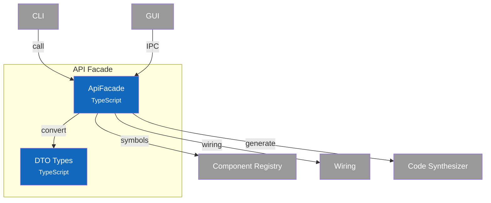

# C4 Component Diagram - API Facade

## Overview

Internal structure of the API Facade container, showing its single-component design and service routing.

## Component Diagram



## Components

| Component | Responsibility | Key Operations | Status | Notes |
|-----------|----------------|----------------|--------|-------|
| **ApiFacade** | Single entry point, service routing, DTO conversion | All public API methods | ✅ | `src/api/facade.ts` |
| **DTO Types** | Transport-safe type definitions | DTOs for all domain types | ✅ | `src/api/types.ts` |

> **Design Patterns**: See [ADR-008: Design Patterns](../adr/008-design-patterns.md) - Facade pattern.

## Design Decisions

| Decision | Rationale |
|----------|-----------|
| Single facade class | Simplified API surface, one import for all operations |
| DTO conversion | Transport-agnostic: works with Electron IPC, HTTP, CLI |
| ApiResponse wrapper | Consistent error handling across all operations |
| Service composition | Facade holds Registry, Wiring, Synthesizer - routes appropriately |
| Factory methods | `create()` and `createInMemory()` for different contexts |
| Transport-agnostic | Same facade used by CLI (direct) and GUI (via IPC) |

---

## Code Details

### ApiFacade API

```typescript:include
source: src/api/types.ts
exports: [IApiFacade]
```

> **Note**: Static factory methods `ApiFacade.create()` and `ApiFacade.createInMemory()` are class-only (not in interface).

### API Response Type

```typescript:include
source: src/api/types.ts
exports: [ApiResponse, PaginatedResponse]
```

### DTO Conversion

The facade converts between domain types and DTOs:

| Domain Type | DTO Type | Conversion |
|-------------|----------|------------|
| `ComponentSymbol` | `ComponentSymbolDTO` | `Date` → ISO string, nested objects flattened |
| `Connection` | `ConnectionDTO` | `Date` → ISO string |
| `ValidationResult` | `ValidationResultDTO` | Direct mapping |
| `GenerationResult` | `GenerationResultDTO` | Direct mapping |
| `DependencyGraph` | `DependencyGraphDTO` | `Map` → array of entries |

### Service Routing Table

The facade routes operations to internal services:

| API Method Group | Routes To | Operations |
|------------------|-----------|------------|
| **Symbol CRUD** | Component Registry | `registerSymbol`, `getSymbol`, `updateSymbol`, `removeSymbol` |
| **Symbol Queries** | Component Registry | `listSymbols`, `searchSymbols`, `resolveSymbol`, `getSymbolVersions` |
| **Relationships** | Component Registry | `getContains`, `getContainedBy`, `getDependents`, `getDependencies` |
| **Connections** | Component Registry | `createConnection`, `removeConnection`, `getConnections`, `getAllConnections` |
| **Validation** | Component Registry | `validate`, `validateSymbol`, `checkCircular` |
| **Wiring** | Wiring Service | `wireConnection`, `unwireConnection`, `validateConnectionRequest`, `getDependencyGraph`, `detectCycles`, `getTopologicalOrder`, `getGraphStats`, `findCompatiblePorts`, `findUnconnectedRequired` |
| **Status** | Component Registry | `updateStatus`, `findUnreachable`, `findUntested` |
| **Bulk** | Component Registry | `importSymbols`, `exportSymbols` |
| **Generation** | Synthesizer Service | `generateSymbol`, `generateMultiple`, `generateAll`, `previewGeneration`, `listGeneratableSymbols`, `canGenerateSymbol`, `hasUserImplementation` |

### IPC Channel Mapping

For Electron GUI, the facade methods are exposed via IPC handlers:

| IPC Channel | Facade Method |
|-------------|---------------|
| `symbols:register` | `registerSymbol()` |
| `symbols:get` | `getSymbol()` |
| `symbols:update` | `updateSymbol()` |
| `symbols:remove` | `removeSymbol()` |
| `symbols:list` | `listSymbols()` |
| `symbols:search` | `searchSymbols()` |
| `wiring:connect` | `wireConnection()` |
| `wiring:disconnect` | `unwireConnection()` |
| `wiring:graph` | `getDependencyGraph()` |
| `wiring:compatible-ports` | `findCompatiblePorts()` |
| `synthesizer:generate` | `generateSymbol()` |
| `synthesizer:preview` | `previewGeneration()` |
| `synthesizer:list-generable` | `listGeneratableSymbols()` |

> **Note**: IPC handlers are defined in `electron/ipc-handlers.ts`

### Notes

- **Source Files**: `src/api/facade.ts`, `src/api/types.ts`
- **Design Patterns**: See [ADR-008: Design Patterns](../adr/008-design-patterns.md) - Facade pattern.
