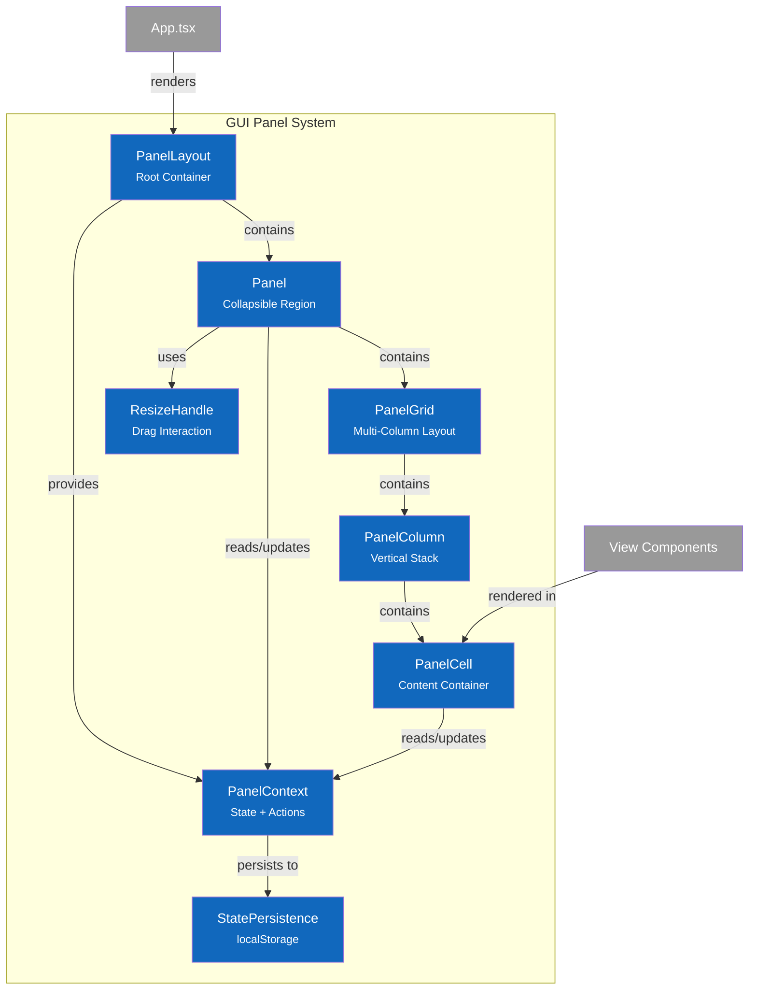

# C4 Component Diagram - GUI Panel System

## Overview

Internal structure of the GUI container's panel layout system, showing the composable panel architecture for flexible view layouts.

## Component Diagram



*Figure: Component architecture of the GUI panel system showing composition hierarchy and state management.*

## Components

| Component | Responsibility | Key Operations | Status | Location |
|-----------|----------------|----------------|--------|----------|
| **PanelLayout** | Root container, provides context | render, initialize state | 🔮 | `src/gui/components/layout/PanelLayout.tsx` |
| **PanelContext** | Shared state and dispatch | setPanelWidth, toggleCollapse, setCellHeight | 🔮 | `src/gui/components/layout/PanelContext.tsx` |
| **Panel** | Single collapsible region | collapse, expand, resize | 🔮 | `src/gui/components/layout/Panel.tsx` |
| **PanelGrid** | Multi-column grid within Panel | layout columns | 🔮 | `src/gui/components/layout/PanelGrid.tsx` |
| **PanelColumn** | Vertical stack of cells | layout cells | 🔮 | `src/gui/components/layout/PanelColumn.tsx` |
| **PanelCell** | Individual content container | collapse, resize height | 🔮 | `src/gui/components/layout/PanelCell.tsx` |
| **ResizeHandle** | Draggable resize control | onDragStart, onDrag, onDragEnd | 🔮 | `src/gui/components/layout/ResizeHandle.tsx` |
| **StatePersistence** | localStorage read/write | save, restore | 🔮 | `src/gui/components/layout/persistence.ts` |

## Design Decisions

| Decision | Rationale |
|----------|-----------|
| React Context for state | Avoids prop drilling; panel state shared across tree |
| Compound components | Flexible composition; Panel doesn't dictate children |
| CSS Grid for layout | Native browser layout; responsive; no JS calculations |
| localStorage persistence | Simple; no backend needed; per-user preferences |
| Reducer pattern | Predictable state updates; easy debugging |
| Position-based panels | Left/Main/Right matches mental model; clear semantics |

---

## Code Details

### Quick Reference

| Component | Purpose |
|-----------|---------|
| **PanelLayout** | Root wrapper providing context |
| **Panel** | Collapsible sidebar or main region |
| **PanelGrid** | Sub-layout within right panel |
| **PanelCell** | Individual collapsible content area |

### Component API

```typescript
// PanelLayout - root container
interface PanelLayoutProps {
  children: React.ReactNode;
  storageKey?: string;  // localStorage key for persistence
}

// Panel - collapsible region
interface PanelProps {
  position: 'left' | 'main' | 'right';
  children: React.ReactNode;
  defaultWidth?: number;
  minWidth?: number;
  maxWidth?: number;
  defaultCollapsed?: boolean;
  collapsible?: boolean;
}

// PanelGrid - multi-column layout
interface PanelGridProps {
  columns: number;
  children: React.ReactNode;
}

// PanelColumn - vertical stack
interface PanelColumnProps {
  children: React.ReactNode;
}

// PanelCell - content container
interface PanelCellProps {
  id: string;
  children: React.ReactNode;
  defaultHeight?: number;
  minHeight?: number;
  unit?: 'px' | '%';
  collapsible?: boolean;
  header?: string;
}
```

### State Shape

```typescript
interface PanelState {
  width: number;
  collapsed: boolean;
  cells: Map<string, CellState>;
}

interface CellState {
  height: number;
  collapsed: boolean;
}

interface PanelContextValue {
  panelStates: Map<string, PanelState>;
  setPanelWidth: (panelId: string, width: number) => void;
  togglePanelCollapse: (panelId: string) => void;
  setCellHeight: (panelId: string, cellId: string, height: number) => void;
  toggleCellCollapse: (panelId: string, cellId: string) => void;
}
```

### Usage Example

```tsx
// MacroView with panel layout
<PanelLayout storageKey="macro-layout">
  <Panel position="left" defaultWidth={250} collapsible>
    <TestSuiteTree {...treeProps} />
  </Panel>

  <Panel position="main">
    <MainContent />
  </Panel>

  <Panel position="right" defaultWidth={550}>
    <PanelGrid columns={2}>
      <PanelColumn>
        <PanelCell id="graph" defaultHeight={60} unit="%">
          <TestCaseGraph {...graphProps} />
        </PanelCell>
        <PanelCell id="controls" header="Debug Controls">
          <DebugControls {...controlProps} />
        </PanelCell>
      </PanelColumn>
      <PanelColumn>
        <PanelCell id="details">
          <StepDetail {...detailProps} />
        </PanelCell>
      </PanelColumn>
    </PanelGrid>
  </Panel>
</PanelLayout>
```

### File Structure

| File | Responsibility |
|------|----------------|
| `src/gui/components/layout/index.ts` | Barrel exports |
| `src/gui/components/layout/PanelLayout.tsx` | Root container |
| `src/gui/components/layout/PanelContext.tsx` | Context + reducer |
| `src/gui/components/layout/Panel.tsx` | Collapsible panel |
| `src/gui/components/layout/PanelGrid.tsx` | Grid layout |
| `src/gui/components/layout/PanelColumn.tsx` | Column container |
| `src/gui/components/layout/PanelCell.tsx` | Cell container |
| `src/gui/components/layout/ResizeHandle.tsx` | Resize interaction |
| `src/gui/components/layout/persistence.ts` | localStorage logic |
| `src/gui/components/layout/types.ts` | TypeScript types |

### Notes

- **Status**: 🔮 Planned (see [ADR-014](../adr/014-panel-architecture.md))
- **Dependencies**: React Context API, CSS Grid
- **Migration**: Will replace ad-hoc panel logic in MacroView, App.tsx
