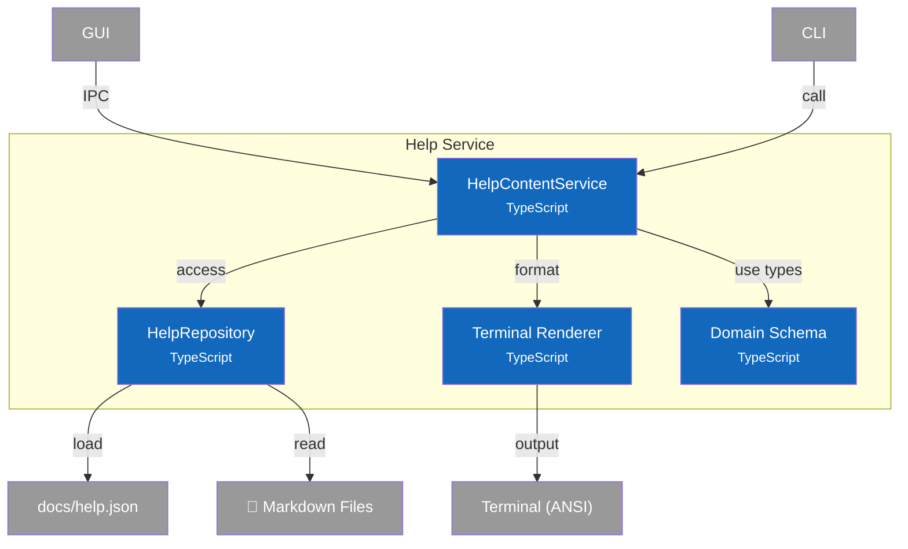

# C4 Component Diagram - Help Service

## Overview

Internal structure of the Help Service container, showing its components and their relationships.

## Component Diagram



## Components

| Component | Responsibility | Key Operations | Status | Notes |
|-----------|----------------|----------------|--------|-------|
| **HelpContentService** | Orchestration, search, formatting | `search()`, `getTopicContent()`, `formatTopicList()`, `clearCache()` | ✅ | `src/services/help-content/service.ts` |
| **HelpRepository** | Data access, manifest loading | `getCategories()`, `getTopics()`, `getTopic()`, `getByCategory()`, `getTopicSubsections()` | ✅ | `src/repositories/help-repository.ts` |
| **Terminal Renderer** | Markdown to ANSI conversion | `renderMarkdownForTerminal()` | ✅ | `src/services/help-content/terminal-renderer.ts` |
| **Domain Schema** | Type definitions | `HelpManifest`, `HelpTopic`, `HelpCategory`, `HelpSearchResult`, `HelpRepository` | ✅ | `src/domain/help/schema.ts` |

## Design Decisions

| Decision | Rationale |
|----------|-----------|
| Manifest-driven topics | Topics defined in JSON, content in markdown - easy to add new topics |
| Repository pattern | Separates data access (repository) from orchestration (service) |
| Lazy loading | Manifest cached on first access, markdown files read on demand |
| Category grouping | Topics organized by category for better discoverability |
| Keyword search | Full-text search across title, summary, and explicit keywords |
| Format abstraction | Support terminal (CLI), HTML (GUI), raw (debugging) output |
| ANSI rendering | No external dependencies - built-in terminal formatting |

---

## Code Details

### Quick Reference

| Category | Methods |
|----------|---------|
| **Service** | `search()`, `getTopicContent()`, `formatTopicList()`, `formatCategoryOverview()`, `clearCache()` |
| **Repository** | `getCategories()`, `getGroups()`, `getTopics()`, `getTopic()`, `getByCategory()`, `getRelatedTopics()`, `getTopicSubsections()`, `getC4Hierarchy()` |

### HelpContentService API

```typescript
interface HelpContentService {
  /** Direct access to help data */
  readonly repository: HelpRepository;

  /** Search topics by query string (adds scoring logic) */
  search(query: string): HelpSearchResult[];

  /** Get the content of a topic's markdown file (preprocessed + formatted) */
  getTopicContent(topicId: string, format?: HelpOutputFormat): string;

  /** Format a topic list for terminal display */
  formatTopicList(topics: HelpTopic[]): string;

  /** Format categories with their topics for terminal display */
  formatCategoryOverview(): string;

  /** Clear all caches (manifest and preprocessor) */
  clearCache(): void;
}
```

### Help Domain Types

| Type | Purpose |
|------|---------|
| `HelpManifest` | Root structure for docs/help.json |
| `HelpTopic` | Topic metadata (id, title, path, category, keywords) |
| `HelpCategory` | Category metadata (id, label, description) |
| `HelpGroup` | Collapsible section within a category |
| `HelpSearchResult` | Search result with score and matched fields |
| `HelpOutputFormat` | Output format: 'terminal' \| 'html' \| 'raw' |
| `DocumentHeading` | Extracted h2/h3 headings for navigation |
| `C4Hierarchy` | C4 diagram navigation structure |

### Algorithms

#### Search Scoring

```
For each topic:
  score = 0
  if title contains query:      score += 10
  if summary contains query:    score += 5
  if any keyword contains query: score += 3
  if id exactly matches query:   score += 15

Return topics with score > 0, sorted descending
```

#### Manifest Loading

```
1. Find project root (look for docs/help.json or package.json)
2. Load docs/help.json
3. Parse JSON as HelpManifest
4. Cache manifest (singleton pattern)
5. Return cached manifest on subsequent calls
```

### Terminal Markdown Rendering

The renderer converts markdown to ANSI-escaped terminal output:

| Markdown | ANSI Output |
|----------|-------------|
| `# H1` | Bold + Cyan + underline with `═` |
| `## H2` | Bold + Yellow + underline with `─` |
| `### H3` | Bold only |
| `` `code` `` | Cyan text |
| `**bold**` | Bold text |
| `*italic*` | Italic text |
| `- item` | Green bullet `•` |
| `> quote` | Dim `│` prefix + italic |
| `[text](url)` | Underlined text + dim URL |
| ``` ```code``` ``` | Dim box with gray content |

### Notes

- **Source Files**: `src/services/help-content/service.ts`, `src/services/help-content/terminal-renderer.ts`, `src/domain/help/schema.ts`, `src/repositories/help-repository.ts`
