# C4 Component Diagram - Help Service

## Overview

Internal structure of the Help Service container, showing its components and their relationships.

## Component Diagram

```mermaid
flowchart TD
    subgraph help ["Help Service"]
        service["HelpService<br/><small>TypeScript</small>"]
        renderer["Terminal Renderer<br/><small>TypeScript</small>"]
        schema["Schema<br/><small>TypeScript</small>"]
    end

    service -->|"load"| manifest["docs/help.json"]
    service -->|"read"| topics["📄 Markdown Files"]
    service -->|"format"| renderer
    renderer -->|"output"| terminal["Terminal (ANSI)"]
    service -->|"use types"| schema

    gui["GUI"] -->|"IPC"| service
    cli["CLI"] -->|"call"| service

    classDef component fill:#1168bd,color:#fff
    classDef external fill:#999,color:#fff

    class service,renderer,schema component
    class manifest,topics,terminal,gui,cli external
```



## Components

| Component | Responsibility | Key Operations | Status | Notes |
|-----------|----------------|----------------|--------|-------|
| **HelpService** | Topic loading, search, formatting | `getTopic()`, `search()`, `getCategories()`, `getTopicContent()` | ✅ | `src/services/help-content/index.ts` |
| **Terminal Renderer** | Markdown to ANSI conversion | `renderMarkdownForTerminal()` | ✅ | `src/services/help-content/terminal-renderer.ts` |
| **Schema** | Type definitions | `HelpManifest`, `HelpTopic`, `HelpCategory`, `HelpSearchResult` | ✅ | `src/services/help-content/schema.ts` |

## Design Decisions

| Decision | Rationale |
|----------|-----------|
| Manifest-driven topics | Topics defined in JSON, content in markdown - easy to add new topics |
| Lazy loading | Manifest cached on first access, markdown files read on demand |
| Category grouping | Topics organized by category for better discoverability |
| Keyword search | Full-text search across title, summary, and explicit keywords |
| Format abstraction | Support terminal (CLI), HTML (GUI), raw (debugging) output |
| ANSI rendering | No external dependencies - built-in terminal formatting |

---

## Code Details

### Quick Reference

| Category | Methods |
|----------|---------|
| **Topics** | `getTopic()`, `listTopics()`, `getTopicContent()` |
| **Categories** | `getCategories()`, `getByCategory()` |
| **Search** | `search()` |
| **Related** | `getRelatedTopics()`, `getTopicSubsections()` |

### HelpService API

```typescript:include
source: src/services/help-content/schema.ts
exports: [IHelpService]
```

### Help Schema Types

```typescript:include
source: src/services/help-content/schema.ts
exports: [HelpManifest, HelpTopic, HelpCategory, HelpSearchResult, HelpOutputFormat]
```

### Algorithms

#### Search Scoring

```
For each topic:
  score = 0
  if title contains query:      score += 10
  if summary contains query:    score += 5
  if any keyword contains query: score += 3
  if id exactly matches query:   score += 15

Return topics with score > 0, sorted descending
```

#### Manifest Loading

```
1. Find project root (look for docs/help.json or package.json)
2. Load docs/help.json
3. Parse JSON as HelpManifest
4. Cache manifest (singleton pattern)
5. Return cached manifest on subsequent calls
```

### Terminal Markdown Rendering

The renderer converts markdown to ANSI-escaped terminal output:

| Markdown | ANSI Output |
|----------|-------------|
| `# H1` | Bold + Cyan + underline with `═` |
| `## H2` | Bold + Yellow + underline with `─` |
| `### H3` | Bold only |
| `` `code` `` | Cyan text |
| `**bold**` | Bold text |
| `*italic*` | Italic text |
| `- item` | Green bullet `•` |
| `> quote` | Dim `│` prefix + italic |
| `[text](url)` | Underlined text + dim URL |
| ``` ```code``` ``` | Dim box with gray content |

### Notes

- **Source Files**: `src/services/help-content/index.ts`, `src/services/help-content/terminal-renderer.ts`, `src/services/help-content/schema.ts`
