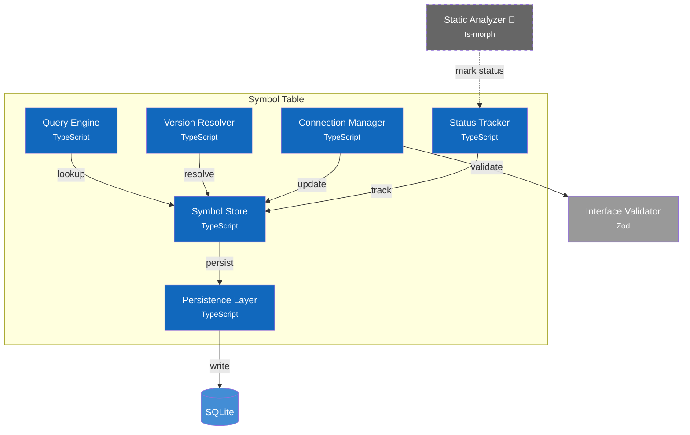

# C4 Component Diagram - Symbol Table

## Component Diagram



*Figure: Internal structure of the Symbol Table container, showing its components and their relationships.*

### Components

| Component | Responsibility | Key Operations | Status | Notes |
|-----------|----------------|----------------|--------|-------|
| **Symbol Store** | In-memory symbol cache | `register()`, `get()`, `update()`, `remove()` | ✅ | `src/services/symbol-table/store.ts` |
| **Query Engine** | Symbol discovery | `findByNamespace()`, `findByLevel()`, `search()` | ✅ | Integrated in Symbol Store |
| **Version Resolver** | SemVer compatibility | `findCompatible()`, `getLatest()`, `checkConstraint()` | ✅ | In `src/services/component-registry/` |
| **Connection Manager** | Port wiring | `connect()`, `disconnect()`, `getConnections()` | ✅ | `src/services/symbol-table/store.ts` |
| **Status Tracker** | Usage tracking | `updateStatus()`, `findUnreachable()`, `findUntested()` | ✅ | Integrated in Symbol Store |
| **Persistence Layer** | Database I/O | `load()`, `save()`, `transaction()` | ✅ | `src/repositories/persistence.ts` |

> **Design Patterns**: See [ADR-008: Design Patterns](../adr/008-design-patterns.md) for complete pattern documentation.
>
> **Note**: Some components shown as separate in the diagram are integrated into a single implementation for simplicity. The conceptual separation remains valid for understanding responsibilities.

### Quick Reference

| Category | Methods |
|----------|---------|
| **CRUD** | `register()`, `get()`, `update()`, `remove()` |
| **Query** | `findByNamespace()`, `findByLevel()`, `findByKind()`, `search()`, `list()` |
| **Relations** | `getContains()`, `getContainedBy()`, `getDependents()`, `getDependencies()` |
| **Versions** | `getVersions()`, `getLatest()` |
| **Status** | `updateStatus()`, `findUnreachable()`, `findUntested()` |
| **Connections** | `connect()`, `disconnect()`, `getConnections()`, `getAllConnections()` |
| **Validation** | `validate()`, `validateSymbol()`, `checkCircular()` |
| **Bulk** | `import()`, `export()` |

### Design Decisions

| Decision | Rationale |
|----------|-----------|
| In-memory cache | Fast queries, SQLite for durability |
| Separate Query Engine | Complex queries isolated from CRUD |
| Status Tracker as component | ADR-005 dead code detection integrated |
| Connection validation delegated | Interface Validator owns type checking |

---

## Code Diagram

*C4-4 UML class diagram showing the ISymbolStore interface with related types.*

```mermaid:c4code
source: src/services/symbol-table/schema.ts
interface: ISymbolStore
related: [ComponentSymbol, Connection, ValidationResult]
maxMethods: 8
```

### Core Types

| Type | Key Fields |
|------|------------|
| `ComponentSymbol` | `id`, `name`, `namespace`, `level`, `kind`, `ports[]`, `version`, `status`, `origin` |
| `Connection` | `id`, `fromSymbolId`, `fromPort`, `toSymbolId`, `toPort`, `transform?` |
| `ValidationResult` | `valid`, `errors[]`, `warnings[]` |

### Notes

- **Type Definitions**: See [Symbol Table Schema](../spec/symbol-table-schema.md) for complete type definitions.
- **Source Files**: `src/services/symbol-table/store.ts`, `src/services/symbol-table/schema.ts`
