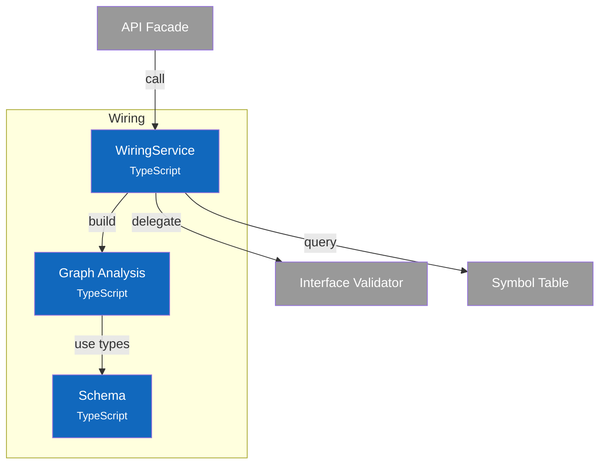

# C4 Component Diagram - Wiring Service

## Overview

Internal structure of the Wiring container, showing its components and their relationships.

## Component Diagram



## Components

| Component | Responsibility | Key Operations | Status | Notes |
|-----------|----------------|----------------|--------|-------|
| **WiringService** | Connection operations, validation orchestration | `connect()`, `disconnect()`, `validateConnection()`, `findCompatiblePorts()` | ✅ | `src/services/wiring/index.ts` |
| **Graph Analysis** | Dependency graph algorithms | `buildDependencyGraph()`, `detectCycles()`, `topologicalSort()`, `getUpstreamDependencies()` | ✅ | `src/services/wiring/graph.ts` |
| **Schema** | Type definitions, error codes | `DependencyGraph`, `GraphNode`, `GraphEdge`, `WiringErrorCode` | ✅ | `src/services/wiring/schema.ts` |

> **Design Patterns**: See [ADR-003: Interface Definition System](../adr/003-interface-definition-system.md) for wiring concepts.

## Design Decisions

| Decision | Rationale |
|----------|-----------|
| Pre-connection cycle check | Prevent cycles before creating connection (wouldCreateCycle) |
| Kahn's algorithm for topo sort | O(V+E) complexity, handles disconnected components |
| DFS for cycle detection | Natural fit for finding back edges in directed graph |
| Cardinality enforcement | Ports without `multiple: true` accept only one connection |
| Delegate validation | WiringService coordinates, Validator owns compatibility rules |
| Connected components | Identify disconnected subgraphs for isolated analysis |

---

## Code Details

### WiringService API

```typescript:include
source: src/services/wiring/schema.ts
exports: [IWiringService]
```

### Graph Types

```typescript:include
source: src/services/wiring/schema.ts
exports: [DependencyGraph, GraphNode, GraphEdge, GraphStats]
```

### Error Codes

```typescript:include
source: src/services/wiring/schema.ts
exports: [WiringErrorCode]
```

### Algorithms

#### Cycle Detection (DFS with Recursion Stack)

```
function detectCycles(graph):
    cycles = []
    visited = Set()
    recursionStack = Set()

    function dfs(nodeId, path):
        visited.add(nodeId)
        recursionStack.add(nodeId)

        for each edge from nodeId:
            neighbor = edge.toSymbol
            if neighbor not in visited:
                dfs(neighbor, path + [neighbor])
            else if neighbor in recursionStack:
                // Found cycle - extract from path
                cycleStart = path.indexOf(neighbor)
                cycles.push(path.slice(cycleStart))

        recursionStack.remove(nodeId)

    for each node in graph.nodes:
        if node not in visited:
            dfs(node, [node])

    return deduplicateCycles(cycles)
```

#### Topological Sort (Kahn's Algorithm)

```
function topologicalSort(graph):
    // Calculate in-degrees
    inDegree = Map()
    for each node: inDegree[node] = 0
    for each edge: inDegree[edge.toSymbol]++

    // Find nodes with no incoming edges
    queue = [nodes where inDegree == 0]
    result = []

    while queue not empty:
        node = queue.shift()
        result.push(node)

        for each edge from node:
            inDegree[edge.toSymbol]--
            if inDegree[edge.toSymbol] == 0:
                queue.push(edge.toSymbol)

    // If we couldn't process all nodes, there's a cycle
    if result.length != graph.nodes.size:
        return null

    return result
```

#### Connected Components (BFS)

```
function getConnectedComponents(graph):
    visited = Set()
    components = []

    // Build undirected adjacency (treat edges as bidirectional)
    adjacency = buildUndirectedAdjacency(graph)

    function bfs(startId):
        component = []
        queue = [startId]

        while queue not empty:
            nodeId = queue.shift()
            if nodeId in visited: continue
            visited.add(nodeId)
            component.push(nodeId)

            for each neighbor in adjacency[nodeId]:
                if neighbor not in visited:
                    queue.push(neighbor)

        return component

    for each node in graph.nodes:
        if node not in visited:
            component = bfs(node)
            components.push(component)

    return components
```

#### Would-Create-Cycle Check

```
function wouldCreateCycle(graph, fromSymbolId, toSymbolId):
    // A cycle would be created if toSymbol can already reach fromSymbol
    // (i.e., fromSymbol is downstream of toSymbol)
    downstream = getDownstreamDependencies(graph, toSymbolId)
    return fromSymbolId in downstream || fromSymbolId == toSymbolId
```

### Notes

- **Source Files**: `src/services/wiring/index.ts`, `src/services/wiring/graph.ts`, `src/services/wiring/schema.ts`
