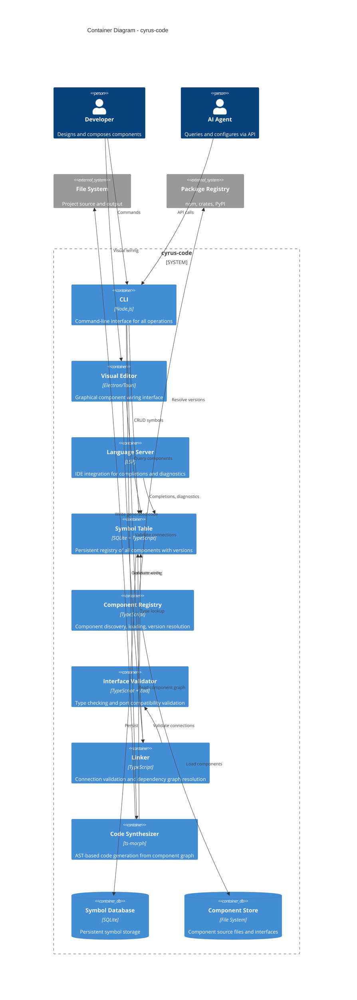

# C4 Container Diagram - cyrus-code

## Overview

Internal architecture of cyrus-code showing major containers and their responsibilities.

## Container Diagram



## Containers

### User-Facing

| Container | Technology | Purpose |
|-----------|------------|---------|
| **CLI** | Node.js | Primary interface for all operations |
| **Visual Editor** | Electron/Tauri | Graphical component wiring (future) |
| **Language Server** | LSP | IDE integration |

### Core Services

| Container | Technology | Purpose |
|-----------|------------|---------|
| **Symbol Table** | SQLite + TypeScript | Central registry of all tracked components |
| **Component Registry** | TypeScript | Discovery, loading, version resolution |
| **Interface Validator** | TypeScript + Zod | Port type checking and compatibility |
| **Linker** | TypeScript | Connection graph validation |
| **Code Synthesizer** | ts-morph | AST-based code generation |

### Storage

| Container | Technology | Purpose |
|-----------|------------|---------|
| **Symbol Database** | SQLite | Persistent symbol storage |
| **Component Store** | File System | Component source and interface files |

## Data Flow

### Registration Flow

```
Source File → Parser → Symbol Table → Symbol Database
```

1. Developer creates/modifies source file
2. Parser extracts component, ports, types
3. Symbol Table registers with unique ID
4. Symbol Database persists

### Validation Flow

```
Connection Config → Linker → Interface Validator → Symbol Table → Result
```

1. Configuration defines connections
2. Linker collects all connections
3. Interface Validator checks each connection
4. Symbol Table provides type information
5. Result includes errors/warnings

### Generation Flow

```
Symbol Table → Code Synthesizer → AST → Source Files
```

1. Read component graph from Symbol Table
2. Code Synthesizer builds AST
3. AST transformed to source code
4. Written to output directory

## CLI Commands

```bash
# Symbol management
cyrus-code register <file>        # Register component from source
cyrus-code list [--level L1]      # List symbols, optionally filter
cyrus-code get <symbol-id>        # Get symbol details
cyrus-code remove <symbol-id>     # Remove from registry

# Validation
cyrus-code validate               # Validate all connections
cyrus-code lint                   # Check for issues

# Generation
cyrus-code generate <output>      # Generate code from graph
cyrus-code preview                # Show what would be generated

# Version management
cyrus-code version <symbol-id>    # Show version history
cyrus-code bump <symbol-id> <type># Bump version (major/minor/patch)
```

## Technology Decisions

| Decision | Choice | Rationale |
|----------|--------|-----------|
| Symbol storage | SQLite | Single file, queryable, no server |
| AST manipulation | ts-morph | High-level TypeScript API |
| Schema validation | Zod | Runtime + compile-time types |
| Desktop UI | Electron/Tauri | Cross-platform, web tech |
| LSP | TypeScript LSP | IDE agnostic |
