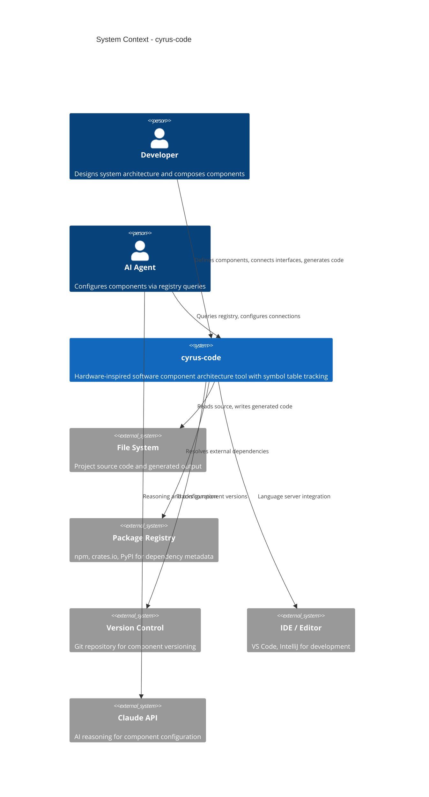

# C4 Context Diagram - cyrus-code

## Overview

System context showing cyrus-code and its external actors/systems.

## Context Diagram

## Actors

| Actor | Description | Interactions |
|-------|-------------|--------------|
| **Developer** | Software architect designing systems | Defines components, wires interfaces, triggers generation |
| **AI Agent** | Automated component configurator | Queries symbol table, suggests connections, configures parameters |

## External Systems

| System | Purpose | Integration |
|--------|---------|-------------|
| **File System** | Source and output storage | Read TypeScript/Python files, write generated code |
| **Package Registry** | External dependency metadata | Resolve npm/crates/PyPI versions |
| **Version Control** | Component versioning | Git integration for version tracking |
| **IDE** | Development environment | Language server protocol for rich editing |
| **Claude API** | AI reasoning | Component configuration assistance |

## Key Interactions

1. **Developer → cyrus-code**: Define components via CLI or visual editor
2. **AI Agent → cyrus-code**: Query registry for compatible components
3. **cyrus-code → File System**: Parse existing code, generate new code
4. **cyrus-code → Package Registry**: Check external dependency versions
5. **cyrus-code → IDE**: Provide completions, diagnostics, refactoring
