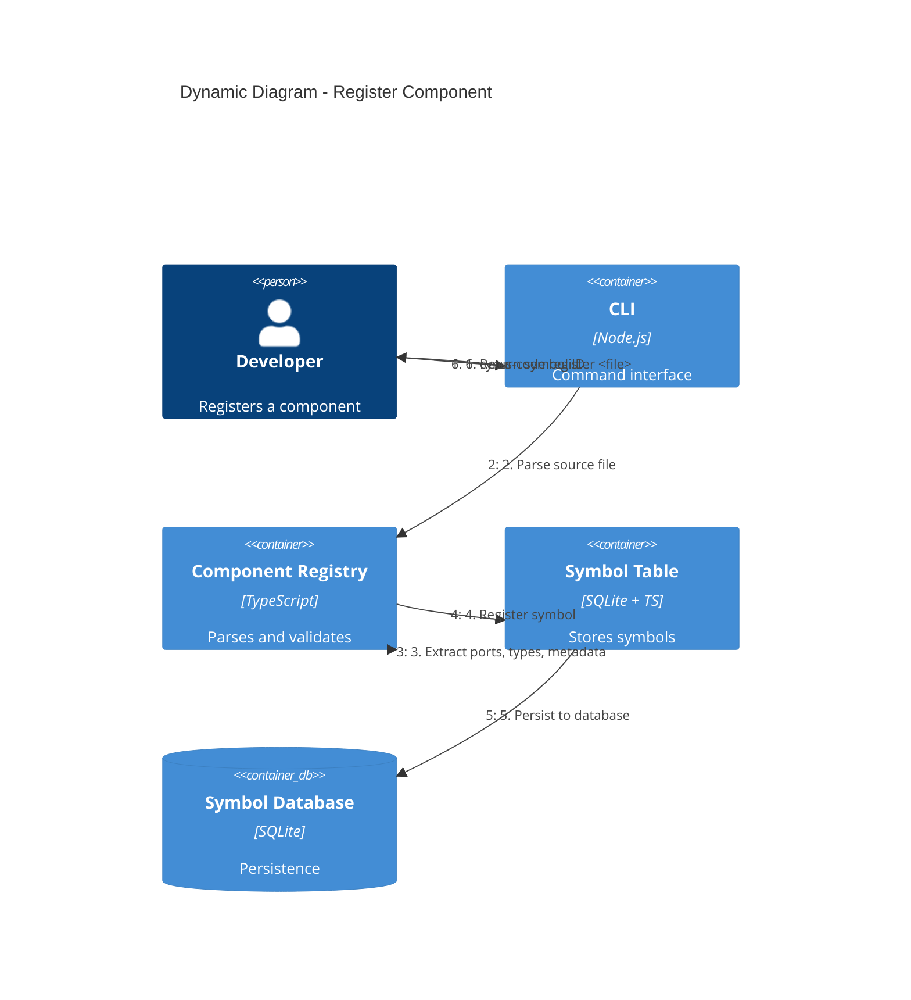
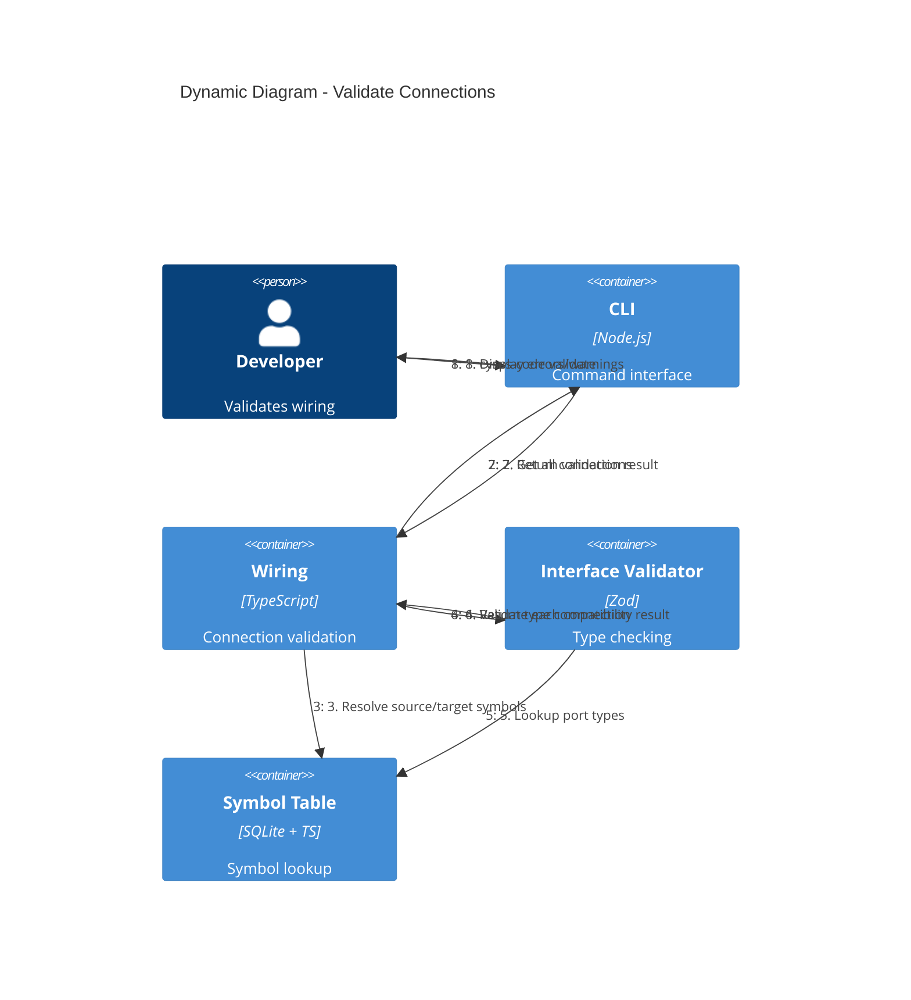
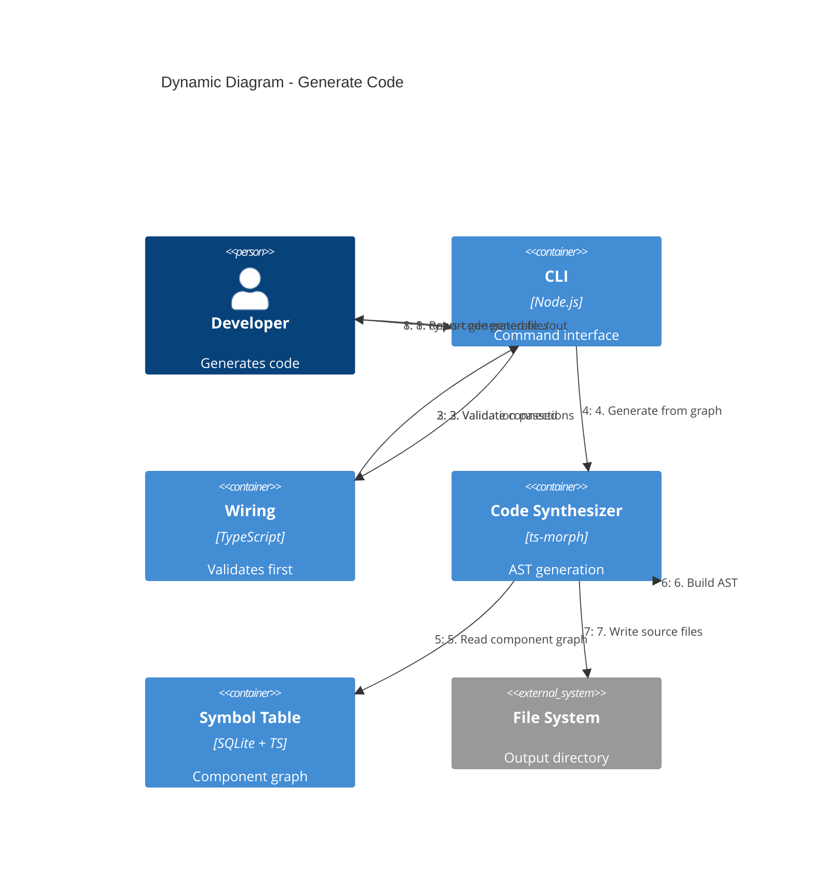
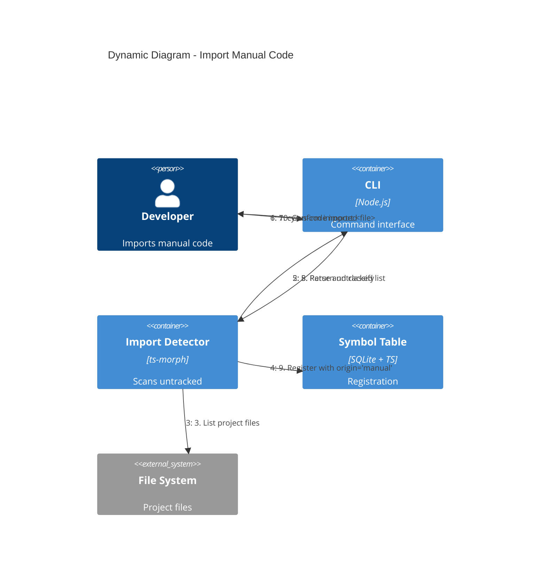

# C4 Dynamic Diagrams - cyrus-code

## Overview

Runtime behavior showing how containers collaborate for key use cases.

> **Note**: These diagrams show **happy-path flows only**. For error handling scenarios (missing symbols, type mismatches, validation failures), see the Data Flow section in [Level 2: Container](2-container.md#data-flow).

---

## 1. Register Component Flow

Shows how a component is registered from source file to symbol table.

### Steps

1. Developer runs `cyrus-code register src/auth/JwtService.ts`
2. CLI invokes Component Registry to parse the source file
3. Component Registry extracts component metadata, ports, and type references
4. Symbol Table receives the new symbol with generated ID
5. Symbol Database persists the symbol
6. CLI returns the registered symbol ID to developer

---

## 2. Validate Connections Flow

Shows how port connections are validated before code generation.

### Steps

1. Developer runs `cyrus-code validate`
2. CLI invokes Wiring to check all connections
3. Wiring resolves each connection's source and target symbols
4. Interface Validator checks port type compatibility
5. Symbol Table provides type definitions for comparison
6. Validation results aggregated (errors, warnings)
7. CLI displays results with source locations

---

## 3. Generate Code Flow

Shows how code is synthesized from the component graph.

### Steps

1. Developer runs `cyrus-code generate ./out`
2. CLI first validates all connections via Wiring
3. If validation passes, proceed to generation
4. Code Synthesizer reads the full component graph
5. AST is built for each component with connections wired
6. Generated files written to output directory
7. CLI reports what was generated

---

## 4. Dead Code Analysis Flow

Shows how symbols are marked as reachable or dead.

### Steps

1. Developer runs `cyrus-code analyze --entry main.ts`
2. Static Analyzer parses entry point files
3. Call graph built by traversing AST
4. Symbols reachable from entry points marked `referenced`
5. Symbols not in call graph remain `declared` (dead code candidates)
6. CLI reports unreachable symbols

---

## 5. Import Manual Code Flow

Shows how untracked code is detected and imported.

### Steps

1. Developer runs `cyrus-code scan` to find untracked files
2. Import Detector compares project files against symbol table
3. Untracked files reported to developer
4. Developer selects files to import
5. Import Detector parses and suggests classification
6. Symbol registered with `origin='manual'`

---

## Legend

| Element | Notation | Description |
|---------|----------|-------------|
| **Person** | Stick figure | Actor initiating the flow |
| **Container** | Blue box | Application container |
| **ContainerDb** | Cylinder | Database |
| **System_Ext** | Gray box | External system |
| **Rel** | Numbered arrow | Interaction step in sequence |

> **C4 Model Reference**: These are Dynamic diagrams showing runtime collaboration. For static structure, see [Level 2: Container](2-container.md).
