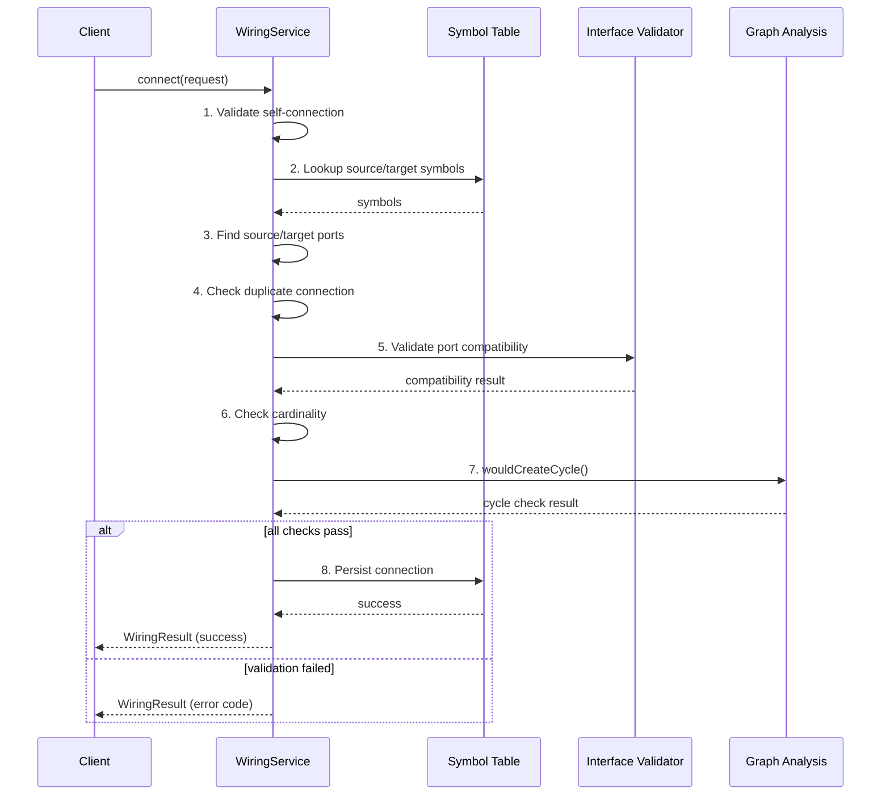
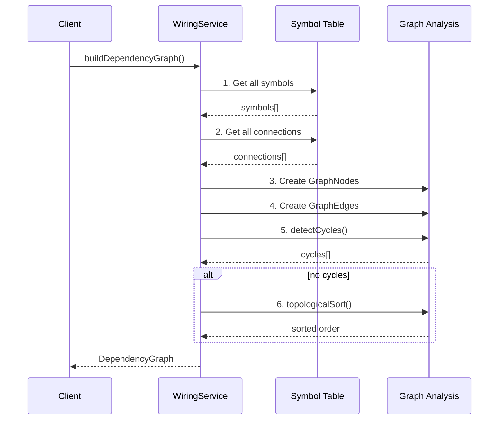

# C4 Dynamic Diagram - cyrus-code

## Overview

Runtime behavior showing how containers collaborate for key use cases.

> **Note**: Dynamic diagrams are a **supplementary** C4 diagram type (not a "level"). They can exist at any abstraction level to show runtime behavior. The numbered C4 levels are: 1-Context, 2-Container, 3-Component, (4-Code).

> **Note**: Each flow includes both happy-path and error handling scenarios.

| Flow | Status | Notes |
|------|--------|-------|
| 1. Register Component | ✅ | `cyrus-code register` |
| 2. Validate Connections | ✅ | `cyrus-code validate` |
| 3. Generate Code | ✅ | `cyrus-code generate` |
| 4. Dead Code Analysis | 🔮 | Static Analyzer schema only |
| 5. Import Manual Code | 🔮 | Import Detector not implemented |
| 6. Internal Flows | ✅ | Wiring algorithm, IPC architecture |

---

## 1. Register Component Flow

Shows how a component is registered from source file to symbol table.

### Steps

1. Developer runs `cyrus-code register src/auth/JwtService.ts`
2. CLI routes request to API Facade
3. API Facade delegates to Component Registry to parse the source file
4. Component Registry extracts component metadata, ports, and type references
5. Symbol Table receives the new symbol with generated ID
6. Symbol Database persists the symbol
7. CLI returns the registered symbol ID to developer

### Error Handling

| Error | Cause | Response |
|-------|-------|----------|
| **Parse failure** | Invalid syntax, missing exports | Report parse error with file location |
| **Duplicate symbol** | Symbol ID already exists | Report conflict, suggest version bump |
| **Invalid metadata** | Missing required fields (ports, level) | Report validation errors |
| **Database error** | SQLite write failure | Report persistence error |

---

## 2. Validate Connections Flow

Shows how port connections are validated before code generation.

### Steps

1. Developer runs `cyrus-code validate`
2. CLI routes request to API Facade
3. API Facade delegates to Wiring to check all connections
4. Wiring resolves each connection's source and target symbols
5. Interface Validator checks port type compatibility
6. Symbol Table provides type definitions for comparison
7. Validation results aggregated (errors, warnings)
8. API Facade returns results to CLI
9. CLI displays results with source locations

### Error Handling

| Error | Cause | Response |
|-------|-------|----------|
| **Missing symbol** | Referenced symbol not in registry | Report unresolved reference with source location |
| **Type mismatch** | Incompatible port types | Report type incompatibility details |
| **Direction conflict** | Invalid flow direction (e.g., out→out) | Report invalid port direction |
| **Circular dependency** | Dependency cycle detected | Report cycle path |

---

## 3. Generate Code Flow

Shows how code is synthesized from the component graph.

### Steps

1. Developer runs `cyrus-code generate ./out`
2. CLI routes request to API Facade
3. API Facade first validates all connections via Wiring
4. If validation passes, proceed to generation
5. API Facade delegates to Code Generation service
6. Code Generation reads the full component graph from Symbol Table
7. AST is built for each component with connections wired
8. Generated files written to output directory
9. CLI reports what was generated

### Error Handling

| Error | Cause | Response |
|-------|-------|----------|
| **Empty graph** | No components registered | Report "nothing to generate" |
| **Validation failed** | Pre-generation validation errors | Abort, report validation errors |
| **AST error** | Invalid template or synthesis failure | Report synthesis error with context |
| **Write failure** | File system error (permissions, disk full) | Report file system error |

---

## 4. Dead Code Analysis Flow 🔮

> **Status**: Planned - Static Analyzer has schema only, logic not implemented (ADR-005)

Shows how symbols are marked as reachable or dead.

### Steps

1. Developer runs `cyrus-code analyze --entry main.ts`
2. CLI routes request to API Facade
3. API Facade delegates to Static Analyzer with entry points
4. Static Analyzer parses entry point files
5. Call graph built by traversing AST
6. Symbols reachable from entry points marked `referenced`
7. Symbols not in call graph remain `declared` (dead code candidates)
8. CLI reports unreachable symbols

---

## 5. Import Manual Code Flow 🔮

> **Status**: Planned - Import Detector not implemented (ADR-006)

Shows how untracked code is detected and imported.

### Steps

1. Developer runs `cyrus-code scan` to find untracked files
2. CLI routes request to API Facade
3. API Facade delegates to Import Detector
4. Import Detector compares project files against symbol table
5. Untracked files reported to developer via CLI
6. Developer runs `cyrus-code import <file>`
7. CLI routes to API Facade, then Import Detector
8. Import Detector parses and suggests classification
9. Symbol registered with `origin='manual'`
10. CLI confirms import to developer

---

## 6. Internal Flows

> **Note**: These sequence diagrams show internal component interactions for key algorithms. They complement the container-level flows above.

### Wiring: Connect Ports

The 8-step validation sequence when connecting two ports:

### Wiring: Build Dependency Graph

How the dependency graph is constructed with cycle detection:

### IPC Architecture (Electron)

How GUI requests flow through Electron's IPC layer:

---

## Design Decisions

| Decision | Rationale |
|----------|-----------|
| Validate before generate | Fail fast - don't generate invalid code |
| Error handling tables per flow | Clear documentation of failure modes |
| Mark planned flows with 🔮 | Distinguish implemented vs roadmap |

---

## Legend

| Element | Notation | Description |
|---------|----------|-------------|
| **Person** | Stick figure | Actor initiating the flow |
| **Container** | Blue box | Application container |
| **ContainerDb** | Cylinder | Database |
| **System_Ext** | Gray box | External system |
| **Rel** | Numbered arrow | Interaction step in sequence |
