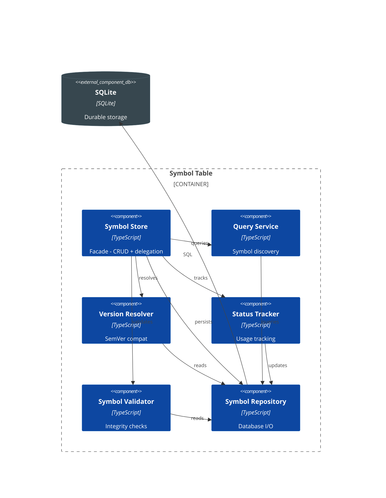
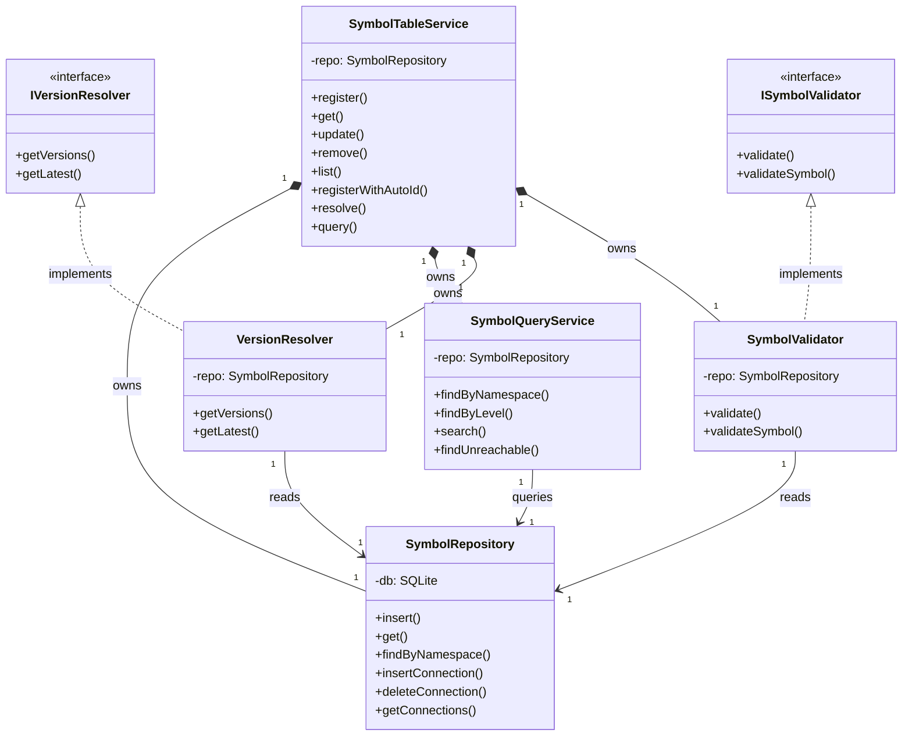

# C4 - Symbol Table

## Component Diagram

*Figure: Internal structure of the Symbol Table container, showing its components and their relationships.*

> **Note**: Connection management moved to WiringService (see [Wiring](component-wiring.md)). SymbolRepository provides connection CRUD directly.

---

## Code Diagram

*Figure: C4-4 UML class diagram showing the Symbol Table implementation architecture with segregated interfaces (ISP) and composed services (SRP).*

> **Design Note**: ConnectionManager was removed (2024-12) as duplicate validation layer. WiringService now calls SymbolRepository directly for connection operations.
