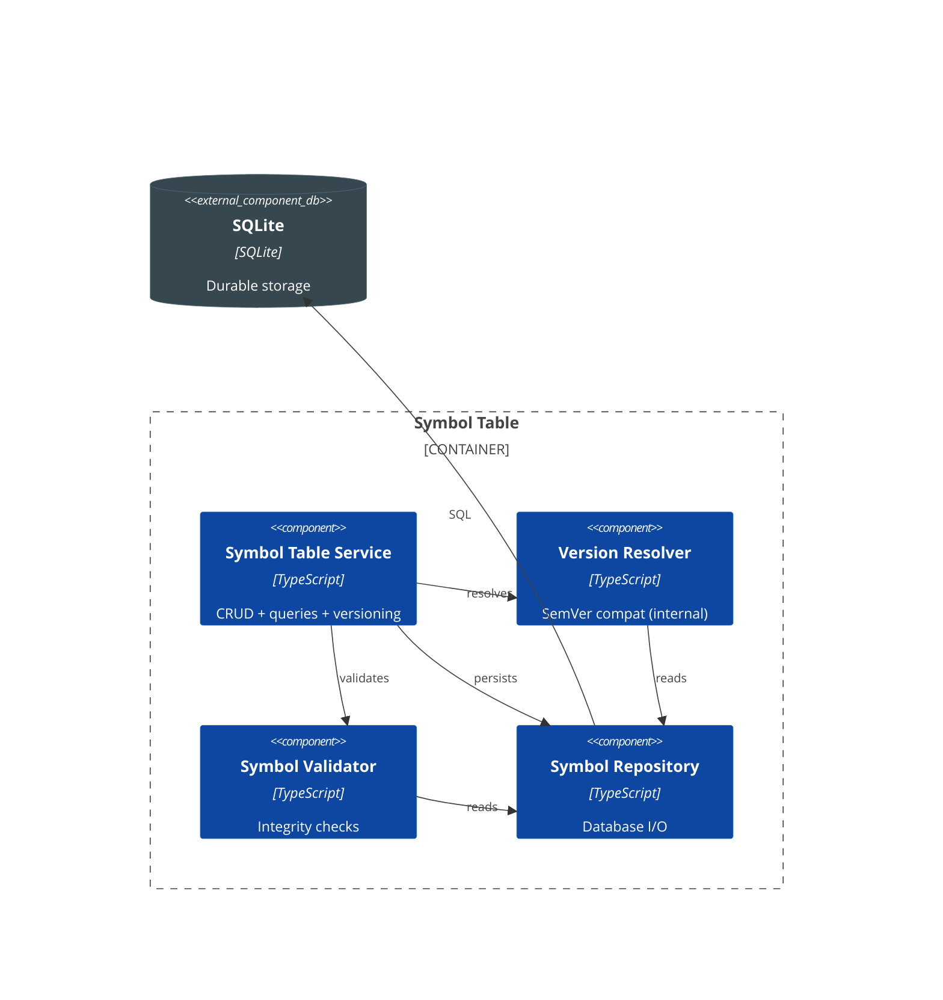
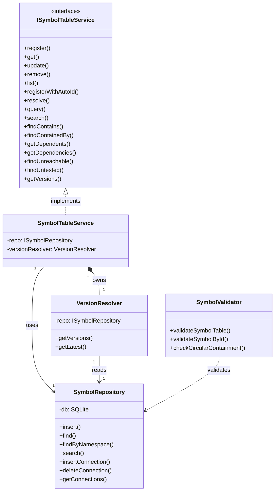

# C4 - Symbol Table

## Component Diagram

*Figure: Internal structure of the Symbol Table container, showing its components and their relationships.*

> **Note**: Connection management moved to WiringService (see [Wiring](component-wiring.md)). SymbolRepository provides connection CRUD directly.

---

## Code Diagram

*Figure: C4-4 UML class diagram showing the Symbol Table implementation architecture. SymbolTableService provides unified CRUD, query, and version operations.*

> **Design Note**: SymbolQueryService was merged into SymbolTableService (2024-12) to eliminate pass-through delegation. VersionResolver remains internal. ConnectionManager was removed as duplicate validation layer; WiringService calls SymbolRepository directly.
