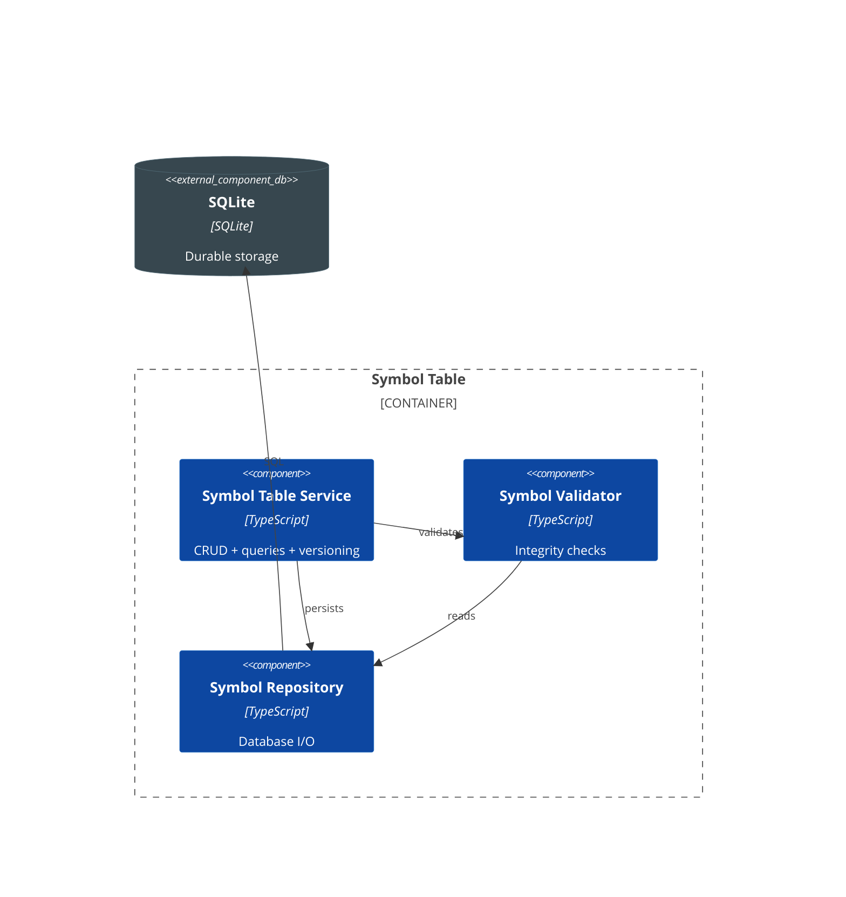
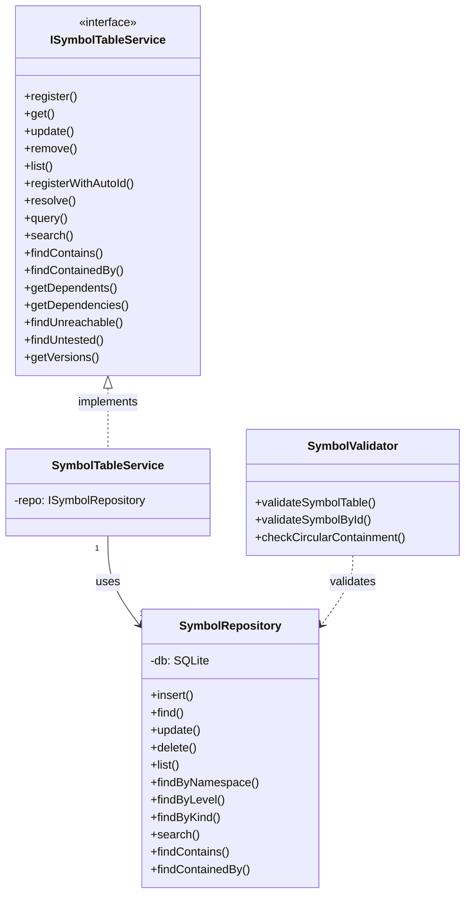

# C4 - Symbol Table

## Component Diagram

*Figure: Internal structure of the Symbol Table container, showing its components and their relationships.*

---

## Code Diagram

*Figure: C4-4 UML class diagram showing the Symbol Table implementation architecture. SymbolTableService provides unified CRUD, query, and version operations.*

> **Design Note**: SymbolQueryService was merged into SymbolTableService (2024-12) to eliminate pass-through delegation. Version resolution is now internal to SymbolTableService.
