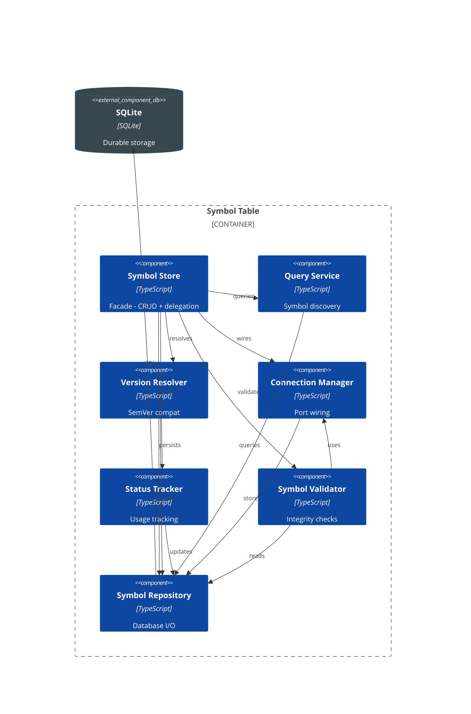
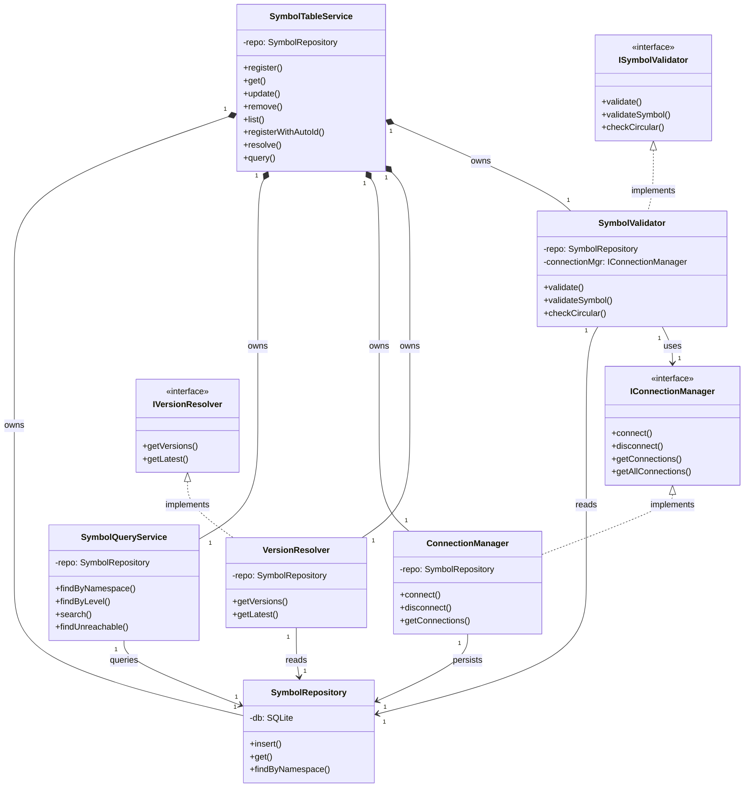

# C4 - Symbol Table

## Component Diagram

*Figure: Internal structure of the Symbol Table container, showing its components and their relationships.*

---

## Code Diagram

*Figure: C4-4 UML class diagram showing the Symbol Table implementation architecture with segregated interfaces (ISP) and composed services (SRP).*
